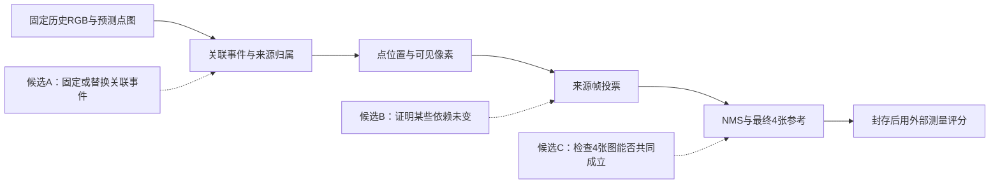

# 从 S6 出发的三项候选贡献与反证审查

实际写入：2026-09-06T00:41:04.253009+08:00。

本文件属于看到 S6 之后提出的新研究设计，全部尚未实验，不改 S6 冻结协议，也不把事后假设写成预先预测。读入材料为 `S6_RESULTS.md`、四份 literature_v2 证据表及 MAINSTREAM_EVIDENCE（已出现，未使用传闻替代）。初稿读入时 S6 结果文件的审查状态尚未同步；现已核对独立3453项通过记录，数值与初稿一致。本文候选仍未实验。

采用本机 `sci-scientific-brainstorming/SKILL.md` 和 `sci-scientific-critical-thinking/SKILL.md` 的假设反转、尺度转换、混淆检查和可证伪设计；没有调用 Claude 模型。已有自主推进授权，已知研究约束充分，因此不按技能的对话示例重新要求用户回答。

## 先限定真正需要解释的现象

S6 主设置平均更新使支持代理从 91.907176% 到 93.271907%，4/8 查询换图；全部换图集中于 B1，其中一张下降 1.4294 个百分点，一张上升 9.6606 个百分点。最近预测位姿的 4 图支持为 93.471823%，但其没有 NMS，不能直接归因。stride12 支持上升时共同像素 MAE 反而从 441.308186 到 447.766940 mm。主设置几何比较仅覆盖平均 2.748555% 的有效目标，稀疏设置仅 0.795224%；两者不能代表整幅表面精度。位置更新还改变后续匹配和点数。这些是 [S6 结果](S6_RESULTS.md) 所报告的事实。

下面三条分别研究**解释机制、减少计算、改变参考集合的选择目标**。它们不是同一个 gate 的三种叫法。只有第一条目前有较清楚的本机贡献路径；后两条必须先通过最小否证试验，才值得继续。没有一条已证明新颖、有效或适合某个会议。

| 候选 | 对象 | 核心机制 | 研究粒度 | 固定 setting | 潜在贡献类型 |
|---|---|---|---|---|---|
| A：可重放的关联分区实验 | 每个历史观测及其地图归属 | 固定关联事件后更换位置更新，拆开在线联动 | 观测→点组→可见投票→参考ID | 冻结 CUT3R 输出；前20历史/后4查询；GT只评分 | 机制评价与可复核诊断 |
| B：保证选图相同的增量计算 | 既有选择器的计算依赖 | 保守检查哪些投影/排序条件没有变，只重算受影响部分 | 像素归属、帧分数、NMS步骤 | 固定选择语义；固定点组起步；未知情形回退全算 | 有正确性条件的效率方法 |
| C：检验参考集合中的互相矛盾 | 被同时提供的4张历史参考 | 空闲空间反证构成帧对关系，检验集合级冲突是否有额外价值 | 跨帧观测关系→参考集合 | 静态场景；相同候选、K、密度、预算；不用查询GT选图 | 任务导向检索候选；重叠风险高 |

图中最后一项仍是几何支持代理；没有接上视频生成效果的已验证箭头。

## A：把“平均有用吗”改成“是哪条机制改变了决定”

**具体假设。** 在同一批预测观测下，平均更新对选图的作用主要可能来自后续关联分区改变，而非最后坐标略微移动。这里“分区”是把多个观测归入同一个地图点的决定，不预先称这种归属正确。S6 点数不同且几何、覆盖、选图不同向，提供了检验这个假设的动机；并未证明它。

**拟议机制。** 给每个输入观测一个不会变的身份 `(历史帧, 原裁剪像素)`，记录新点创建、匹配目标、位置更新、来源帧添加的事件。分别按首写与在线平均获得关联事件轨迹 `A0/A1`；再在每条固定轨迹上重放首写和平均位置规则 `G0/G1`，得到四个地图 `M(A0,G0)`、`M(A0,G1)`、`M(A1,G0)`、`M(A1,G1)`。重放时不得重新运行邻居匹配。对角两臂必须逐值复现原运行；否则先修正事件接口，不评分。

同一 `A` 内两个地图具有同样点组和来源集合，坐标规则差可以被隔离。跨 `A` 的效应包含点数、分区及来源关系变化，因此必须称“关联轨迹效应”，不能又缩写成纯来源错误。记录每步可见点、帧票数、排序与 NMS 淘汰理由，才能查清差异在哪里进入最终选择。若之后需要单独检验来源标签，应在固定同一地图身份的条件下另设明确干预，不能在两个不同点数的地图间硬交换来源集合。

**与最近工作的具体差异。**

| 近邻 | 已有机制 | 本候选若成立的额外内容 |
|---|---|---|
| [VMem](https://arxiv.org/html/2506.18903v3) | 来源集合、几何投票与NMS；有检索策略→生成消融 | 观测身份不变的事件重放，拆分位置与在线关联联动；不声称发明来源索引 |
| [AnchorWeave](https://arxiv.org/html/2602.14941v1) | 局部点云与多anchor，检索覆盖 | 研究固定生成参考预算下的中间事件；其局部/全局比较含anchor数变化 |
| [Spatia](https://arxiv.org/html/2512.15716v1) | 更新空间记忆，投影与参考帧2×2消融 | 干预单位下移至观测归组，不把模块开关或密度当位置误差 |
| [LSM-World](https://arxiv.org/html/2606.09828v2) | 换depth source并比较生成指标 | 同一预测观测上控制关联和坐标规则，避免换估计器同时改变多种误差 |
| [SysCON3D](https://arxiv.org/html/2605.18754v1) | 分解评测骨干、残差和聚合，受控破坏输入 | 面向记忆到参考决策的执行机制；必须学习其失败计入原则，不冒充通用评测器创新 |

这些差异指向“可解释的组件诊断贡献”，不是已经证明文献空白。一个新的四臂表格本身不足以构成强方法论文。

**最小可区分实验。** 只读已有三块预测数组，重新运行带事件记录的轻量建图；全部12查询保留，8测试与4开发不混合。每块固定 stride8 后完成四臂，stride12另作为预先声明的敏感性复核。固定候选20、K=4、NMS规则和裁剪相机。主要输出为每臂每查询的最终ID、外部支持、票数差进入哪一步；几何误差及覆盖为伴随结果。

若 `A0` 固定时位置规则已经解释大部分换图，关联主导假设受反证；若只有换 `A` 才改变ID，则说明在线关联是必要解释之一；若票数变而最终不变，选择边界吸收了几何变化。所有结论以干预设置为条件，不能用8图估计整个领域的效应。B1第22帧若是唯一明显例子，保留该事实，不能事后只选它构建成功展示。

**最强失败条件。** 对角臂无法复现；事件重放暗中重新关联；跨分区效应被误称纯坐标或纯来源效应；不同场景复核不出现现象。若只是复现了显然的排序阈值效应且没有可迁移规律，成果应停在诚实诊断/复現报告。**本机状态：原数组可用；事件清单尚未记录；无新模型推理必要；计算耗时尚未实测。**

## B：用最终决策的稳定条件减少无效重算

**具体假设。** 在部分记忆变化下，可见像素归属或帧票数界限足以证明最终4张图不会变，因此无需每次完整渲染和排序。这里保持原地图写入和选图结果，目标是省计算；不追求更低depth误差，也不通过少写记忆掩盖变化。

**拟议机制。** 维护“地图点→目标像素的最前可见者→来源帧票数→逐步NMS”的依赖。对一次有限更新保守界定可能受影响的像素和分数上下界。只有投影取整、正深度/视锥、遮挡深度顺序、分数并列规则及每一轮NMS决定均受覆盖时，才能给出“这一步结果相同”的证书；任一条件未知就重算。先从候选A的固定点组、固定查询相机入手；点的增删、来源变更或查询相机变化须显式失效或触发回退，不假装证书普适。

证书是一个可逐次检查的逻辑条件，不是模型置信度。不能仅凭“第4与第5名分数差大”判定安全：NMS可能跳过若干高分项，微小遮挡变化也能重新分配多张帧的票数。第一版宁可保守全算，禁止容许悄悄错选来换速度。

**与近邻及老方法的差异。**

| 近邻 | 已有内容 | 本候选必须额外证明什么 |
|---|---|---|
| [VMem](https://arxiv.org/html/2506.18903v3) | 几何投票和NMS决定参考 | 该完整复合选择语义下的充分稳定条件与可重复省时 |
| [FreeScale](https://arxiv.org/html/2604.10512v1) | 可靠几何可见性构成view graph | 本候选不靠certainty改选图；输出须与原选择器相同 |
| [GIM-World](https://arxiv.org/html/2606.02436v1) | 同预算历史pruning与几何监督 | 不换pruning准则或训练模型，减少同一准则执行成本 |
| [Efficient Maintenance of Materialized Top-k Views](https://www.cse.ust.hk/~yike/topk/icde03.pdf) | 早已有增量维护top-k、辅助候选与更新分类 | 新意不能是“缓存top-k”；若无法处理投影/遮挡/来源/NMS组合，只是工程移植 |
| [Visibility Computations for Global Illumination Algorithms](https://graphics.stanford.edu/papers/visglob/) | 已有保守而精确的增量可见性计算 | 新意不能是“可见性证书”；需论证在本任务组合中的实际额外收益 |

**最小可区分实验。** 对全部固定查询，回放同一组真实地图更新；完整选择器作为逐步真值，增量版只改变计算调度。先核全部ID、顺序、并列选择逐项相同，再测证书通过率、回退率、实际触达点/像素数量、额外缓存与总耗时。计时包含证书维护，不只计被省掉的函数。用固定次序、同一硬件预热与重复；压力场景另加像素边界、深度并列、NMS阈值和点增删用例，明确属于人工正确性测试。

若大量变化在排序前已被稳定条件吸收，且端到端选择耗时下降，支持效率路线；若证书总是失效、维护成本超过全算，或只能去掉NMS才有收益，则这个候选失败。**零错选是本轮正确性门槛；零错选的有限测试仍不等于形式证明。** 即使成功，也只支持更便宜地得到同样参考，不能声称参考更好或生成更好。

**最强失败条件。** 小地图全算已极快；相机持续变化使缓存失效；近深度并列导致保守界太松；算法退化为既有top-k维护加普通缓存。**本机状态：选择核心可用，依赖索引与证书未实现；S6的两个检索宽度结果一致不能直接证明此假设。**

## C：先检验“参考越多地覆盖，是否也越多地互相冲突”

**具体假设。** 在同样4张参考的条件下，仅追求可见覆盖会选入相互无法共同解释的历史几何；集合中的冲突关系可提供单帧质量或coverage以外的信息。该假设尚未从S6测出：S6支持高不代表有冲突，也不代表生成器会被冲突伤害。

**拟议机制。** 保留历史观测来源，不先把互相矛盾的观测平均成一个位置。用历史预测depth和pose构造帧对关系，区分“可共同支持”“违背已经观测到的空闲空间”“没有足够观察”。例如A的表面点投到B有效深度之前很远，意味着A把表面放进B射线已观测到的空区；而投到B前景后面可能只是被挡住，单向判为未知，不能自动罚作矛盾。无效深度、视野外、边缘及几何尺度不一致须单列，不能一概当负证据。

只有关系能在外部测量中得到验证，才进一步检验固定K集合上的冲突约束；不把一张图总体置信度低就删掉，也不把coverage-greedy加个新名字。20选4只有4,845个集合，初轮可枚举固定目标，先排除“只是贪心搜索质量变了”的解释。预测关系生成、选择全部完成后，才能读取测量数据评分。

**最强已有反证：负证据本身是老方法。**

| 近邻 | 已有内容 | 尚可检验的狭窄差异 |
|---|---|---|
| [AnchorWeave](https://arxiv.org/html/2602.14941v1) | 独立局部记忆、多anchor、覆盖检索与条件融合 | 在同K、同候选、同搜索能力下检查来源帧之间的显式矛盾关系；不称发明局部记忆 |
| [FreeScale](https://arxiv.org/html/2604.10512v1) | certainty-aware可见性view graph | 是否存在单帧/共享可靠性分数无法替代的关系效应，尚未证明 |
| [EM-Fusion](https://openaccess.thecvf.com/content_ICCV_2019/papers/Strecke_EM-Fusion_Dynamic_Object-Level_SLAM_With_Probabilistic_Data_Association_ICCV_2019_paper.pdf) | 软关联进入配准和融合 | 对象归属的概率方法已有；本候选输出是固定预算历史参考集合 |
| [Pixelwise View Selection for Unstructured Multi-View Stereo](https://doi.org/10.1007/978-3-319-46487-9_31) | 几何、光度、遮挡进入逐像素view selection | 换成世界模型参考任务不自动构成创新；需证明集合冲突在该消费者中有不可替代价值 |
| [Using Self-Contradiction to Learn Confidence Measures in Stereo Vision](https://www.cv-foundation.org/openaccess/content_cvpr_2016/papers/Mostegel_Using_Self-Contradiction_to_CVPR_2016_paper.pdf) | 已用free-space/occlusion正负投票生成置信度训练标签 | 不能宣称发明空闲空间反证、来源一致性或三态证据；只能检验新的下游决策作用 |

**最小可区分实验。** 先做观测诊断，无需实现新选择器：使用现有固定20历史，建立所有帧对的预测冲突、未知比例，再用实测depth/pose离线核对它们。若预测冲突主要来自pose误差，或把遮挡当矛盾，停止方法开发。若能识别真实不相容，则在相同枚举搜索与K=4下比较coverage-only、coverage+单帧质量、coverage+帧对冲突三臂，另加同分布打乱帧对关系对照。所有权重只用B0定一次；测试结果不回调。

必须同时报告支持、覆盖、参考相互一致性、未知比例；冲突减少但覆盖大跌不是自动成功。打乱关系也同样改善，说明只是正则项/预算效应；单帧质量完全解释收益，集合机制受反证；只有GT冲突图有效而预测图无效，只能得到oracle可行性结论。即使三臂有收益，也需真实生成器同预算实验才能声称消除了条件冲突对视频的伤害。

**最强失败条件。** CUT3R共同系统误差使错误图彼此自洽；真实动态变化破坏静态假设；负证据测不准；收益等价于已有confidence filtering或view selection。**本机状态：已有历史数组足够进行第一阶段预测/测量诊断；冲突图与选择器都未生成。本方向重叠最高，优先级低于A，当前不宜作为主创新承诺。**

## 优先次序与必须保留的退出路线

建议先做A的事件可重放性检查，因为它直接回答S6中的混淆，不需要再训练。A若证实多数变化发生在可见性/NMS而非关联，下一步可以转向B；若存在经外部测量核实的参考相互矛盾，才考虑C。这样的分支选择应写新日志和新协议，不能追认成S6原计划。

三条都需要新增独立场景后才能讨论泛化。同房间的B0/B1/B2、同查询两个检索宽度和多种参数条件都不是独立样本。当前不拟显著性或总体效应，不保证首次、投稿、导师评价；合理失败结果可以使项目明确否定一条不值得继续的方法方向。

## 本轮极少量定向补搜与核验记录

补搜实际读钟：2026-09-05 16:33:50 UTC（北京时间2026-09-06 00:33:50）。查询三条：`multi view stereo view selection free space consistency source selection contradiction`；`incremental top k query result maintenance certificate geometric visibility rendering`；`camera view selection negative evidence free space consistency reconstruction view graph`。后续完整题名核验查询：`Using Self-Contradiction to Learn Confidence Measures in Stereo Vision authors`；`Efficient Maintenance of Materialized Top-k Views authors`；`Pixelwise View Selection for Unstructured Multi-View Stereo Schönberger Zheng Frahm Pollefeys`。后续未单独读钟，不伪造秒数。

- Mostegel、Rumpler、Fraundorfer、Bischof（CVPR2016）：[arXiv元数据](https://arxiv.org/abs/1604.05132)确认标题作者；CVF原文§3/图3确认负投票与free-space/occlusion。两步 VERIFIED；只用机制断言，不转用论文性能数字。
- Ke Yi、Hai Yu、Jun Yang、Gangqiang Xia、Yuguo Chen（ICDE2003）：[作者机构书目](https://scholars.duke.edu/publication/807148)确认标题作者；上表作者PDF摘要/§3核动态top-k辅助视图维护。两步 VERIFIED。
- Schönberger、Zheng、Frahm、Pollefeys（ECCV2016）：[Springer正式章节](https://doi.org/10.1007/978-3-319-46487-9_31)核作者顺序与题名；该页§4.5核几何一致性进入推断。两步 VERIFIED；未沿用作者序不同的流传preprint。
- Teller、Hanrahan：[Stanford作者项目页](https://graphics.stanford.edu/papers/visglob/)核题名作者，摘要明确增量、保守、精确可见性。VERIFIED限摘要，不声称已读其完整实现或复杂度证明。

其余近邻书目、版本及主张沿用本轮已核实的 [主流方法证据](literature_v2/MAINSTREAM_EVIDENCE.md)、[融合证据](literature_v2/FUSION_EVIDENCE.md)、[补充检索](literature_v2/TARGETED_EVIDENCE.md)、[评价证据](literature_v2/EVALUATION_EVIDENCE.md)。没有把搜索未命中当作新颖性证据。
