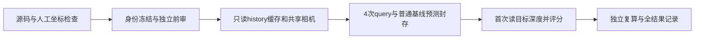

# S14E 设计草案：给定已知相机时，预测深度究竟有多准

本文件是运行前设计，尚无 S14E 真实数组解码、模型调用或质量结果。设计作者只读现有协议、源码和两份 JSON 元数据。S14D 已证明不用目标 RGB 的接口可以运行；下一步用同一段已见照片的真实相机条件，检查输出能否与实测深度作有意义的比较。**这是普通质量诊断，不是新方法、未见场景或完整视频验证。**

## 1. 本次回答什么

固定原 S8 block0 的 20 张 history 与 query 20—23。历史 RGB 已参与 S14D，四个目标在以前阶段也被看过和评分过；本协议只在新一次执行中隔离目标照片/深度，不能把数据重新叫作未见测试。

显式给所有方法同一份已知 history/query 相机轨迹与标定。history 20 个 pose 固定在原 RGB 时间插值，四个目标固定在原配对 depth 时间插值，使预测相机对应实际深度的采集时刻；保留原 RGB/depth 时间差，不按结果改配对。其来源可以是数据集 GT pose，但它在本设置中是允许输入，而目标 RGB、目标深度是封存后的评价资料。最终名称应为“已知相机条件下、不读目标 RGB 的探索性深度诊断”。不声称相机位姿也不可得，不把它等同仅 RGB 的部署设置。

可推翻的有限问题：在完全相同的 20 张历史与相机条件下，CUT3R ray-only 的目标深度是否比普通历史深度重投影、单一常数深度更有用？四 query 全部报告。结果差或失效照实保留，不通过更换 head、尺度、相机拟合、掩码或 query 子集挽救结论。不作总体显著性、新方法优越性或跨场景推断。

## 2. 先把三个坐标系分开

记 W 为数据集米制世界坐标，M 为当前 CUT3R 状态使用的坐标；第 i 张相机的 camera-to-world 记作 Cᵂᵢ=(Rᵂᵢ,tᵂᵢ)，已保存 history 预测记作 Cᴹᵢ。目标深度是相机自己的光轴 z，**不是离相机的欧氏距离**。

冻结唯一主对齐：第一张 history 的朝向确定全局旋转，全部 20 张 history 的平移确定一个正尺度。用 float64 计算：

```text
A = Rᴹ₀ (Rᵂ₀)ᵀ
aᵢ = A (tᵂᵢ − tᵂ₀),  bᵢ = tᴹᵢ − tᴹ₀, i = 0..19
s = Σᵢ aᵢ·bᵢ / Σᵢ ||aᵢ||²            # 模型单位 / 米
c = tᴹ₀ − s A tᵂ₀
Xᴹ = s A Xᵂ + c
Rᴹ_query = A Rᵂ_query
tᴹ_query = s A tᵂ_query + c
```

使用第一相机朝向，可以避免仅靠近直线相机中心估计三维旋转的不稳定性；它仍会继承第一张预测朝向误差，因此完整保存 history 平移残差、20 个朝向残差、尺度和数据范围。全 Sim(3)/Umeyama 不作为看过目标答案后的替代方案。本次若另算它，只能预先列为不用于主输出的坐标敏感性诊断；最小执行可以完全不算。

硬失败条件在模型前检查：24 个输入 pose shape/finite/proper rotation 不合法；20 张 history 顺序或 SHA 不符；pose 插值无有效包围区间/超过冻结最大间隔；Σ||aᵢ||²≤1e−12 平方米；s 非有限或≤0；变换/逆变换数值回环不通过。出现这些情况只完成坐标诊断，封存失败，**不读取目标深度求尺度**。拟合残差大但数值合法时保留并警示解释限制，不凭目标效果重新拟合。数值阈值和单位须进入执行 manifest。

记录 s、每个残差、归一化 RMS、最大值和 history 轨迹三轴方差；可预列逐 history 去一尺度作为稳定性描述，但不能据此删点或挑尺度。四个目标平移/旋转只是给定条件，不进入拟合。也不使用任何 history 实测深度作本协议尺度校准。

## 3. 官方“射线编码”与物理投影不能混用

固定 CUT3R commit `8bc15dc92a6d7fd92920b4ec81540d3dec7d3ecf`。实读官方 `src/dust3r/datasets/base/base_multiview_dataset.py:13–23,384–391`：训练数据与 viewer 都使用

```text
origin = t
encoded_direction = normalize(R K⁻¹ [u,v,1]ᵀ + t)
```

这里方向含平移项；这不是标准几何中的 `normalize(R K⁻¹p)`。但它是当前官方训练/推理一致采用的输入编码，不应仅因为非标准就改公式、重跑并挑分数。S14E 继续使用已冻结、AST 提取的官方编码，以转换后的相机和真实裁剪 K 替换 S14D 的人工相机/pseudo K。保存全部输入相机、K、ray_map 和独立复算误差。

该编码不适合直接当物理光线做几何求交。所有传统重投影、z-buffer、GT 点计算单独使用标准 `X_camera = z K⁻¹p` 和 camera-to-world 变换。把“训练编码一致”和“物理射线正确”列成两个独立检查。

## 4. 固定主 head 与辅助诊断，不能二选一

实读官方 `losses.py:384–400`：self GT 在各自相机坐标，cross GT 在第一相机坐标；`linear_head.py:306–346` 的 `LinearPts3dPose` 有独立 self/cross 投影头。它**不是**同文件中未被此 factory 选择的 `LinearPts3dPoseDirect`。因此不得用 `other = predicted_pose × self` 作严格恒等式验收。

官方 viewer `viser_utils.py:546–549` 对 ray-only 输出直接展示 self 的 z，并用给定 target pose 放到世界。故冻结主预测：

```text
d_query_meters[u,v] = pts3d_in_self_view[0,u,v,2] / s
```

不根据目标 GT 做逐图 median alignment、scale-and-shift 或改用 other。所有 self xyz/rgb/conf/pose 与 other 原始输出照存；不按置信度筛主结果。

辅助但不用于换主指标：①输出 pose 与给定 query pose 的差；②把 other 用给定 query pose 逆变换后的 z/s 与 self z/s 的逐像素差；③self 的 x/z、y/z 与 K⁻¹p 的偏差；④非有限、非正深度数。这些揭示条件/输出坐标失配，不能充当两个独立深度方法的获胜选择。强制工程 gate 是 shape、dtype、输入身份、未变 latent、输出保存完整；精度差本身是结果，不是可以悄悄重试的代码故障。

## 5. 复用缓存的合同

S14D 已保存 `results/S14D_ray_only_probe/state_before.npz` 的五个状态字段，以及 `probe_inputs.npz` 的 history pose encodings/poses。其具体 SHA、shape/dtype 从 S14D run_metadata 绑定到新 manifest。恢复每个字段原 dtype；尤其 `state_pos` 是 int64，不能把全部状态统一转换 float。

S14D **没有保存 20 张 history 点图**。普通基线若复用原 S8 predictions NPZ，只能按白名单读取 frame0..19 的 self 点图和相机字段，不能循环解码全 NPZ 再丢弃 query。先核 history 图 SHA/顺序、权重/commit、预处理/精度和运行条件，再核 S8 与 S14D 保存的 20 history pose 的 shape/dtype/字节完全相同，并核 S8 已保存 state_feat/mem 的 history anchor 哈希与 S14D 同字段相同；另外三个 latent 字段若 S8 无保存哈希，不冒称全部五字段跨运行相同。任一应精确相同的域不相同就不直接混接；根应冻结一个单独补取缺失 history 点图的理由与预算，或将本轮限定坐标诊断，不能声称它们早已保存。

模型阶段只恢复已有权重与这一个 history state，先做1次旧 Q0 parity 控制，再调用4次新的物理 query，共5次；query RGB encoder 计数应为0。parity 使用 S14D 已封存的 Q0 原始 rays/pseudo K/pose/NaN占位，全部输出 shape/dtype/字节与旧 call0 一致后才继续；这是恢复 latent 后的等价门，不能算新增真实质量样本。每次 `update=False`，五个状态字段前后字节相同。每 call 完成即保存，不在最后一次才保存总结果。不重跑 S14D 的整套位移与 NaN-zero 接口测试；只有上述一次 Q0 恢复等价门。

## 6. 两个普通基线

两基线与模型都可访问同20 history 预测深度、同已知 history/query 相机与 K，全部成本分别记账；不宣称每种计算路线的成本天然相同。本轮没有四图检索/NMS，不能和 S12 的四图选择结果混为一项。

**B1：20-history 预测深度标准重投影。** 每个 history self-z 保持模型单位，使用共享裁剪 K 标准反投影，再用其已保存的预测 history pose 放入模型世界，以已给定并经同一对齐变换的目标 pose 转到目标相机。具体为 `Xᴹ=Rᴹᵢ(zᵢ K⁻¹p)+tᴹᵢ`，`X_query=(Rᴹ_query)ᵀ(Xᴹ−tᴹ_query)`，输出目标 z/s 为米。已知 history pose 只用于前述统一对齐，不逐 history 用 GT pose 纠正预测几何。固定全部 224×224 点，所有有限且 z>0 的 history 深度，不做 confidence/一致性筛选。投到目标像素坐标后用 `floor(u+0.5), floor(v+0.5)` 最近像素、标准 z-buffer 最小正 z；投影前保留越界/后方/非有限计数。无点命中为 NaN 与明确空掩码，不能填零深度、插值、补洞或复制邻点。精确同 z tie 以 history index 再 raster index 小者选定，仅用于来源可复核。

该基线用深度加已知 K 的标准反投影，不直接使用 self 的自由预测 x/y，名称中说明这点。它与模型共享统一对齐后的条件，历史几何保留原预测 pose 的误差。本任务是有用性诊断，不把差值归因于某个新机制。

**B2：history 单一常数。** 把相同20 history 全部有限且正的 self-z 以 float64 汇总，取一个全局像素中位数后除以 s，在四目标所有像素重复。固定 NumPy 通常偶数中位数规则，保存样本数、常数、finite/positive 计数。没有有效 history 深度时失败并保留，不能从目标答案取常数。

## 7. K、裁剪与深度注册是执行前未决门

本设计不猜 TUM fr2 应选哪组 K/畸变。根的官方标定/单位审查须在读任何真实质量结果之前给出明确数值与来源，写入 manifest。若新 K 与 S8 旧默认 K 不同，本轮另立协议，旧 S8 结果和 SHA 不改。目标 RGB 不需要打开；native 尺寸从已绑定数据格式/元数据取得，评价时核深度尺寸。

实读当前官方 `load_images`：640×480 的原图先 resize 为299×224，再 crop `(37,0,261,224)` 得224方图。K 要由同一像素中心约定和这个变换得到，不把目标“224方图”当成原图等比例缩放。建议采用 Pillow 中心采样相应的变换：`fx'=sx fx; cx'=sx(cx+0.5)-0.5-left`，y 同理，`sx=299/640, sy=224/480`；执行前用人工像素坐标和独立实现验证，不盲抄旧 helper 的近似 K。

GT depth 按官方单位转为米，再以固定 nearest resize/crop 映射到相同224网格；保存所用原生像素索引映射。注册/畸变若使该映射无效，先修协议或仅交付坐标检查，不能把错位深度计算成质量。不能为提高结果把主掩码改成旧 `measured_target` 的5×5平滑内区。本轮主 GT 域是裁剪后的所有 finite、z>0 像素；未测量像素排除且报告数量。不追加看过结果的边界裁剪、距离剪裁或置信门。

## 8. 评分：同时保留准确度与缺失代价

全部四 query ×三方法保存224×224原始预测/掩码和逐 query 表，不只给平均数。

主结果为每 query 的**全 GT 有效域 δ1 成功率**：GT finite且>0 的所有像素作分母；预测 finite且>0 并满足 `max(pred/GT,GT/pred)<1.25` 作分子；缺预测、非正值、非有限值均失败。空GT域记 null/状态，不加 epsilon 伪造分数。

同时报告各方法在 GT 有效域的预测覆盖率、有效交集上的 MAE(米)、AbsRel、RMSE；明确这些误差的分母。另在三方法共同有效域报告同样误差与共同像素数，防止稀疏基线只保留容易像素显得更准。共同域为空则 null，不删该 query。没有全域可定义的 MAE 时，不把缺失深度填为0去制造一个误差。

四 query 逐项列出主率与两普通基线的差；附等权 query mean 和有效像素总数，均为本段描述，不是独立样本量。无 p 值、置信区间、拟合、门限搜索、胜者选择。δ1/MAE 是常规诊断指标，不是创新。即使四项均胜，也只支持继续下一独立场景/机制实验，不能提升为论文新方法结论。

## 9. 执行、冻结和失败保留顺序



独立前审须在真实数组解码前覆盖：S8 subset-reader 无 query 解码、S14D state恢复、pose/quaternion/插值、对齐正尺度与退化、K像素中心、标准投影/稀疏空值和最近像素tie、δ1完整分母、人工遮挡/非有限/空域例。人工检查是代码准备，不计真实样本。

manifest 固定：恰好20+4身份与顺序；24共享pose的输入来源和插值合同；裁剪/标定/单位；权重与所有实际导入源码；旧缓存与状态SHA/schema；主对齐/主head/两个baseline/所有指标；CPU8线程/seed0/原精度；最多5次direct调用（1次旧 Q0 恢复控制+4次新目标）、不重跑history、外部600s/32GiB预算。不同作者完成审读再冻结；最终核对控制文件版本，避免再次发生准备稿与 manifest 更新竞争。

阶段 C 中可读已知轨迹数值、history NPZ白名单，以及旧 Q0人工条件/输出仅供parity；严禁 query NPZ字段、目标 RGB/深度数组、旧 query 分数参与预测。身份核查可能读取文件字节作 hash，应与数组/JSON解码次数分开计数，不把“未解码”写成“未读文件”。预测封存必须覆盖 K/pose/rays、恢复state身份、旧Q0 parity结果、4query全部head、B1/B2深度/掩码、尺度和所有参数；根核 SHA/域后，评分进程才打开4张目标depth。目标 RGB不影响任何数值，若做可视化只在评分后另记4张打开。

独立复核使用保存结果，不重跑模型：相机变换/尺度可用不同代数实现，z-buffer可独立排序而生产用最小归约，评分逐像素或不同归约复算；输入/输出/代码身份和评分前封存顺序一并核验。状态和缓存字段身份采用精确字节检查；float容差先冻结。人为构造正确平面也要失败时，判工程问题；真实预测误差大或baseline更好则保留负结果，两者不能混淆。

## 10. 技能应用、近邻和当前结论

实际阅读 HKUSTDial/Supervisor 的 `idea-evaluator/SKILL.md` 与 `references/fatal-flaws.md`，应用 F1/F6 的最近工作与可证伪实验审查；沿用对 S14C 有限命题的 Reject and Pivot，不重新包装已反驳指标。S14E 尚无自创算法，故不补一个虚构的五维创新评分或“可投稿”结论。当前判断：普通诊断协议可继续完善，质量执行以前述 K/缓存一致性/独立前审门为条件。

实际阅读本地 Claude `sci-scientific-critical-thinking/SKILL.md`，应用构念效度（self-z vs射线/欧氏距离）、输入混杂（GT pose显式共享）、预测封存、缺失值偏差和外推限制。图示建议已考虑，采用本地可编辑 Mermaid 表达执行顺序；不需要 AI 绘图、Claude 模型或CLI。

近邻复用 S14D 四项已核原文对照：MVS逐像素几何一致性、COVRAG目标any-hit覆盖和外部轨迹尺度、I3DM目标rays、VMem目标渲染；本设计不宣称这些普通组件为新增量。另实际定点检索并打开 CUT3R 官方页/issue：作者[项目页](https://cut3r.github.io/)已展示给定虚拟query raymap读取pointmap，故本接口能力明确属于已有工作。[官方训练编码](https://github.com/CUT3R/CUT3R/blob/8bc15dc92a6d7fd92920b4ec81540d3dec7d3ecf/src/dust3r/datasets/base/base_multiview_dataset.py#L13)、[官方head](https://github.com/CUT3R/CUT3R/blob/8bc15dc92a6d7fd92920b4ec81540d3dec7d3ecf/src/dust3r/heads/linear_head.py#L306)、[官方viewer](https://github.com/CUT3R/CUT3R/blob/8bc15dc92a6d7fd92920b4ec81540d3dec7d3ecf/viser_utils.py#L546)依据本机固定源码阅读，而非搜索摘要。arXiv v2 HTML 本次404，未据失败页面作论证；issue只看到了提问，没有把它当维护者确认。

下一步：根合并官方标定/数组单位核查；独立作者审读上述最终合同；若坐标和缓存域可成立，再冻结并执行一次新真实质量诊断。当前本设计作者未读真实 NPZ、实测深度/轨迹数组、未运行模型，也未更改主记忆或共享主账。
