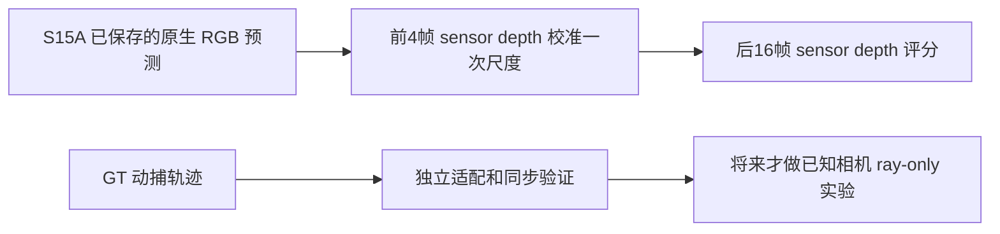

# S15B：Bonn 位姿问题的有界解决路线

**现在可以开展 Bonn 原生观测视图的真实深度评分，无须等待 GT 位姿；仍不能把未核实的位姿变换当成光学相机 c2w。** 本轮追到 CUT3R 实际评测代码，证实其 Bonn 视频深度路径也不读取 GT 轨迹。根任务已采用独立的 S15C 观测视图方案：复用 S15A 已封存的预测，只新增传感器深度评分，不重跑成功的模型。

本轮性质是原始源码检索、公开常数计算与实验设计。没有获取或解码 Bonn 新 RGB、depth、trajectory，没有运行模型或获得新准确率。实际访问、源码 SHA 和时间见 `work/S15B_bonn_resolution/receipt.json`。新增来源限定为 6 份，包含一个目录入口；到此收束，不再无限查房间身份或等待作者回复。

## 1. 这次新解决了什么

本地 CUT3R README 的 Bonn 准备指向 MonST3R。沿该路径核对后，发现不能用“官方代码提到 TUM 格式”来补足相机坐标的证据，也不必让这个问题阻挡所有测量。

| 原始资料 | 实际行为 | 对本项目的决定 |
|---|---|---|
| [MonST3R 数据说明](https://github.com/Junyi42/monst3r/blob/main/data/evaluation_script.md) | Bonn 位于视频深度准备与评测段落；相机位姿评测另列其他数据。 | Bonn 深度评测不是 GT 光学姿态认证。 |
| [MonST3R prepare_bonn.py](https://github.com/Junyi42/monst3r/blob/main/datasets_preprocess/prepare_bonn.py) | RGB、depth 文件分别排序后取 `[30:140]`；GT 数值行也独立取该区间。没有时间戳关联，也没有外参转换或去畸变。 | 不照抄行号对应；继续使用 S15A 已冻结的最近时间匹配。注释提到 stride 2，但实际切片步长为 1。 |
| [CUT3R eval 目录](https://github.com/CUT3R/CUT3R/tree/main/eval) | 明确分 video_depth、relpose 等入口。 | 本轮仅沿已打开的 video_depth 路径作有界核查。 |
| [CUT3R video_depth/launch.py](https://github.com/CUT3R/CUT3R/blob/main/eval/video_depth/launch.py) | RGB loader → inference → self-view 点图的深度保存；输入相机字段使用单位矩阵占位。该文件不调用 `gt_traj_func`，不加载 GT 数值，也没有 undistort。 | 可做输入 RGB 对应的深度测量；不能把这里的占位矩阵当成真实相机。官方该入口断言 512 输入，本项目 224 权重和裁切属于明确的本地诊断，不能称复现其论文表格。 |
| [CUT3R video_depth/metadata.py](https://github.com/CUT3R/CUT3R/blob/main/eval/video_depth/metadata.py) | Bonn 定义 `groundtruth_110.txt` 路径和 `traj_format='tum'`；列出 5 个动态序列。 | 字段存在不等于调用发生。我们使用 static_close_far，也不是它的同一评测集。 |
| [CUT3R video_depth/eval_depth.py](https://github.com/CUT3R/CUT3R/blob/main/eval/video_depth/eval_depth.py) | 深度 PNG 除以 5000、零无效；预测 resize 到 GT 尺寸；支持 scale/scale&shift/metric 模式，不需要 GT 相机。 | 支持不用位姿测深度的路线。我们的历史校准尺度、224 网格、等帧平均、完整分母要独立声明，不能直接横比官方报告数字。 |

6 份源码/页面全部实际 HTTP 200 保存，合计 266857 字节；访问 UTC 2026-09-06T10:14:24.191424—10:14:25.339591。公开 main 分支内容按本次 SHA 固定；不是已有模型 99 份源码或 checkpoint 的替换。另一次本地路径搜索未找到 eval，因为现有本地 checkout 只保存模型所需子集；随后改查作者公开文件。未因此重新下载模型仓库。

## 2. 位姿、畸变与同步的证据边界

复核已有缓存的 [Bonn 发布者页面](https://www.ipb.uni-bonn.de/data/rgbd-dynamic-dataset/)、[ReFusion 原论文](https://arxiv.org/abs/1905.02082)、官方转换脚本和作者 issue。作者说明动捕记录传感器姿态，深度已与 RGB 配准，并提供 RGB 内参及五个非零/零畸变参数；模型对齐激光点云使用 `Tros^-1 * T0 * Tros * Tm`。这依然没有证明各 PNG 已否去畸变，也未给出逐帧光学姿态和相机/动捕同步偏移的认证接口。原论文描述用同时被两种系统观测到的环境标记完成模型坐标校准；这不等同于一份公开可核验的逐帧 hand-eye 导出器。

已缓存作者 issue #14 的成员回复只指向发布页面；用户后续关于时间不同步的猜测不能写成作者确认。[问题原文](https://github.com/PRBonn/refusion/issues/14)

因此本轮没有可靠直接证据足以给出“已认证 optical c2w”转换函数。其状态是 **UNRESOLVED_POSE_SEMANTICS**，不是“Bonn 数据坏了”，也不是整个研究被阻塞。新增代码只用于文献路径核查，不覆盖这一未知项。

### Tm 的尺度究竟意味着什么

公开 `Tm[:3,:3]` 的三个奇异值接近 1.05929。新增代数计算表明：其最近统一尺度旋转 `sR` 的 `s=1.0592904533894127`，最大逐元素残差 `4.449567365838458e-5`。这与四位小数舍入和一个相似变换相容，但**不是作者确认它在校准深度尺度**。不能据此将原 PNG 深度直接乘 1.05929。

若将公开模型链仅当一个待验证的候选，可写 `F_i = A T_i A M`，其中 `A=Tros`；相邻转换为 `F_i^-1 F_j = M^-1 A T_i^-1 T_j A M`。如果 `M` 严格为统一尺度乘旋转，那么共轭后的旋转尺度会抵消；平移和实际传感器尺度仍需定义。原 `M` 是四位小数近似矩阵，直接代入仍不严格刚体。人工相对旋转例的正交残差为 `2.286192652867225e-5`。它不能绕过项目的 SO(3) 约束。

这些都是**公开常数 + 人工运动**计算。没有用实际 Bonn 轨迹尝试公式并选最高分。最近相似分解仅用于解释风险，不自动成为后续预测程序的一部分。

## 3. 若未来需要 pose：最小独立适配实验

这是一份供后续冻结的工程方案，尚未运行。独立目标是“让同一个静态物体在不同帧投影重合”，不以 CUT3R 的测试深度成绩挑变换。

1. **固定适配数据与预算。** 可使用 S15A 的已暴露 20 个 history RGB 及其对应 depth、允许的动捕轨迹；它们全部登记为适配集，不能再充当未见校准见证。前 15 帧拟合，后 5 帧验证。仍不获取 future 4 帧。最多 20 RGB、20 depth 和覆盖其时间的轨迹，一次适配失败就保留结果并停该路线。
2. **固定两种图像模型。** H0 视 PNG 为现成原生针孔网格，H1 用官网 `K,d` 做共同全图 remap；K_new=K，RGB 线性、depth 最近邻、零边界。只允许在适配前 15 帧选一个模型；两者的拟合/后 5 帧结果都报告，不看未来目标决定去不去畸变。
3. **用传统几何构造光学相对运动。** 固定 OpenCV 版本、seed 0、ORB 2000 特征、Hamming mutual matches、ratio 0.75、有效 depth=raw/5000。对相邻及相隔 2 帧的固定全部对，以源 RGB-D 3D 与目标 RGB 2D 做 PnP RANSAC（1000 次、2 px、0.999），随后固定一次迭代优化；输出每对全部匹配和残差，少于 30 个内点的对保留 FAIL。算法不依赖 CUT3R 预测。
4. **明确方向和手眼方程。** 令 `G_i` 为世界←动捕物体，`C_i` 为世界←光学相机，未知常量 `X` 为物体←相机，则 `C_i=G_i X`。定义 `A_ij=G_i^-1 G_j`、`B_ij=C_i^-1 C_j`，满足 `A_ij X=X B_ij`。PnP 若输出相反方向必须显式取逆并人工核对。对 `G_i=A T_i A` 仅作为官网解释导出的待验证约定。使用固定 Park 方法估计 X，不把公开含尺度的 Tm 直接送进刚体算法。
5. **限定同步搜索与可辨识性。** 前 15 帧只搜索固定 `[-0.1,0.1]` 秒、0.005 秒网格；动捕平移线性和最短弧 SLERP，禁止外推，gap 上限 0.1 秒。统一以拟合对的归一化 SE(3) 残差选择 Δt，等分取绝对偏移小者，再取较早者。工程误差标准须在运行前定版。至少两组非平行旋转轴是手眼外参可辨识的基本要求；若数据主要前后平移，则登记 DEGENERATE，不能靠调参硬给外参。[已缓存 OpenCV 官方说明](https://docs.opencv.org/4.13.0/d9/d0c/group__calib3d.html)
6. **后 5 帧只做一次检验。** 冻结 X、Δt、H0/H1 后，固定对应点的中位投影误差≤2 px、90分位≤5 px；3D 残差中位≤0.03 m、90分位≤0.10 m，并完整报告匹配率/失败对。它们是预定工程阈值，不是厂家精度声明。任一关键条件失败，接口不认证，不将后 5 帧并回拟合救结果。即使通过，也只是该适配块的工程支持；之后换新时间块再测试，不能声称作者认证。

后续实现前还要固定“归一化 SE(3) 残差”的平移/旋转权重、可辨识性数值阈值及生成样本清单，因此本节是可落地的适配设计，不是可直接执行的最终实验合同。这条路线当前没有启动，也不阻挡 S15C。

## 4. 现在可执行的 S15C 观测视图路线

本节记录根任务已选的方案，实际运行仍以其后独立冻结的 S15C 合同为准。

- **复用什么：** S15A 20 个 self-view Z 预测及各自原生 RGB 身份；RGB 已经被模型看过，预测在 sensor depth 读取前已封存。零新增模型调用。
- **先校准：** 只解码第 0..3 帧对应 depth；原生 640×480 的 uint16/5000，按官方 224 输入的同一 resize/crop 几何做 nearest depth 采样。将所有这 4 帧中 GT>0、预测有限且>0 的成对像素池化，固定 `s=median(pred_z/gt_z)`；后续米制预测为 `pred_z/s`，不能再按评分帧调尺度或 shift。s 非正/非有限或校准有效对不足按合同 FAIL。
- **封存校准后再评分：** 第 4..19 帧 GT depth 只用于评分。共同常数基线使用前 4 帧全部正 GT 的全局 median 米数；不读取后 16 帧答案设常数。保留所有像素分母、每帧结果、有效覆盖，等帧汇总，不能只画较好的帧。
- **不需要什么：** GT trajectory、K、Tm、未认证光学 c2w、去畸变和 future 4 帧。本轮不做 remap；预测和答案在同一原生注册像素网格上比深度。RGB-depth 匹配沿用原 S15A 固定 nearest、最大 0.025 秒规则。异步残差与传感器系统误差保留为测量局限。
- **能回答什么：** 已有 CUT3R 在这一段输入 RGB 上的深度形状，经少量先前传感器深度校准后，能否胜过同样校准信息的常数图；可给后续机制诊断提供真实误差。
- **不能回答什么：** 新颖方法胜过最强基线、未见 RGB 的相机条件预测、全场景泛化、预测中没有额外监督、CCF-A 录用或完整 VMem 视频质量。前 4 帧深度属于明确新增校准信息；与无传感器监督的方法比较时必须标出。

这一方案直接利用已经支付的模型计算和未打开的真实深度，避免为位姿未知重复跑模型。根已开始它的独立合同与代码准备，本报告不代替执行/结果回执。

## 5. 技能落实与本轮实际产物

实际读取本地 Claude `sci-scientific-critical-thinking/SKILL.md`，执行了测量有效性、替代解释、信息隔离、可证伪性和结论强度检查；项目上位科研原则和 Supervisor 流程保持。没有调用 Claude 模型。本文 Mermaid 已清楚区分两条路线，未额外生成可能被误认为实拍的示意照片。

`public_matrix_analysis.py` 实际运行了 3 项公开/人工代数检查并全部 PASS，另静态解析了新获取的 launch.py；没有执行下载的评测源码。PASS 仅说明代数说明与源码读取一致，不表示实际 Bonn 标定正确。旧 S15 标定报告、S15A 原始预测、失败下载与 S14E 成功结果均保留。
