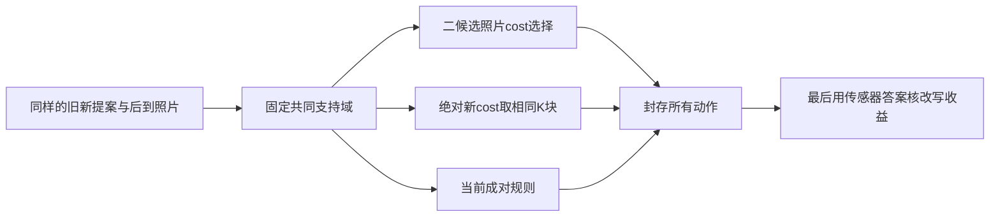

# S15B：配对几何改写的强近邻审查与判别对照

**结论：Reject and Pivot，拒绝把“用后到照片比较旧、新几何，误差降低才改写”本身定位为新方法。** 本轮检索找到更直接的已发表先例：DTAM已经在固定参考像素上逐帧累计深度候选的照片代价；DSO的作者代码明确比较修改前后能量并恢复失败修改。冻结候选、保留来源身份和延迟写入仍是正确实验设计，但单靠这些不足以确立新增机制。父任务继续的S15B真实运行应定位为**已有组件的信号探索**，不是该新方法的确认实验。

由 `s15b_mechanism_pressure_test` 编写，实际获取时刻和失败在 `work/S15B_literature/`。本任务只读原则、记忆、日志、技能、公开论文和公开代码文本；没有读任何实验RGB、GT或NPZ，也没有运行模型或更改研究主账。本文是在公开文献上辅助设计自有研究，不是代替正式会议评审。

## 第一印象与致命缺陷

原候选的单句主张是：冻结模型对固定来源像素的几何改写，利用后到实拍对新旧提案的相对照片误差作判断，再决定是否写入记忆。它属于计算机视觉实验方法，在当前定义下更接近**已有多视图代价选择在预训练状态模型上的应用**。

Supervisor `idea-evaluator` 的F1检测要求回答“相对最近工作增加了什么”，不能只组合已有机制。针对上述通用新方法主张，F1为**CRITICAL**：除提案由CUT3R提供、外部存档格式和有限观察窗口外，尚无区别于固定参考点的多假设照片评价与误差下降更新的机制。按技能早门规则，本报告不再补五维分数、范式探针或承诺式辩护。

这不是“本次真实数据已经推翻所有几何研究”；本任务没有看实验结果，也没有据未测试结果拒绝更广的研究方向。拒绝对象限定为上述新方法主张。所有后续观察问题必须另行明确问题和近邻，不以换名字挽救它。

## 五篇新增直接原始工作

以下五篇不重复S15已查Mostegel、Poggi、ConfidentSplat、Merrell、COVRAG。检索摘要仅找入口；技术判断来自实际打开或下载的正文。有限定点检索没有证明覆盖全领域。

| 原始工作 | 本次实际核实的机制位置 | 与当前候选的重叠和真实差别 |
|---|---|---|
| **DTAM: Dense Tracking and Mapping in Real-Time**，Richard A. Newcombe、Steven J. Lovegrove、Andrew J. Davison，ICCV 2011 | [作者PDF §2.2、Eq.2–3、Fig.3及§2.2.1](https://www.doc.ic.ac.uk/~ajd/Publications/newcombe_etal_iccv2011.pdf)：参考图像的同一像素对应多个逆深度，投影到重叠图像形成照片cost；新帧到达时更新cost volume，解出深度并加空间正则。 | **最直接重叠**：固定来源像素、后到图像、多个几何假设和选择较低照片代价。当前只有两份模型提案、使用Census及两时间组，并不使这种选择原则成为新机制。没有声称DTAM实现了本项目全部状态查询接口。 |
| **REMODE: Probabilistic, Monocular Dense Reconstruction in Real Time**，Matia Pizzoli、Christian Forster、Davide Scaramuzza，ICRA 2014 | [作者PDF §II-B Eq.2–5、§III-B](https://rpg.ifi.uzh.ch/docs/ICRA14_Pizzoli.pdf)：每个参考像素随后续视图更新深度与内点比例分布；依据方差和内点比例决定收敛、拒绝或继续观察。已下载原文并读取上述段落。 | 等待后续证据、按来源像素维护可信程度及不立即接受不可靠估计，均已有。区别是贝叶斯连续估计及三角化，而本项目采用两份固定模型提案；不能把普通延迟置信决策单列创新。原文独立观测假设也不能自动迁移为8张图统计独立。 |
| **Direct Sparse Odometry**，Jakob Engel、Vladlen Koltun、Daniel Cremers，2016预印本，后发表于TPAMI | [原文§2.3及§3](https://arxiv.org/html/1607.02565v2)维护参考帧逆深度并随新关键帧做照片误差优化；[作者源码 `FullSystemOptimize.cpp`](https://raw.githubusercontent.com/JakobEngel/dso/master/src/FullSystem/FullSystemOptimize.cpp)约444–481行比较新旧总能量、接受下降更新或恢复备份。 | **相对收益与回滚已有直接实现**。DSO是联合位姿/深度优化，候选是固定相机下模型给出的两份几何，两者不是完整同一系统；但“比较新旧再接受”不能当新机制。源码snapshot SHA见回执；master未成功解析commit，不冒称固定commit。 |
| **ElasticFusion: Dense SLAM Without A Pose Graph**，Thomas Whelan、Stefan Leutenegger、Renato F. Salas-Moreno、Ben Glocker、Andrew J. Davison，RSS 2015 | [正式会议PDF §II–III、Fig.2](https://www.roboticsproceedings.org/rss11/p01.pdf)：surfel维护初始和最后更新时间，较久未见部分转为inactive；重访成功配准后通过形变修正地图并重新激活。 | 旧地图重访、时序状态和验证后修正不是新增。其输入含RGB-D，修改依靠配准/形变，不是同来源像素的两份单目深度决策，因此只用于约束“首次提出修订旧记忆”的宽泛主张，不能拿其整机精度冒充同输入基线。 |
| **BundleFusion: Real-Time Globally Consistent 3D Reconstruction Using On-the-Fly Surface Reintegration**，Angela Dai、Matthias Nießner、Michael Zollhöfer、Shahram Izadi、Christian Theobalt，TOG 2017 | [作者PDF §5.1–5.3](https://vcai.mpi-inf.mpg.de/projects/MZ/Papers/arXiv2016_BF/paper.pdf)：保留原RGB-D及integrated/optimized两份pose，撤销原融入后按新pose重新融入；根据pose变化排序，在固定预算内处理更新。 | 原观测可追溯、修正历史贡献、保留旧新状态及预算化改写已有。它改的是相机引起的TSDF贡献，本项目改的是模型深度提案；这种对象差别仍需独立的问题价值与机制，不能仅称“可追溯几何记忆”便认定创新。 |

**重要来源细节：** DSO所读2016 v2论文写到其实验不需要Levenberg–Marquardt阻尼；当前作者代码具有 `lambda` 与accept/reject逻辑。本文将两份来源分开，不把现有代码细节误称该版本论文原句。ElasticFusion首次下载的是2016扩展版入口但失败；最终实际分析的是上述RSS 2015原文。BundleFusion一个作者站点在Web返回404，改用另一作者站点原文；错误保留。

## 最有判别力的同输入对照

父任务拟真实运行的12帧前缀、来源0/3/6/9和后到8帧只是明确的探索窗口。以下建议必须进入其冻结协议才成为执行规则；本报告不授权打开新答案，也不假定它们已经运行。

所有路线使用同样的旧、新候选、source frame/pixel、相机、灰度/Census、投影、共同有效域、角度桶、时间组和原始照片；所有照片代价同时算好。缺失条件不能因策略而变化，也不能用只被策略选中的块作为主评分分母。模型confidence对照也可以读取同样输入，动作仅用confidence，成本另列。

### 对照A：二候选照片cost选择，先检查代数等价

令共同样本上的旧、新照片cost分别为 `c_old(j), c_new(j)`，权重相同且固定。若策略采用均值，则：

```text
mean(c_old - c_new) > 0
    等价于 mean(c_new) < mean(c_old)
    等价于在 {old, new} 两候选中选择较低平均照片cost。
```

上述等价是代数事实，不需要真实数据验证。相同支持域和tie规则下，若程序输出不同，先查聚合、mask或数值实现，不把差异解释为新科学发现。它是DTAM代价选择思想的两候选组件对照，**不是DTAM整机复现**。

若当前规则用 `median(c_old-c_new)`，不能错误写成与 `median(c_old)-median(c_new)` 普遍相等。应分别保留：同权重均值二候选argmin、当前逐样本差的稳健聚合、每候选分别稳健聚合再argmin。两时间组各自必须赞成，与“全部样本平均赞成”也不同。这些差别可能来自稳健聚合或保守共识；本身不是已确认的动作因果机制。

### 对照B：改写数完全匹配的绝对新cost排序

这是当前最少必须有的强对照，用于区分“理解这次改写的收益”与“只选看起来可靠的新几何”。

1. 在完全相同的预先定义可比较块集合上计算候选策略的动作，总接受数为K；K只来自已到达RGB证据，禁止GT参与。
2. 对照只按绝对新cost由小到大排序，取前K块改写；并列按 `source_frame, block_row, block_col` 排序。其余保留旧几何，K=0时全部保留，K=总数时全部更新。
3. 为防止“候选只是多改/少改”解释收益，两条路线共有相同改写数。对照获得候选的K，是给对照额外便利的**匹配诊断**，不应被写成独立可部署策略或当作GT调阈值。
4. 同时保留预设固定比例的绝对cost排序完整曲线，避免只展示最有利K。但不得在看GT后挑一个比例作为主胜利结论。
5. 最终以传感器答案计算同一总体和逐来源/逐目标结果，报告正确改写、错误改写、保留但本可改善、缺失数及总收益；照片cost降低不能替代真实几何收益。

同样的匹配也适用于原模型confidence的排序。若配对策略没有胜过绝对新cost或confidence，不能声称它识别了“修改本身”才有的信息。若只胜过never/all-new仍不足；这两个端点通常过弱。固定0.5混合有助于检验收益是否仅来自两份预测的平滑，仍须报告其改变的动作语义。



## 本轮测量后最多保留的两个新研究问题

以下是可检验的问题，不是新方法、新颖性或论文级别声明；它们不阻塞当前推理与评分。

**问题1：在状态模型提出的大幅几何修改中，有多少真实改进或损害对允许的实拍证据不可辨？** 先利用同一冻结提案，列出实际投影位移、照片cost差、共同支持/缺失和最终几何收益的关系。需要区别三种情况：投影位移不足一个采样单元而离散照片评分完全相同；存在位移但纹理/遮挡使两份cost接近；证据明确支持一个候选却与传感器收益相反。第一种是测量分辨率，第二种是观测可辨识性，第三种是代理误导。不要给“接近”临时调门槛：优先报原始连续值、严格相等及固定采样单元界限。若真实改写收益几乎都被普通照片cost解释，则这个问题的新增价值有限。当前几何子集只能生成探索线索，后续需另立跨轨迹/纹理/视差的系统干预与最近工作调查。

**问题2：几何指标改善何时会损害固定来源照片的后续支持/选择？** 在相同source身份和未来相机下，区分“深度数值更接近GT”“投影中的遮挡顺序/胜出source改变”和“固定四图消费者得到的真实支持变化”。当前保存两套几何可以先量前两项；只有另行运行并冻结同候选池、同输出四张、同NMS的消费者后，才有第三项答案。若消费者收益完全由普通深度误差或覆盖解释，就无需新目标函数；若存在稳定的反向例子，才有理由研究目标定义。S15B目前不产生视频或检索收益结论。这是世界模型记忆的任务有效性问题，不能把“延迟改写”重新包装成答案。

## 博士/高水平会议目标怎样落地

[CVPR 2026公开评审指南](https://cvpr.thecvf.com/Conferences/2026/ReviewerGuidelines)同时强调技术可靠、知识增量、新颖性和潜在影响；没有“刷到SOTA才有价值”的唯一标准，也要求指出重叠时给具体来源。因此本项目应追求一个有用问题、可复查反例、最强相关对照和机制解释，不能用审查次数、agent数、日志长度或一次数据集差值替代贡献。本轮不核定CCF目录版本，不声称已达到CCF A、不保证导师反应或录用。

## 技能执行与回执

- 阅读并执行 `/Users/rocket/.codex/skills/idea-evaluator/SKILL.md` 和 `references/fatal-flaws.md`：以三组关键词找原始工作，明确对象/机制差异，F1 CRITICAL后短路，不补分数。根任务已接收拒绝新方法定位，继续真实组件探索。
- 阅读并应用 `/Users/rocket/.claude/skills/sci-scientific-critical-thinking/SKILL.md`：照片cost作为代理的构念效度、共同支持域和改写率的混杂、单时间段的外部效度、后验阈值/指标挑选偏差。示意采用可编辑Mermaid；没有调用Claude模型、CLI或外部生图服务。
- 使用Web原文、Python标准库HTTP、rg、pdftotext和SHA。第一次批量下载3个TLS错误、DSO commit API解析失败及Web超时/404均原样保留；论文正文采用成功获取的原始副本。下载成功不等于运行过对应算法。
- 文献实际HTTP响应主要发生于2026-09-06 UTC 10:14:08–10:15:20；这是本任务下载事件范围，不能写成用户投入工时。完整逐请求时刻在回执。报告生成时刻另记 `receipt.json`。

