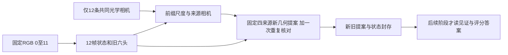

# S15B 前缀与来源几何提案接口

这是已见 TUM S8 block 0 上的受控信号探索代码准备，尚未执行这次真实模型运行，不证明新方法或泛化。S14E、S15A 成功档案保持。本阶段比较固定来源相机下的旧 self-z 和冻结12帧状态给出的新 self-z；光度代理、传感器评分、外部记忆写入属于后续单独封存的阶段。

## 固定输入与调用

```sh
.venv-cut3r/bin/python scripts/run_s15b_prefix_proposals.py --manifest /absolute/new-manifest.json --output /absolute/new-directory
```

真实运行应由已审阅的 `scripts/run_s14d_controlled.py` 外部监控执行，600秒、32 GiB RSS。监控器历史名称与schema不代表重跑S14D；这里是新的12帧条件和来源查询。输出目录必须不存在，失败目录保留。CPU 8线程、seed 0、FP32；保留既有官方内部RoPE类型转换。不下载权重、不训练、不产生视频。

Manifest：

| 字段 | 固定内容 |
|---|---|
| `schema` | `s15b-prefix-proposals-manifest-v1` |
| `repo`, `commit`, `python` | 原固定官方checkout、`8bc15dc92a6d7fd92920b4ec81540d3dec7d3ecf`、模型venv绝对路径 |
| `runner`, `checkpoint`, `rope_check` | 新runner、已有224 linear权重、已有签名RoPE检查 |
| `camera_inputs` | 下述仅12条given optical c2w的JSON |
| `history_images` | 恰好12项 `{index, path, sha256}`，index 0…11，原RGB绝对路径不重复 |
| `control_files` | 可选、独立列出的冻结MD/JSON/Python控制文件 |
| `identities` | 上述12 RGB、相机JSON、权重、RoPE检查、adapter、新runner、99份官方Python源码及control_files的精确路径/SHA全集 |
| `contract` | 直接复制runner的`EXPECTED_CONTRACT`；必须与每个实现固定值完全一致 |

身份列表不接受额外NPZ、NPY、见证照片、目标照片或原始`groundtruth.txt`/`rgb.txt`/`depth.txt`。模型构造维持既有weights-only与scoped OmegaConf globals；禁止unsafe-loader环境覆盖。输入/源码运行前后都作流式SHA，这会读取允许RGB和权重字节，不能说“未读字节”。模型执行才实际解码12张640×480 RGB，官方 `load_images(size=224)` 正常处理299×224 resize和224裁切一次；禁止见证12…19、目标20…23和任何sensor depth解码。

相机JSON的必需字段：

```json
{
  "schema": "s15b-prefix-cameras-v1",
  "history_rgb_paths": ["12个与manifest顺序完全一致的RGB绝对路径"],
  "history_rgb_sha256": ["12个相同顺序的SHA"],
  "history_timestamps": ["12个实际RGB浮点时间，严格递增"],
  "gt_c2w": ["形状12×4×4、有限、光学camera-to-world矩阵"],
  "K": [[245.2734375, 0, 112], [0, 245, 111.5], [0, 0, 1]],
  "source_indices": [0, 3, 6, 9],
  "pose_time": "rgb",
  "coordinate_frame": "TUM optical camera-to-world",
  "units": "meter"
}
```

上面是字段说明，并非可直接运行的实际数据文件。root从允许轨迹元数据生成真实12个RGB时刻pose并封存；runner不重新读完整轨迹、不使用见证或目标pose拟合。可在JSON另附只含来源身份/生成规则的文本元数据，不能夹带深度或额外图像数组。

## 模型和坐标定义

先用12 RGB执行一次官方 `inference`，得到12×6官方头和13个时序state快照（初始+12次吸收）；保留最终五字段。一次image encoder批处理包含12帧；原官方分支还执行一次内部零dummy ray编码，贡献被乘零。它不是来源查询。

只以这12帧的GT光学pose `G_i` 和官方预测pose `P_i` 拟合：

```
A = R_P0 R_G0^T
u_i = A (g_i - g_0), v_i = p_i - p_0
D = sum_i ||u_i||², N = sum_i u_i · v_i
s = N / D                      # model units per meter
c = p_0 - s A g_0
R_given_i = A R_Gi
t_given_i = s A g_i + c
```

`D>1e-12`且s有限为正，否则失败，不能取绝对值、截断或改用倒数。rotation绝对容差1e-5，translation/rotation roundtrip绝对/相对容差1e-5。保留12帧位置残差、尺度、朝向残差与退化信息；这不是GT深度拟合。

四个来源恒定为0、3、6、9。**旧self-z和新self-z都用对应aligned given optical camera及同一K定义物理pinhole点**，均除同一个s转为米。原预测xyz三个分量仍完整保留；下游不能擅自拿旧xy和新pinhole xy混作同一控制。给定相机是共同输入，不称纯RGB未知相机算法。

网络条件从固定官方 `viser_utils.py::PointCloudViewer.get_ray_map` 提取纯NumPy方法：`ro=t; rd=normalize(R K^-1 p + t)`。它与标准物理方向 `R K^-1 p` 的定义不同，不能自行“纠正”。来源物理构点仍使用标准pinhole。保存提取的原方法文本、4个224×224×6 float32 rays与对应float64 c2w/K。

来源查询顺序固定 `[0,0,3,6,9]`。每次 `img_mask=false, ray_mask=true, update=false, reset=false`，dummy image为零，`idx=source`与`instance=s15b_source_<source>`。前两次输入的所有值、索引、instance都相同；重复首query计入总5次真实查询预算。第二次须六头shape/dtype/连续字节SHA及逐元素都与第一次相等，之后才查其他三来源。每次从同一冻结12state调用 `inference_step`，五字段hash必须不变；query image encoder必须0，ray encoder必须5。



## 输出与下游读取

| 文件 | 内容 |
|---|---|
| `predictions.npz` | `frame0_`…`frame11_` × 六官方头，72数组 |
| `history_poses.npz` | `history_pose_encodings` 12×7 f32、`history_poses` 12×4×4 f32 |
| `state.npz` | `state_feat, state_pos, init_state_feat, mem, init_mem`五字段 |
| `alignment.json` | 12帧forward-OLS A/s/c、残差和固定边界 |
| `proposal_inputs.npz` | `source_indices`、`source_poses`、`K`、`ray_maps`、`old_self_z_model`、`old_self_z_m`、`old_conf_self`、`gt_history_poses`、`aligned_history_poses`、`s_model_per_metric` |
| `query_call_0.npz`…`query_call_4.npz` | 每次完整六官方头，包括重复首query |
| `query_outputs.npz` | 同5次全部30数组，键`call0_`…`call4_` × 官方头 |
| `proposals.npz` | 固定四来源的旧/新self-z（model、meter）、旧/新conf_self、正深度mask、同一source_indices/c2w/K/s |
| `state_after_queries.npz` | 5次查询后的同五字段，必须逐字节不变 |
| `run_metadata.json` | 状态、实际UTC/耗时/RSS、读取记录、精确调用计数、各数组schema/hash、文件hash、失败traceback |

六头为 `pts3d_in_self_view` / `pts3d_in_other_view` / `rgb`（1×224×224×3 f32），`conf_self` / `conf`（1×224×224 f32），`camera_pose`（1×7 f32）。这里的rgb头是模型预测，不是实拍。

五state字段shape/dtype沿用S15A：state_feat/init_state_feat 1×768×768 f32；state_pos 1×768×2 int64；mem/init_mem 1×256×1536 f32。未做confidence筛选或sensor深度评分；有限性是完成门槛，非正z原样保留并统计，不抹去。来源像素身份为固定224×224栅格行优先 `source_pixel=row*224+col`，新旧两候选完全同域。

返回的原始头与state先保存，再检查有限性/语义；query失败也保留已返回文件。成功后root还须封存mutable metadata与全部输出，之后才能读见证或GT；runner自己不读取那些答案、不发起后续任务。

## 已完成的软件检查与技能执行

`work/S15B_prefix_preparation/round2/receipt.json`记录50项人工数据检查；初轮44项回执与人工数组仍保留。覆盖精确输入数量/身份、禁止额外图像和NPZ、相机时序/光学旋转/NaN、forward-OLS尺度与负/退化失败、与另一分量公式一致的官方ray、12帧72头保存、5次查询与六头parity、五state不变、无图像encoder、失败原输出保留。它们没有真实图像解码、真实模型实例、真实NPZ/trajectory/权重读取；Torch是用于人工张量，并非CUT3R运行。此前真实实验没有重跑。

按Supervisor `vibe-research-workflow` 的coding步骤先给接口，再按root已确认坐标定义实现，使用小步骤、明确边界、保留失败与可追踪输入。按本地Claude `sci-scientific-critical-thinking` 的实验设计/构念效度要求控制source与相机混杂、区分软件检查与效果、保留已见探索限制。没有调用Claude模型或CLI。学术责任、私人阅读/理解确认和投稿披露没有被假称完成；主张原创性由独立文献/机制审查负责，本代码不是创新证明。
