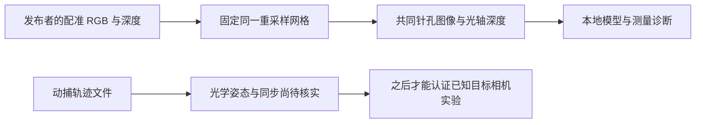

# S15 Bonn 标定与坐标接口核查

结论：**可以按明确假设实现共同针孔图像网格；尚不能把 Bonn 的 `groundtruth.txt` 直接认证为 S14E 所需的光学相机 c2w。** 这不会阻止新来源数据适配，但需要区分“图像/深度适配”和“已知目标相机条件实验”。本轮只查文献、官方源码并跑人工代数检查，未读候选包的 RGB、depth、groundtruth 成员，未运行模型。

实际访问和检查时间见 `work/S15_calibration/receipt.json`；人工检查实际为 UTC 2026-09-06 09:43:12.872302—09:43:12.901412。主任务另行获取元数据，本报告不代它声称数据下载或检查完成。

## 1. 证据分级与技能应用

已读 `AGENTS.md`、`RESEARCH_PRINCIPLES.md`、`RESEARCH_MEMORY.md`、最新日志及 S14 两份 Bonn 来源/目录核查。实际应用本地 Claude `sci-scientific-critical-thinking/SKILL.md` 的测量有效性、混杂和主张强度审查，以及 `references/experimental_design.md` 的先固定输入和主要指标要求。不调用 Claude 模型。本文已有下方 Mermaid 接口图，人工参数计算比生成示意照片更适合本次工程核查。

证据分成：发布者明确说明、作者源码实际行为、本文由数学推导的实现、尚未实测的假设。网页能下载和 7 个程序检查通过，都不是新来源预测准确的证据。



## 2. 图像与深度的可执行约定

官方给出配准声明与 RGB 参数：

```text
K_native = [[542.822841, 0, 315.593520],
            [0, 542.576870, 237.756098],
            [0, 0, 1]]
d = [0.039903, -0.099343, -0.000730, -0.000144, 0]
```

发布页没有用一句明确的话证明 PNG 是否已经去畸变。**将 d 按 OpenCV `(k1,k2,p1,p2,k3)` 使用，并将配准 PNG 视为该 RGB 有畸变网格，是建议固定并检查的适配假设，不应写成已实证的文件事实。** [Bonn 官方发布页](https://www.ipb.uni-bonn.de/data/rgbd-dynamic-dataset/)

给定上述假设，RGB 与已配准深度必须使用同一个 map。`R=I`、输出 `K_new=K_native`、640×480 全图，不根据成绩使用 optimal K、ROI 或另裁边：

```python
mx, my = cv2.initUndistortRectifyMap(K, d, np.eye(3), K,
                                    (640, 480), cv2.CV_32FC1)
rgb_u = cv2.remap(rgb, mx, my, cv2.INTER_LINEAR,
                  borderMode=cv2.BORDER_CONSTANT, borderValue=0)
depth_u = cv2.remap(depth_uint16, mx, my, cv2.INTER_NEAREST,
                    borderMode=cv2.BORDER_CONSTANT, borderValue=0)
```

这是从每个**输出针孔像素**找原始有畸变像素的逆采样。map 的坐标由 Brown–Conrady **正向畸变**计算：令 x=(u−cx)/fx、y=(v−cy)/fy、r²=x²+y²，a=1+k1r²+k2r⁴+k3r⁶；原图采样位置为 `fx*(x*a+2*p1*x*y+p2*(r²+2*x²))+cx` 和对应 y 式。不是把畸变系数简单取负，也不对现成配准深度再用 IR 内参。[OpenCV 相机模型及参数顺序](https://docs.opencv.org/4.13.0/d9/d0c/group__calib3d.html)

固定光学约定：数组 `[v,u]`，像素中心为整数 u/v，u 向右、v 向下；相机 X 向右、Y 向下、Z 向前。深度 `z = uint16/5000` 米、0 无效；`X=(u−cx)z/fx, Y=(v−cy)z/fy, Z=z`，不是沿单位射线的欧氏距离。边界 0 继续无效，不能用颜色黑色来判断深度无效，也不把临近无效深度与有效值线性混合。Bonn 格式引用 TUM；作者读取程序也直接除以 5000。[作者 fr_parser.cpp](https://github.com/PRBonn/refusion/blob/master/src/example/fr_parser.cpp) · [TUM 格式定义](https://cvg.cit.tum.de/data/datasets/rgbd-dataset/file_formats)

若后续使用 CUT3R 的 224 入口，在上述全分辨率 remap 后按固定 299×224 resize、`[37,0,261,224]` crop，并按**像素中心**换 K：

```text
fx_224 = 253.60004602968752
fy_224 = 253.20253933333333
cx_224 = 110.174941375
cy_224 = 110.68617906666667
```

公式是 `f'=s*f; c'=(c+0.5)*s−0.5−crop_offset`，x/y 的实际 s 分别 299/640 与 224/480。RGB 线性 remap 后的 resize 插值需在主合同与模型 loader 一致固定；深度 resize 仍 nearest。主合同还应固定插值库版本、边界和 mask，并保存像素映射。若 PNG 实测尺寸不是 640×480，停止当前 K 合同，不能静默 rescale 后继续。

**实现可行不等于输入语义已证明。** 作者示例 `example.cpp` 使用 ROS 默认 525/319.5/239.5，其 parser 不去畸变，不能由这个示例反推标定网页是错的，也不能声称它验证了上述 remap。它只说明旧基线代码不是适合我们直接复制的校准依据。[作者示例](https://github.com/PRBonn/refusion/blob/master/src/example/example.cpp)

## 3. 轨迹：真正未解决的是光学姿态，而非文件列格式

官方脚本清楚表明 7 位 pose 的列顺序为 `tx ty tz qx qy qz qw`，四元数转 R 后以 `[R,t]` 构矩阵。完整 TUM 记录前面另有秒级 timestamp。脚本自带一行公开示例位姿，本轮读取了该**文档示例**，没有读取 `static_close_far` 的真实轨迹成员。[官方转换脚本](https://www.ipb.uni-bonn.de/html/projects/rgbd_dynamic2019/compute_global_transformation.py)

官网用于重建模型对齐激光参考的关系是 `Tg=Tros^-1*T0*Tros*Tm`，其中 Tros 为动捕坐标写出变换，Tm 将传感器参考系接到标记参考系；这与“文件的每行就是 RGB 光学 c2w”并不等价。官方脚本只计算第一帧的模型到全局变换，没有给一个经过核验的逐帧光学姿态导出器。[Bonn 评估说明](https://www.ipb.uni-bonn.de/data/rgbd-dynamic-dataset/)

本轮对**公开常数**实算：Tm 的 3×3 奇异值为 `[1.0593475514,1.0592862342,1.0592375746]`，det=1.1886258577，`max(abs(M.T@M−I))=0.12218811`。因此它不是纯旋转；不能直接放进要求 SO(3) 的 S14E camera pose、用转置当逆或暗中 SVD 修正。其接近统一尺度的性质是数值发现，不是已核实的深度缩放说明。Tros 自逆且 det=1，仅它本身是合法旋转。

公开 issue #14 报告直接用 Bonn GT 拼点云不齐；作者成员 jbehley 指回网页，后续用户怀疑时间对齐，但没有解决回复。因此：**不能把用户猜测写成官方确认的时间偏移，也不能由仍开放的 issue 断言数据坏了。** 本轮成功读取 API 中三条完整评论。[作者仓库问题及评论](https://github.com/PRBonn/refusion/issues/14#issuecomment-1881053257)

若推导一个候选公式 `G_i=Tros^-1*T_i*Tros*Tm`，必须先明确 T_i 是何物体坐标、Tm 的尺度含义和 timestamp 同步；官网只为首帧模型到激光给出此链，把 i 任意推广是**推断**。在澄清前，不用它给“真实目标光学相机”盖章，也不把对目标 depth 试多个坐标式、挑分数最高者伪装成标定。

## 4. 时间与最低实际核验

可预定 `timestamp` 秒、RGB/depth 各自列表和独立时间戳，不能把行号当同步。目标 depth 评分以目标 depth 时间定义相机；历史 RGB 推理以 RGB 时间定义。轨迹插值应禁止外推，平移线性、单位四元数最短弧 SLERP、明确最大 gap；已有 S14E 的 0.1 秒上限可作为预定工程条件，但不是 Bonn 发布者对同步误差的保证。RGB-depth 配对与允许差值、采样窗、GT 缺失处理都要在看成绩前冻结。

后续适配块的有效用途是核文件尺寸/类型、单位、时间覆盖、无效值和接口残差。适配块一旦看过标签/图像或用来选相机规则，就登记为适配数据，不再冒充测试留出。若要从图像/轨迹自行估计手眼外参，必须另定校准方法和新留出块，不能让 4 个测试目标帮忙纠正姿态。

当前可继续的路径：

1. 根负责有界获取三个文本成员，核时间和列格式，完整保留下载与访问记录；这一步不需要光学姿态问题先全部解决。
2. 固定独立适配块，按上述声明的同网格假设做 RGB/depth 接口检查。需要后续原始采集说明或独立校准证据来提高“原网格未去畸变”的可信度。
3. 若光学 pose 仍无直接依据，可以先做**新来源观测视图深度诊断**：每个被测 RGB 明确作为模型输入；尺度规则在允许的历史校准数据上固定，目标 depth 保持评分隔离。它是新来源测量，不是没有目标照片的 ray-only 生成实验。
4. 要延续 S14E 的真实已知相机 ray-only 质量实验，先完成逐帧光学 pose 与时间接口核验；不要用未核实链产生漂亮但无法解释的分数。

Bonn 作为新的采集来源可以登记，无须无限追查房间街道地址。物理房间关系、完整预训练接触仍 UNKNOWN；本轮不把 26 序列算 26 个独立房间。这些泛化边界与上述坐标实现问题分别记录。

## 5. 已实际运行的人工几何检查

执行命令：`.venv-cut3r/bin/python work/S15_calibration/artificial_geometry_checks.py`。NumPy 1.26.4、OpenCV 4.11.0；源码和结果 SHA 见回执。没有修改旧协议，也没有跑真实模型。

| 检查 | 实测结果 |
|---|---|
| 手写 Brown 全图 map 对照 OpenCV FP32 map | 最大差 0.0000305175356 像素；预定 0.00004 容差内 |
| 零畸变输出恒等映射 | 最大差 5.25e−14 像素；预定 1e−5 容差内 |
| nearest 对人工离散深度标签与无效 0 | 只保留输入标签，没有插出混合深度 |
| 2.5 米人工正对平面 | 有效输出 Z 仍 2.5 米；角落欧氏距离不同，避免混用距离定义 |
| 半像素 resize/crop 对针孔射线 | 最大误差 1.11e−16；预定 1e−12 容差内 |
| 公开 Tm 刚体检查 | 正确拒绝其作为 SO(3) 旋转，保存奇异值和行列式 |
| 公开 Tros 检查 | 自逆且 det=1 |

上述参数在 640×480 网格上的最大重采样位移为 3.844125289 像素；这是**参数代数诊断**，不是观测到的照片畸变误差。7 项都通过只证明我们的代数/库接口一致，不能确定现实传感器和网页参数一一匹配。无失败的真实模型实验被隐藏；本轮未运行真实实验。

访问问题完整保留：首次官方脚本 SSL EOF，重试成功；首次 GitHub issue 评论 SSL EOF，重试成功；OpenCV HTML 原生 HTTP 403，web 工具成功读取官方文档并保存官方 4.13.0 头文件作为固定源码依据；web 对 Python 内容类型不支持，改用普通 HTTP 获取。不是科学假设失败，也没有绕过账号权限。
