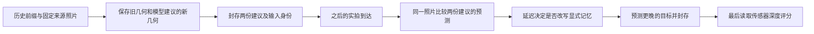

# S15：先验证旧记忆的预测，再决定是否改写几何

本轮结论：**普通“历史一致性→置信度→模型/重投影混合”版本不作为新方法推进；保留一个范围更窄的延迟几何改写候选，先做可推翻的组件诊断。** 严格时间前缀、无目标深度和多角度去重本身都已有先例。当前没有新算法结果、未见数据评分或新颖性认证。

本报告由 `s15_novelty_mechanism` 子任务编写。只读取项目原则、已完成报告、技能及公开原文；没有打开任何实验NPZ、RGB、目标深度、未见场景数据或运行模型。准确下载时刻、SHA、失败与工具检索原文在 `work/S15_novelty/`。主账由父任务统一维护。

## 已知事实与问题边界

[S14E](S14E_RESULTS.md)已在本机真实执行：已有CUT3R在S8 block0四个已见目标上的等query深度δ1为93.0974%，20历史点云重投影为85.8008%；共同有效域MAE也更低。这只说明该模型在这四个目标上的结果有用，不能作为我们的新增机制得分。S14C已否定的粗历史分散假设继续停止，不调阈值挽救。

下一问题是：模型建议修改一块历史几何时，能否用**后来实际到达、在建议生成时尚未输入模型的照片**检验这项修改，只有获支持的修改才影响之后的显式记忆？后续照片在检验发生时已属于历史；真正待预测的最终目标照片和传感器深度始终不可进入方法。

“一致”只是间接线索。重复纹理、遮挡、位姿误差、非刚体运动和同一网络的共享偏差都可能让线索误导；必须用最终独立于动作决策的测量评价。

## 三组定点检索与五篇直接近邻

实际关键词包括：G1 `online self supervised depth / confidence / memory / prequential`；G2 `multi view stereo / correlated errors / independent observations / uncertainty fusion`；G3 `geometry memory / counterfactual / deferred validation / depth fusion`。完整14条查询逐字记录在回执；搜索摘要只用来找入口，以下方法判断来自已打开正文或下载的作者原文。没有用搜索未命中证明首创。

| 原始工作、作者、年份 | 实际读取位置及既有机制 | 约束与可区分轴 |
|---|---|---|
| **Using Self-Contradiction to Learn Confidence Measures in Stereo Vision**；Christian Mostegel、Markus Rumpler、Friedrich Fraundorfer、Horst Bischof；CVPR 2016 | [原文§3.1–3.3](https://arxiv.org/html/1604.05132v1#S3)：同算法多视角的支持/矛盾产生弱标签；明确讨论相近视角误差相关，按观察角度分桶，避免单一方向重复投票。作者PDF已下载，正文也已交叉核对。 | “独立视角支持数”“角度去重”“自由空间矛盾”不是新增。候选必须区别于既有静态多图投票：拟作用于提前冻结的**具体改写动作**，由之后的原始照片验证相对收益。差异存在不等于贡献成立。 |
| **Self-adapting confidence estimation for stereo**；Matteo Poggi、Filippo Aleotti、Fabio Tosi、Giulio Zaccaroni、Stefano Mattoccia；ECCV 2020 | [作者PDF§3.2、§4.4](https://mattpoggi.github.io/assets/papers/poggi2020eccv.pdf)：光度重投影、邻域一致与唯一性产生自监督信号；在线实验先预测/评价confidence，再算loss，更新只影响之后的帧。官方[代码入口](https://github.com/mattpoggi/self-adapting-confidence)核实书目。 | 无GT在线置信学习与先预测后适应已经存在。候选区别不能只写“prequential”；必须检验**旧几何与新几何的配对动作差**是否超出单个预测的置信学习。 |
| **ConfidentSplat: Confidence-Weighted Depth Fusion for Accurate 3D Gaussian Splatting SLAM**；Amanuel T. Dufera、Yuan-Li Cai；2025 v1预印本 | [§III-C Eq.4–7](https://arxiv.org/html/2509.16863v1#S3.SS3)：按邻接关键帧几何一致计数得到多视角权重，单目权重取补数，线性混合深度后监督地图。 | 普通model/warp置信混合已有直接先例。本文只据方法公式判断重叠，不背书该预印本效果或完整复現；其自称SOTA与本文无关。拟动作是保持来源身份的离散记忆改写，仍须胜过相同信息的这类混合组件。 |
| **Real-Time Visibility-Based Fusion of Depth Maps**；Paul Merrell、Amir Akbarzadeh、Liang Wang、Philippos Mordohai、Jan-Michael Frahm、Ruigang Yang、David Nistér、Marc Pollefeys；ICCV 2007 | [作者原文§4.1–4.2](https://paulmerrell.org/wp-content/uploads/2021/06/Merrell_DepthMapFusion07.pdf)：逐一测试深度候选的遮挡/自由空间稳定性，另一个版本先置信融合再核支持。§3还以两侧照片的光度cost比较深度假设。 | 多假设验证、先融合后检查、光度比较都不是新增。拟差别须落在冻结模型建议的时间边界、相对既存记忆的具体改写及不变来源关联；这些仍可能只是旧方法的应用变化，须由同信息组件对照决定价值。 |
| **Retrieve What’s Missing: Coverage-Maximizing Retrieval for Consistent Long Video Generation（COVRAG）**；Minseok Joo、Dogyun Park、Taehoon Lee、Kyujin Lee、Hyunwoo J. Kim；2026 v1预印本 | [§4.1–4.3](https://arxiv.org/html/2606.02479v1#S4)：预测深度投影的any-hit覆盖、残余覆盖贪心、滑窗缓存历史深度。 | 目标覆盖、去除空间冗余、缓存本身不是新机制。几何改写须在相同来源照片、候选池、输出数、NMS和覆盖算法下改变可验证结果；不能多给候选或放松预算。 |

另外，已读[CUT3R官方项目State Analysis与Method Overview](https://cut3r.github.io/)：Qianqian Wang、Yifei Zhang、Aleksander Holynski、Alexei A. Efros、Angjoo Kanazawa（CVPR 2025）已有在线状态、revisiting、虚拟视角查询和随新观测修正先前解释，不能重命名为本项目创新。已有[S14D近邻报告](S14D_TARGET_VIEW_NEAREST_METHODS.md)核实COLMAP/MVS前后向一致性与I3DM置信覆盖，它们继续是强基线。以上是有限近邻审查，不能断言覆盖了所有在线地图更新工作。

## 候选1：历史前缀自验证后做confidence gating或混合

### 第一印象

这是已有方法的新组件应用版本。精确定义可以是：在时刻t输入RGB之前，用状态 `S_(t-1)` 和给定相机得到ray深度 `D^r_t`，同历史得到warp深度 `D^w_t`；冻结后，当前实拍 `I_t` 到达，用相同来源照片及相机分别重投影，记录两条路线光度误差。只用以前已到达照片的误差拟合一个门控，之后按该门控选择或混合ray/warp。主目标RGB和传感器深度均不参与门控。

### 致命缺陷早门

| 缺陷 | 级别 | 依据 |
|---|---|---|
| F1：新增贡献仅是已知自监督置信、先预测后适应和置信融合的组合 | **CRITICAL，针对上述新方法主张** | Supervisor要求能用一句话指出相对最近工作的新增内容。Poggi §4.4已明确时间顺序，ConfidentSplat已有几何/先验融合，Mostegel已有角度去重；该版本没有隔离更具体的新机制。 |

### 结论

**Reject and Pivot。** 不继续给这个版本打五维高分，也不靠换名或增加一个阈值挽救新颖性。它仍是必要且有用的组件基线和测量工具；写程序验证可用性不等于将其立作论文贡献。其失败/成功都不能自动判定下一个不同动作机制的结果。

## 候选2：由后续实拍验证具体几何改写，保留来源身份

### 1. 第一印象与唯一新增主张

定位为**New Setting中的方法候选，未确认新颖**。不直接学习“模型大概可信多少”，而是在显式记忆的一块固定来源区域上，提前保留旧几何和模型给出的新几何；后来真实照片到达后比较**这一次改写相对保留原状的收益**，延迟决定是否修改。模型权重和CUT3R隐式状态更新规则保持原样；修改对象是外部带 `source_frame/source_pixel` 的几何存档，原RGB身份、颜色和索引不改。

### 2. 可实现的最小操作定义

下面是一份可实现的**设计草案，尚非冻结执行协议**。推荐先用已有场景作软件/信号探索，再在父任务另行固定的新场景上评价；不得用本报告授权读取新目标答案。

1. **固定提案。** 20历史帧中，在只吸收0…11之后保存状态。固定四个来源帧 `s={0,3,6,9}`，将每个来源图划为不重叠16×16块。旧候选 `X_old(s,p)` 来自该来源首次观测时存档；新候选由同一个12历史状态在来源相机处ray查询得到self-z，再按标准pinhole变换为 `X_new(s,p)`。两候选用同一提前冻结的坐标/历史尺度；不逐块或逐目标拟合尺度。不把两个预测head强作刚体等价。
2. **提案先封存。** 保存两套XYZ、原图/像素身份、状态hash、允许输入清单。之后才解码历史12…19的实拍作为见证。这8张在提案时是未来，到最终目标20…23预测时才是已获历史。
3. **同源成对照片残差。** 固定灰度转换和5×5 Census（24个非中心比较位），用新旧XYZ分别投到同一见证相机。对同一来源像素p定义 `c_h(s,t,p)=Hamming(Census(I_s,p),Census(I_t,nearest(project_t(X_h))))/24`，`h∈{old,new}`；两个落点都在允许图像范围时才有成对观测。`Δ=c_old−c_new` 为改写的照片支持差。几何输出必须在 `I_t` 被读取前冻结；不能用吸收 `I_t` 后的CUT3R深度作独立答案。Census只减轻部分亮度变化，不是深度真值。
4. **观测来源与缺失。** 按原始RGB文件身份去重；重复查询同一份RGB不新增证据。分别记录唯一RGB数、观察角度桶数、共同模型前缀以及每块有效像素数。按Mostegel已有10°角度分桶，每桶最多贡献一份块内/桶内中位差；不把几十个同源预测当几十份独立测量。见证时间分为固定的12…15与16…19两组，必须两组各有至少一份有效桶支持，且合计至少两个不同角度桶。没有满足条件就保留旧几何；不能把缺失记为一致或成功。
5. **单一预定动作。** 两个时间组的桶中位 `Δ` 都严格大于0时，该块采用新候选；否则保持旧候选。没有扫描阈值，也不输出线性平均。原来源照片/像素索引保持不变。该零阈值和分组只是明确可推翻的起点，不是已经校准的安全保证；执行前要固定tie、边界、灰度、离散化和缺失细则。
6. **更晚的独立评价。** 吸收允许的20历史之后，对最终目标20…23的输出/选择封存，再读取这些目标的传感器深度。先评价显式memory几何和重投影，只有通过后才进入四图检索消费者实验。不能把几何变动当成选图或视频已改善。

该规则的作用是防止新几何仅因与自身共享状态的预测一致就覆盖旧几何。它**不能**从依赖结构得到真实误差相关系数：不同RGB、不同角度、不同时间组仍可能共享纹理、位姿和网络误差。这里最多说“有效来源记录/去重后的观测组”，不得叫“统计独立样本数”或宣称概率风险保证。完全无纹理区域可能长期没有可判别线索；不能为了让算法激活去删除困难目标。

### 3. 致命缺陷早门

| 缺陷 | 级别 | 防御与当前状态 |
|---|---|---|
| F1：可能仍等价于既有稳定性融合、动作门控或视图一致性过滤 | MAJOR，可修但未解除 | 相对已有方法的差别是提前冻结的旧/新几何**配对动作**、后到原始RGB、延迟写入和不变来源关联。Merrell原文已补读；必须在完全相同提案/见证/预算下实现其稳定性思想的组件对照。如果普通一致性或绝对confidence解释全部增益，就停止新增机制主张。 |

当前机制没有新数据结果，不能按“数据已经反驳”处理；但S14E的模型优势也不能转移给它。照片代理可能错误、遮挡混杂和独立样本不足是测量/可行性限制，已在方案和停止条件里处理，不隐藏在创新措辞下。

### 4. 生命周期、能力与五维

类别是收窄的应用研究；Supervisor通用生命周期参考3—6个月不是项目完成保证。用户自述新手，M3 Max/64GB、暂无远程GPU；每周实际有效工时、理论熟练度和导师讨论频率未知，不能编造能力分或学生投入小时。先做固定组件，完整视频、新理论和多场景论文不同时承诺。

所有分数从5起调，只评该未验证机制。

| 维度 | 分数 | 明确依据 |
|---|---:|---|
| Higher | 6 | 机制推测：成对比较对准“修改是否更好”而非绝对置信；但照片残差未必与真实深度收益同向，待最小实验。 |
| Faster | 3 | 明确增加四次来源ray查询、两套投影和延迟，暂无节时依据。 |
| Stronger | 7 | 机制推测：冻结建议与后到原始照片可减少自我确认；相对改写证据有望减少错误覆盖。共享错误、遮挡和偏移仍可能击败它，尚无实测支撑。 |
| Cheaper | 5 | 不用人工新标注有可行性，但相对已有自监督方法无额外省钱依据。 |
| Broader | 5 | 目前只限带来源的显式几何记忆，跨模型或视频收益没有依据。 |

主要轴为Stronger，Higher次之。范式探针：第一原则Partial（挑战本项目“较新的模型几何应立即覆盖旧值”）；新技术窗口Partial（可直接查询预训练状态）；长期被回避的大问题No；成功是否改变领域优先级No。合计2/8，是增量候选，不包装范式革命。

### 5. 与四类普通机制的判别

| 对照 | 必须共享的条件 | 候选独有待检验内容 |
|---|---|---|
| 普通confidence gating | 同新旧候选、同历史/见证RGB、同相机、同计算记录；按新候选绝对照片残差或原模型confidence决定改写 | 成对的“新减旧”是否比绝对质量多提供信息；不是多看了见证图 |
| 历史MVS一致性及Mostegel角度去重 | 同来源、相机、提案和见证；同角度桶/缺失处理 | 原始见证照片的提前预测差，是否超出预测几何间的支持/自由空间检查 |
| model-vs-warp blending | 同输入和两候选，固定0.5混合及固定一致性权重组件 | 延迟离散写入固定来源记忆是否有价值；若混合更好，不靠换指标挽救 |
| 目标coverage/COVRAG组件 | 同目标相机、来源候选池、四张输出与NMS约束，同投影网格和选择器 | 几何改写是否让相同选择器获得更真实的支持；不能只是增加覆盖面积或候选数 |

另必须有：永不改写、全部改写、仅angle-binned绝对置信、仅配对差不分观测来源四条消融。最后一条用于判断来源去重是否有作用，不能把普通角度分桶包装成第二项创新。所有路线处理同样的候选块；机制自选的有效块不能成为主评分分母。

### 6. 最小判别实验、本机预算与停止条件

**最先要解决测量门，而不是训练新网络。** 先在固定历史前缀产生少量真实ray预测，验证在见证RGB读取之前能完整落盘；检查成对照片残差是否有足够非缺失值、是否与最终封存后测得的真实修改收益同向。来源关联、共同视域、纹理和遮挡分别记录，报告全部预定块与缺失数。旧场景仅探索，不能叫独立验证。

真正机制试验可用一段预先选定的新24帧序列作为**工程与方向门**：20历史/4最终目标、1个12帧提案时刻、固定4个来源、8个见证，按前述规则。这仍不是4个独立场景；不能据此报告显著性或泛化。方法规则须在最终GT解码前冻结，同一新场景结果不能同时调规则并作为确认集。

CPU推理上限建议为**20次历史吸收+4次来源ray提案+4次最终目标ray基线=28次逻辑模型调用**，另有各路相同的存档投影。只加载一次已有约3GB权重，保存12帧与20帧状态；模型进程沿用600秒/32GiB监控上限，光度/投影另给600秒与8GiB的明确上限。以上是拟定预算，不是新实测耗时；S14E旧运行只能说明量级可行，不能相除得到加速比。无训练、无远程GPU、无新大模型下载。

主结果为相同最终GT有效域的δ1（缺预测算失败），同时报告共同域MAE/AbsRel、覆盖、改写率、改写后变差幅度及所有目标逐项结果。未来四图检索应另固定同候选/NMS/输出数并量实测支持；当前不以模型深度成绩替代检索表现。按物理场景聚合后才考虑统计检验，所需独立场景数需另行精度设计。

停止条件固定为：①来源/时间隔离做不到；②几乎无可判别观测且只能靠删难例激活；③配对差在相同信息下不优于简单绝对confidence/MVS/角度分桶；④收益仅来自额外照片、修改source索引或放宽预算；⑤去掉配对动作或来源记录后同样有效；⑥真实目标深度收益方向不支持机制。足够精度下触发③—⑥就拒绝这一版本；精度不足写“不确定”，不移动阈值到通过。

### 7. 结论与前三项行动

**Accept with Revisions，仅保留为待验证的条件性探索。** 先用相同信息对照排除“只是稳定性融合”；再冻结前缀/提案/见证/最终GT合同及相同输入对照；先完成真实前缀预测与代理信号门，信号有价值才实现复杂memory更新和检索消费者。

## 实际技能、工具与审查范围

- 已实际读取并局部应用[Supervisor idea-evaluator](</Users/rocket/.codex/skills/idea-evaluator/SKILL.md>)及fatal-flaws、five-dimensions、lifecycle-capability-matching、paradigm-shift-probe：候选1在CRITICAL早门停止；候选2完成定位、单一F1风险、资源匹配、五维、范式和停止条件。没有把阅读技能当实验。
- 已实际读取并应用[本地Claude scientific-critical-thinking](</Users/rocket/.claude/skills/sci-scientific-critical-thinking/SKILL.md>)：分开构念效度（照片残差不是深度）、内部效度（共享输入/来源混杂）、外部效度（单段不独立）与确认偏差（看答案后改阈值）。采用可编辑Mermaid说明时间与答案隔离，没有调用Claude模型或生成图片服务。
- 工具为rg、Python标准库HTTP、curl、pdftotext、公开Web搜索/原文访问和SHA记录。直接CVF/PDF浏览及部分Python HTTPS失败已保留；作者PDF超过初设12MB下载上限后改用40MB文献下载上限，实际约19MB，原失败没有覆盖。Mostegel PDF文本提取有xref重建警告，返回0；关键§3又用arXiv HTML交叉核实。

没有全面survey、已验证创新、真实实验新结论、人工阅读确认、学生工时或老师反应保证。本轮有价值的进展是明确排除了已有组合，并把一个可实现动作收紧到可被强基线推翻的版本。
