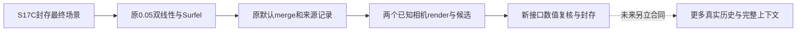

# S18 最小接口连接草案：已封存的 512 全局点图到原 Surfel 记忆

草案实际落盘完成时间：2026-09-06 11:46:40 UTC（北京时间 19:46:40，工具时钟；不反推此前工作时长）。状态：**仅源码与已有协议审查；未建图、未渲染、未读取任何新照片/GT、未重新打开模型或 S17C NPZ。** 本文不是执行冻结文件或实验结果。负责者 `/root/s15b_prefix_runner`；root 维护主账。

下一轮唯一实质问题是：**S17C 已经成功产生的最终 world XYZ、深度、清理后 confidence、优化焦距及相机，能否按原空间缩小和 Surfel 入口构成一份具有可追溯来源的记忆，并被原可见性/来源候选入口消费？** 这是补齐一个尚未接过的真实数据接口，不是新方法，也不重做旧 merge、NMS 或性能实验。

## 1. 先继承旧成果，明确新增部分

本次已读 `S0_RESULTS.md`、`S6_BRIDGE_DESIGN_REVIEW.md`、`S6_MEMORY_BRIDGE_PROTOCOL.md`、`S6_RESULTS.md`、S7 协议/独立审计相关段、`S9_B_CANDIDATE_QUOTA_CORRECTION.md`、`S10_NUMPY_PROMOTION_REVIEW.md`、`S11_RESULTS.md`。

| 已经完成，不能当作本轮新发现 | 本轮确有必要的新输入连接 |
|---|---|
| S0/S0b 核原 first-write、Surfel/Octree 和空间索引问题；S6/S7 核学习几何记忆、来源、姿态排序/NMS；S10/S11 核渲染提速与扩展来源回归 | S17C 的原 embedded **512 DPT + 400 步全局对齐 + 原 clean** 最终点图，尚未实际进入原 `pointmap_to_surfels` |
| S6 用独立 224 linear 的 self-Z、固定裁剪 K、预测 pose 重建 X/Y；stride 8/12、自定义有效邻域/跳变筛选、单叶语义的 cKDTree 首匹配 | 使用 S17C 原最终 world XYZ、匹配的优化 focal/R/t/depth、已 clean 的 confidence；按原 **0.05 双线性空间缩小**，不套 S6 的邻域过滤或重新构造 X/Y |
| 首项票权双加、0.999 分位、first-write、候选至多 14 且活跃调用每来源至多一次，均已记录 | 只核新 19×25 点图、法向/半径、默认原 Octree 下的具体来源关联与两次已知相机的可见候选；不重新宣称上述已知语义是新发现 |
| S11 已证明可见来源少于 4 时，原选择器在完整历史初始化下可以合法返回 1/3 个 ID | 两张历史本身没有原默认 NMS 的初始化时点，也没有真实 VAE/CLIP 缓存；本轮停在候选入口，不能假装已经验证完整生成上下文 |

不重新运行 S0–S11 回归套件、不比较 first_write/frame_mean、不扫缩小率/阈值/seed、不重新计时 S10 提速。原已成功阶段与所有负结果保留。

## 2. 固定原源码与直接入口

只读 checkout：`/Users/rocket/Documents/Codex/2026-09-05/users-rocket-desktop-hkust-it-ip/work/vmem`；本次 `git rev-parse HEAD` 为 `39291e4f272f6b4f270691d930926ab5930f942e`，`git status --porcelain` 为空。源码 SHA-256：

| 文件 | SHA-256 |
|---|---|
| `modeling/pipeline.py` | `90a45f452a4f734b3371fb526c566162026e5d900e0c8204709dd57f44ef1d7e` |
| `utils/util.py` | `0b71dcf6d4a43109d785f49d9c6def37b1256c4d189ab9438bfb185f3099f013` |
| `configs/inference/inference.yaml` | `8d849588016935573a22ef6aaee567f71125ca4d3bdf18f51e3552a64be9fea3` |

原函数与调用位置：`pipeline.py` 的 `construct_and_store_scene` 958–1085、`estimate_normal_from_pointmap` 910–948、`pointmap_to_surfels` 832–908、`merge_surfels` 770–830、`render_surfels_to_image` 228–409、`process_retrieved_spatial_information` 462–502、`get_frame_distribution` 411–460、`get_context_info` 505–765；`util.py` 的 `Surfel` 1274–1290、`Octree` 1294–1362、`average_camera_pose` 601–637。源码意见以执行语句为准，不能照抄“95 percentile”等过时注释。

优先复用已有 `src/vmem_memory_kernel.py` 和 `src/vmem_retrieval_kernel.py` 中经提取的原函数，执行前仅将所需 AST 与上述固定原件核对。新增的 `pointmap_to_surfels` / `estimate_normal_from_pointmap` 尚不在这两个 kernel 中，可透明提取原方法；不改其数学。把从已保存结果开始的三路插值/逐帧调用写成独立适配器，逐句绑定原 987–1056 行；它不是调用整个 `construct_and_store_scene`，因为后者会重新运行 CUT3R。

不要 import/实例化 `VMemPipeline`：其顶层导入牵涉 diffusers/主模型/AutoEncoder/CLIPConditioner，构造器还下载和加载主模型。隔离的数值方法只需现有 NumPy、Torch/F、math、typing、deepcopy；若后续观察相机排序，`average_camera_pose` 另需现有 SciPy。已有 `.venv-cut3r` 是 NumPy 1.26.4、Torch 2.7.0、SciPy 1.16.2，来源见 `work/S17C_environment/environment_ready.json` / `import_smoke_v2.json`；**本轮未重复 import smoke，未安装依赖**。S10/S11 的 NumPy 2.3.5 标量比较证据不能当作 1.26 等价证明；不要未经审查换用已加速 renderer。

## 3. 最小运行合同建议

允许输入只有三个已绑定控制文件、S17C `run_metadata.json` 与 `final_result.npz`。原 NPZ 仅解码 `point_clouds`、`depths`、`confidences`、`focal`、`R`、`t`；`pp` 可只作为元数据说明，因为原 Surfel/renderer 不消费 scene pp；本轮不用颜色数组。无 RGB/PNG/GT/其他模型输出/权重读取。控制身份沿用：

- manifest `docs/S17C_EXECUTION_MANIFEST.json`：`a9d74acb5d79e81696a7cb2cb665577071f47e5af19292230e768638f311c885`。
- seal `docs/S17C_OUTPUT_SEAL.json`：`424090fd2e1de5cdcf7cd124ed893b9a1dea380cf772420cbb48e57834f31df8`。
- independent `results/S17C_embedded_independent/verification.json`：`b783a0343f268c601080d3206e1c49670a1485a074d645925ef60879f026efa8`。
- final NPZ：`0062327c2395236c087a3cfc743a3d82d57167450f552b9b29ba379171efdc9d`，metadata：`1e11d45013cf18d038a58853a11785889c0d522bdc61e6121de61fbb7451693a`。

新 manifest 冻结原函数/适配器/检查器/协议/环境身份后，只实际执行一次。建议 CPU 8 线程、FP32 输入、seed 0（延续 S17C 的记录设置）、600 秒和 32 GiB 外控；计时是本轮组件总耗时，不做性能排名。原 YAML 全局 seed 为 42，但此处方法没有随机采样、随机排序或 RNG 调用，不能将 seed 0 叫原全视频种子复现。若发现新增 RNG，先停止并补合同。

### A. 从已有最终场景构造记忆

1. 两帧按 0、1 顺序，不反序、不删图。从 R/t 组成优化后的 **optical c2w**，与 S17C world point 同一任意尺度；不与旧 raw camera head、TUM K 或 GT pose 混用。S17C 已无先验优化；原在线 pipeline 会传已有 c2w 翻转 Y/Z 后的 pose，并可固定旧 depth。这里是在原 Surfel 数学入口传 S17C 优化相机，**不等同于原在线受约束场景状态**。
2. 三路点图、depth、cleaned confidence 均按原维度变换调用 `F.interpolate(scale_factor=0.05, mode='bilinear')`。保留原默认 `align_corners=False` / 不重新计算 scale 的行为，不把比例替换成输出尺寸之比。原 384×512 变成 **19×25**，每图先有 475 格，共 950 格；这是双线性插值，不是抽取 5% 像素，更不是随机抽样。focal 仍乘精确配置 0.05。
3. 原 normals：右/下相邻世界点差先分别归一化，再叉积归一化；最后一行/列保持零。原方法并未用 S6 的邻域深度跳变规则；不能新增“看起来更干净”的过滤。零差向量可能产生非有限值：保存并失败，不替它补法向。零法向本身可保留，renderer 会跳过它。
4. 原候选 mask 是 `depth <= torch.quantile(depth, 0.999)` 与 `conf >= 1`。分位在缩小后的整帧 depth 上计算，不先按 conf 过滤。分别记录通过数、拒绝数和交集，不能承诺 475 个全被保留，也不删除正常低置信的整个来源图。
5. normal 按 `dot(normal, normalize(position-camera_center)) < 0` 翻向；radius 为 `0.5*depth / (focal*0.05) / (0.2+0.8*abs(cos))`。保留原 FP32 运算顺序。源 `Surfel(pos,norm,rad)` 未传 color，因此 color 为 None；不能拿 viewer 的 RGB 着色宣称原 Surfel 结构已经带颜色。
6. 空初始记忆；第 0 帧候选全部先写，第 1 帧执行原 `merge_surfels`。position threshold 不传配置里的 0.2（原调用已注释），实际每次取旧+新半径 mean + 0.5*std；normal threshold=0.6 且严格 `>`，position 距离 `<=`；原 Octree `max_points_per_node=10`。只查冻结旧树，不做同帧新点间合并；首个满足原树遍历顺序的旧节点获得来源，不是最近节点、不是按全局 ID 排序的 cKDTree。
7. merge 只追加来源帧 ID；旧 position/normal/radius/color 不变，新对象顺序按过滤结果追加。原 `time_indices` 参数在该写入循环并未替换 `frame_idx`，本次来源就是 0/1。原 Octree 在 S0 已有边界问题证据，不能悄悄换成旧单叶修复语义再叫默认原版；若本次原树失败，保留失败与实际邻居记录，另写后续修复合同。

新增源身份采用 `(frame_id, reduced_row, reduced_col)`，不是任意原图单像素 ID。双线性格依赖原图邻域四点；可记录连续输入坐标和四邻域索引/权重，不能给插值坐标伪造唯一原像素出处。逐候选保存最终保留/合并目标 ID，使每个最终 Surfel 的几何首写者与来源列表分别可追溯。

### B. 最小消费：两个已有估计相机的原渲染和来源候选

查询固定为 S17C 优化 optical c2w 0、1，每个一次；是**已参与建图的相机检查**，非未见视图或新照片。直接传原 renderer 的 optical 约定。若通过 `get_transformed_c2ws` 观察其适配，则先用 `c2w_pipeline = c2w_optical @ diag(1,-1,-1,1)`，再经原翻轴恢复，不重复翻转已 optical 的输入。

按原 YAML 消费设置固定 render **512×288**、主点 (256,144)、两轴 focal 为两帧原优化 focal 的均值 ×0.65、disk_resolution=16。这是原程序的更宽视野近似；与 S17C 384×512 输出及 pp=(256,192) 不同。不得把该 render depth 当 S17C 对齐相机的完整成像深度或拿去算准确率，也不根据看图好坏更改尺寸。

保留 near=0.1、far=1000（模型任意单位）、屏幕 margin=50、背面/零法向剔除、16 边形整数像素测试，以及**面片有效顶点平均相机深度**写入 FP32 z-buffer；它不是标准每像素平面求交。严格 `<` 和原 Python float/NumPy 标量比较路径不能转成 FP64 后声称等价；同深度原顺序先占位保留。空像素 depth=0、surfel ID=-1、cos=0。

随后原 `process_retrieved_spatial_information` 按 C-order 可见像素累计 `cos/(1+depth)`，每来源首项双加的旧语义保留。两图至多 k=2 个有支持来源，n=min(14,k)；非空时每来源候选数各 1，因此这一案例只检查**可见来源集合**，不能展示权重数值驱动的截断收益。保存原权重、候选计数、有序来源、覆盖像素和每个像素 Surfel ID。

不保证地图/候选非空。若地图为空，原 renderer 的 positions 形状路径不能直接消费，应写 `NO_SURFELS`、保留所有中间产物而不补点。若两次查询可见来源为空，保留原空候选和状态 `NO_VISIBLE_SOURCE`，不把无候选交给完整选择器导致 `sorted_frames[0]`，更不补为 4 图。若非空但权重和为零/非有限，作为真实接口退化保存失败。

### C. 完整选帧消费入口仍有哪些差距

原 `get_context_info` 先 render/process，再 geodesic distance 排序和 NMS，最终读取 self.latents、encoder_embeddings、Ks、c2ws。默认 NMS 的 `initial_threshold` 只在 `len(pil_frames)==5` 时创建；原视频通常由初始 1 图加生成 4 图到 5 图。两图首次调用没有该字段。关闭 NMS 也不是等价修复，因为它另行追加末帧，并可能造成重复/超额。

满额 4 张上下文至少需要 4 个可见候选和 4 份真实缓存；默认初始化时点需要 5 张历史。S18 不人工伪造五张历史、不把占位 latent/embedding 叫真实特征。旧 S6/S11 占位包装下的选图核验继续有效，但没有必要为本轮两个候选再次做一遍。**本轮计划的可执行停点是原 render/process 返回可核来源候选，完整 get_context_info 仅静态说明。** 若以后有新的真实历史与生成缓存，再单列接入任务，不将这一步升级为视频能力。

## 4. 新接口的必要验证与停止条件

只新增本次输入边界的检查：19×25 bilinear 坐标与 NumPy 标量公式、首/末行列法向和 FP32 radius、实际默认 Octree 的匹配来源、两个实际 render 的逐像素出处/权重。先小型人工入口案例和版本相关 strict-z 标量案例，再冻结实测输入；这不是重跑旧 S0–S11 全套。

不同实现复核应独立计算插值四邻权重、world 差向量法向/半径，逐项对原结果；离散 mask/source ID/最终 source lists/首写几何保留必须 exact。初始数值容差建议在人工前审中固定为 absolute 1e-5 + relative 1e-5（输入/计算 FP32），实际如果不足就保留失败，不在看过真实误差后放宽。此容差只用于连续值，不准用来改变 mask 或合并决策；临近阈值样本单独记下原运算的实际量。

不能以原 Octree 候选等于暴力最近邻为默认通过条件：保留原遍历与既有漏查边界，核实际选中目标符合原候选/严格法向且几何首写未变。若要比较暴力邻域，只能标原索引完整性诊断，不能重构另一张地图后替换本轮结果。

两次查询前后完整记忆字段/来源 SHA 必须不变；无候选是实际结果，不填补。输出建议为新 `results/S18_s17c_memory_bridge/`：run metadata、frozen manifest、三路缩小图、全 normal/mask/radius、每帧候选与合并事件、最终 Surfel 数组/来源 JSON、两个 render NPZ、source voting JSON、独立验证与终态失败/成功回执。所有既有文件前后 hash 不变。

不输出准确率、视频质量、算法提升或新颖性分数。最大证据只能是：**这两张已见 Bonn 照片的本轮原 512 无先验场景结果，实际接通了原 Surfel 构造/默认 merge 与可见来源候选组件。** 若为 0 可见点或原数值失败，也照实交付，不换图/调阈值挽救展示。

## 5. Skills 与本次实际工作记录

沿用 Supervisor `vibe-research-workflow` 的小步实现、先明确输入/停点/检查与不伪造结果；本地 Claude `sci-scientific-critical-thinking` 用于审信息条件、旧/新差异、候选数量与质量指标之间的证据断点。没有调用 Claude 模型或 CLI，没有把用户私下阅读/学术判断记作已核验。本次是源码合同，不生成虚构实验图；短流程如下。

本次只读源码、既有协议/结果说明和环境 JSON；一次辅助 `rg` 在 VMem checkout 中误指项目脚本路径，返回不存在，随后在项目 `src/` 定位已有 kernel；没有执行错误目标或改变结果。无模型/数据读取/安装/原源码修改。下一步是 root 审查本草案，再决定是否实施上述唯一最小桥接；不是自动进入新一轮旧机制实验。
