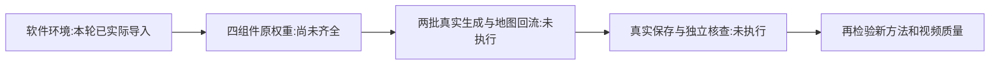

# S20：完整生成程序的本机依赖已接通

**已完成软件环境安装与实际导入，尚未加载主生成器或生成视频。** 这一次从此前仅几何组件的环境，前进到完整 `VMemPipeline`、`Navigator`、VAE/CLIP类、采样器与视频接口可在本机导入。结果不能替代四组件真实权重装载、模型前向或视频质量测试。

记录时间：2026-09-06T12:50:14.911683+00:00。源代码仍为原 VMem `39291e4f272f6b4f270691d930926ab5930f942e`，本机 Torch2.7.0、torchvision0.22.0、NumPy1.26.4；没有远程GPU或Claude模型调用。Supervisor工作流用于小步执行/留失败，本地Claude科学批判用于区分软件可用、权重可用和科学效果。

## 实际安装和导入

安装UTC 2026-09-06T12:42:21.321320+00:00 至 2026-09-06T12:42:57.311941+00:00，35.990862秒。11份官方PyPI wheel，合计 **53,192,919 B**；本次wheel正文实际传输同样为53,192,919 B。每份按官方SHA-256、精确大小及ZIP CRC核验后，离线 `pip --no-deps --require-hashes --no-compile --target` 安装到 `work/S20_environment/site-packages`。所有旧环境的文件路径/大小/mtime和分发METADATA/RECORD/可执行文件摘要前后相同（排除bytecode）；这不是声称重新全字节认证了所有旧库。

版本为本次兼容性候选锁定，不声称作者此前锁了相同版本。新增包的26项启用基础依赖声明，与已有保留环境或新增wheel满足；没有宣称审查了所有已安装包的所有可选extras。

| 包 | 版本 | wheel字节 |
|---|---|---:|
| av | 14.2.0 | 22,070,132 |
| diffusers | 0.32.2 | 3,226,075 |
| ftfy | 6.3.1 | 44,821 |
| imageio-ffmpeg | 0.6.0 | 21,113,891 |
| importlib-metadata | 8.6.1 | 26,971 |
| kornia | 0.8.0 | 1,078,141 |
| kornia-rs | 0.1.8 | 1,713,055 |
| open-clip-torch | 2.30.0 | 1,514,664 |
| timm | 1.0.15 | 2,361,373 |
| wcwidth | 0.2.13 | 34,166 |
| zipp | 3.21.0 | 9,630 |

最终v3导入UTC 2026-09-06T12:46:58.854593+00:00 至 2026-09-06T12:47:08.129791+00:00，**9.275224秒**，worker峰值 **665,321,472 B**，**292项检查通过**，45个实际已加载项目模块来自隔离源码。检查包括199份源码身份、接口存在、包版本与路径、模型/文件/网络守卫、旧环境身份。检查数不是实验样本量、精度或创新分数。

已导入原Pipeline、Navigator、AutoEncoder、CLIPConditioner、create_samplers、do_sample、embedded global_aligner，Diffusers AutoencoderKL、OpenCLIP、Kornia及Torchvision/PyAV。OpenCLIP原tag和ViT-H架构配置通过本地包查询，尚未创建模型。**主模型构造尝试0、torch权重load尝试0、PIL图像open尝试0、网络尝试0、未知禁止文件访问0。** Python audit只针对本次脚本可观察的Python接口，不宣称操作系统沙箱级隔离。

## 隔离源代码及必要差异

复制S17C已审199份小源码，继承其signed RoPE CPU实现与安全载入适配。新增两份差异逐字复用S17已人工验证候选：`utils.util.do_sample`三个相机/K/mask的CUDA硬搬改传入device、CPU禁用CUDA autocast；`construct_and_store_scene`省略device时使用self.device。第二项是helper默认值便利性，原导航显式传self.device，本入口不依赖它。没有修改NMS、数学attention、模型规格或采样步数。原transformer与固定checkout逐字相同，保留已小型实测的CPU FLASH。

导入成功不代表正式离线加载器已实现。原构造器仍写有HF下载入口；正式运行前要另外固定本地四权重及loader，不能让构造器自行联网或静默替换VAE。隔离目录不含初始实拍和模型权重。

## 保留的失败及纠正

1. pip在线dry-run因PyPI TLS EOF失败；没有修改旧环境。随后使用官方PyPI JSON与哈希wheel。
2. 首份依赖计划发现ftfy所需wcwidth缺失，状态FAILED保留；v2补一份wcwidth，复核26项声明后安装。没有删失败、装着试凑。
3. import v1实际通过292项，49.631781秒，其中首次Matplotlib建字体缓存；v3耗时不可据此宣称算法加速。
4. 第三作者建议补上路径resolve、test_samples/.bin和socket/subprocess审计。v2实际在2.811054秒失败：NumPy的可选CPU探针尝试`lscpu`，严守卫抛RuntimeError，原NumPy只捕获OSError。
5. v3仍禁止该命令执行，只对精确`lscpu`探针抛PermissionError，由原NumPy的OSError分支标记SVE不可用。单列 **1次被拒本地探针**；未知子进程及网络继续硬拒。没有放行外网、伪造CPU信息或修改科研算法。

v1/v2/v3脚本、日志和真实回执均保留。导入过程中字体和弃用警告不是模型失败；没有遵从缓存警告擅自联网更新模型。

## 不同作者复核与下一步

第三作者已独立核199源文件、两项与S17候选一致的差异、45实际模块和最终v3身份链；没有重复模型或把作者自测写成外部复现。复核见 [环境审查回执](../work/S20_protocol_review/environment_completion_review.json)。

- 最终导入：[import_smoke_v3.json](../work/S20_environment/import_smoke_v3.json)，SHA `c74df6a03cb07add0d7865edc9e2ffb54fc8bd5d7052e5baac79d363d3f319d6`。
- 安装：[install_receipt.json](../work/S20_environment/install_receipt.json)，SHA `660510f6b8eaa6d49a80a88fb28635c6961f9d4a5b0ffd048044266085a82763`。
- 隔离源：[source_manifest.json](../work/S20_environment/source_manifest.json)，SHA `66f913d7a7be7890447ea01e766c4bef10e2818fcafd7a8141d2e01d7bdbe841`。
- 失败：[v2导入](../work/S20_environment/import_smoke_v2.json)、[首份依赖计划](../work/S20_environment/wheel_plan.json)、[pip解析日志](../work/S20_environment/resolution.stderr.txt)。
- 依赖缺项与官方来源：[S20_DEPENDENCY_ACCESS](S20_DEPENDENCY_ACCESS.md)；真实两批原入口：[S20_MINIMAL_VIDEO_PROTOCOL_DRAFT](S20_MINIMAL_VIDEO_PROTOCOL_DRAFT.md)。

指定LAION OpenCLIP公开可取，但本轮没有下载其3.94GB权重。原VAE匿名API/config本轮401，原因与原文件身份仍未知；主VMem gated访问仍依据S17已有回执，未本轮反复请求。需要这些原组件合法齐全，才能进一步完成实际生成。不能用合成视频导出测试、旧几何数据或日志工具代替它。

复现导入命令使用 `work/S20_environment/import_smoke_v3.py`，但该脚本拒绝覆盖已有回执。需要复核时先明确新理由和新输出目录，不因接手就反复跑成功阶段。当前wheel和包目录可直接复用；实际原输入/模型仍未加入此环境测试。
