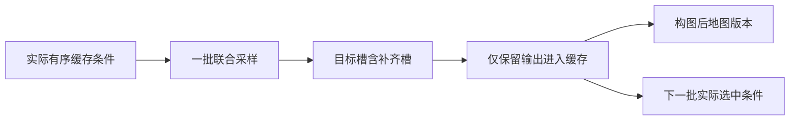

# S20 生成条件事件记录合同

状态：**实现与作者人工测试已完成，尚未接上真实生成调用。** 本模块不加载 VMem、权重、照片、GT 或旧 NPZ。它为下一次真实运行留下条件来源记录，既不是生成器，也不是科研新方法。

代码：[src/s20_generation_trace.py](../src/s20_generation_trace.py)。人工入口：[artificial_checks.py](../work/S20_trace_preparation/artificial_checks.py)。旧版32项人工通过，0.625秒，证据见 [artificial_v2/receipt.json](../work/S20_trace_preparation/artificial_v2/receipt.json)；第一版29项人工与旧代码单独保留。第三作者发现原第二批ID是一维Torch整型Tensor，已针对性修正；最终版用隔离CPU版实际 `do_sample` 的AST函数与人工sampler/AE/denoiser追加15项接口检查，0.608秒，见 [original_cpu_interface_v1/receipt.json](../work/S20_trace_preparation/original_cpu_interface_v1/receipt.json)。没有重跑旧29项来掩盖接口差异。正式身份以 [preparation_receipt.json](../work/S20_trace_preparation/preparation_receipt.json) 为准。

## 1. 来源和构念

固定原 VMem commit `39291e4f272f6b4f270691d930926ab5930f942e`；原 checkout 未修改。`modeling/pipeline.py` SHA `90a45f452a4f734b3371fb526c566162026e5d900e0c8204709dd57f44ef1d7e`，`utils/util.py` SHA `0b71dcf6d4a43109d785f49d9c6def37b1256c4d189ab9438bfb185f3099f013`。原函数的本次接口核验见准备回执。

- `pipeline.py:517–522` 由实际选中 ID 从缓存取 latent、CLIP embedding、camera/K，并转换到运行 dtype/device；`759–765` 返回完整 `context_info`。
- `1123–1192` 的 `get_cond` 实际计算条件，其中 embedding 沿 context 维取均值，局部拼接相机经历尺度/坐标变换。因此记录选中缓存与转换后 context，再记录 `do_sample` 和 sampler 两处实际条件身份。
- `1249–1284` 选条件后调用 `do_sample`；`1287–1298` 对全部目标槽做 CLIP，再只保存非 padding 目标；`1305–1309` 构图。
- `util.py:673–734` 的 `do_sample` 第4参数为 sampler。初始 `randn` 在710行生成，712行交给 sampler。记录器仅替换这个 callable 参数为委托包装，直接观察实际传入噪声；不 monkeypatch `torch.randn`、不重写采样数学。
- `modeling/sampling.py:393–398` 还计算 `sigma_hat = sigma*(gamma+1)+1e-6` 并调用每步 `randn_like`。**初始噪声不是全部随机输入**，churn为0也不能推断无后续随机数消耗。

S19已拒绝“生成后代覆盖旧Surfel坐标”的原构念。本日志只允许说：某批实际选择了哪些已有缓存条件、产生了哪些联合输出、保存了哪些历史条目、构图前后完整地图内容是什么。仅有来源关联或有序列表不证明某个条件对结果具有非零因果效应。



同批输出共享同一个生成节点；保存次序不生成帧间父子边。第二批只有 `selected_context_ids` 真正包含某个已生成 ID，且记录器核到其对应缓存张量时，才可称该条缓存被消费；history中存在不等于被选中。

## 2. 接口与精确接入点

`TraceWriter(fresh_directory, evidence_kind, source_identities, manifest_sha256=None, rng_devices=())`。

`evidence_kind` 只允许 `synthetic_test` 或 `recorded_execution`。后者必须给额外冻结运行manifest的SHA；这只是调用合同，模块不能自行证明传来的 callable 确为真实模型，真实运行还需外caller、固定源码/权重身份和输出封存。

集成必须写入另行冻结的隔离运行入口，**本阶段没有改原pipeline，也未提交下面接法的真实运行产物**。下面展示必须插入的位置，不是一份可以替代原生成循环的程序：

```python
# 原 get_context_info 返回后，原 get_cond/采样前：
with trace.batch(batch_id, pipeline, context_info, target_c2ws, target_Ks,
                 padding_size=padding_size) as event:
    # 保留原 get_cond 的所有计算和原参数。
    # 此处局部 no_grad；记录器自身不会改变梯度模式。
    with torch.no_grad():
        samples, samples_z = event.sample(do_sample, *original_args, **original_kwargs)
    # 原 tensor_to_pil、encode_image、append 循环在这里照常执行。
    # target_encoder_embeddings 是 encode_image 的实际完整目标批输出。
    event.commit_cache(target_encoder_embeddings=target_encoder_embeddings)
    # 原 construct_and_store_scene 在这里照常执行，其内部可 enable_grad。
    # 不允许用全局 inference_mode 包住几何优化。
    event.commit_map()  # 仅在原构图函数确实返回后调用。
trace.close()
```

`sample` 用 `inspect.signature(...).bind` 保留原位置/关键字参数，只替换 sampler 参数。包装 sampler 的 denoiser callable 会记录实际 callback 序号、sigma及参数身份，并原样委托；callback次数不等于优化步数、CFG模型前向数或VAE调用数，禁止互相冒充。模块自身不进入 `no_grad`/`inference_mode`，不设置种子、线程、模型模式或设备，不改变原返回对象。

初始化和选条件发生在批对象之前，可先用 `trace.observe(name, values=...)` 留开始/结束、初始缓存、原 VAE/CLIP 实际计数；若失败，外层捕获异常并调用 `trace.failed_operation(phase, error)` 后原样重新抛出。该方法保存失败阶段/异常/完整受支持RNG状态。批内异常由 `with` 自动记录并重新抛出；未经实际 cache与map提交的批退出会记录失败。原 worker 仍须保留外caller失败回执。

生成/解码/CLIP/构图的真正调用计数应由运行者另行挂只委托的observer，再通过 `observe` 写入。记录器不会把预期“50步、16CFG槽、初VAE编码1、CLIP行数1/7/4、VAE解码8/8”填成实际结果。`scale` 是传入sampler的cfg标量，**不是** `MultiviewScaleRule` 变换后的逐帧实际系数；当前未挂guider，不能用轨迹推测的1.2/2.0填入实测。原app外层 `torch.no_grad` 可与原几何函数内部 `torch.enable_grad` 共存，禁止的是覆盖几何优化的全局 `inference_mode`。

## 3. 事件、缓存与地图

事件链：`session → batch_begin → sample_call → sampler_enter → denoiser_call* → sampler_return → sample_return → cache_commit → map_commit → batch_complete`。异常事件为 `failure` 或批外 `operation_failure`；`observation` 是显式附加观测，不自动晋升为核心计数。会话正常关闭写 `session_end`，有失败的会话也可关闭，关闭并不等于模型运行成功。

- `batch_begin`：完整历史缓存的身份、有序实际context IDs（接受原首批整数list及后批一维Torch整数Tensor；保留重复，拒绝浮点/布尔/二维伪ID）、实际cast后四类context张量、目标camera/K、输入mask、全部slot角色、padding数、保留数、构图前map版本。选中缓存按actual dtype/device转换后与传入context逐条SHA一致，否则拒绝。
- `sample_call`：实际 `c/uc/c2w/K/mask/H/W/C/F/T/cfg/device`；要求原mask为前context后target，T与所有槽数一致，必须返回latents。
- `sampler_enter`：实际初始noise原始字节、actualcond/uc/c2w/K/mask与scale的SHA。`denoiser_call` 的输入包含sigma身份；不保存每步内部噪声。
- `sample_return`：所有槽的实际图像/latent张量SHA和shape。模块不伪造图像文件，不替代视频导出。
- `cache_commit`：实际 append后长度、旧缓存未改验证、新保存frame IDs及对应slot、实际latent/embedding/camera/K SHA，全部目标CLIP输出行数与指纹。验证 latent与返回 `samples_z` 对应保留槽exact、embedding与实际CLIP输出对应行exact；未通过则失败。padding槽明确无历史frame ID。
- `map_commit`：原构图返回后的完整有序Surfel position/normal/radius/color、每点完整source IDs、数量与内容SHA，以及实际 `surfel_Ks_length`。前后版本内容同样保存原始字节；这是新的 `s20-full-surfel-list-v1` 编码，不与S18旧地图SHA混用。

默认原4目标导航首批7目标槽含3padding，实际history1→5；第二批4context+4target使history5→9。原surfel_Ks列表可能5→14，记录实际长度，不强制改成9。少于4个实际context不能人工padding来满足协议；当前 `sample` 的T/slot门会拒绝不匹配。首批和第二批均仍按原8槽采样成本；以上数字是固定入口源码预期，真实数值必须来自之后的运行。

## 4. SHA、随机状态与文件规则

张量SHA包含dtype、shape、little-endian/C-order、字节数及原始canonical bytes，不仅是浮点数值的打印字符串。NumPy与Torch同dtype/shape/bit内容共享身份；非连续张量按逻辑C顺序；bfloat16保留原始位而不升成FP32。仅支持dense非量化张量和数值NumPy数组，拒绝object等类型。

初始噪声、Torch RNG状态、NumPy RNG整数状态、地图数组保存到内容寻址的 `.bin`；Python全局RNG状态作为完整JSON保存。缓存/条件/采样输出默认只存身份，真实输出另由生产者封存；没有保存字节的张量身份不能由单独日志离线重算其原内容。`pil_frames` 只计长度，未认证其像素身份；`surfel_Ks` 只记长度而非数值，稠密depths也未归档。本模块不是S20完整输出归档器。

采样前、sampler入口、sampler返回、采样返回及批内失败分别记录 Python global、NumPy legacy global、Torch CPU 完整RNG。设备RNG必须显式要求；CUDA只读已初始化状态、不会为日志初始化CUDA；MPS要求可用。自建 `torch.Generator`、NumPy `Generator` 或第三方随机源不在默认范围。S20固定CPU路径无需伪写GPU状态。重放另需完整固定采样器、RNG和运行环境；日志不能证明跨平台确定性。

新目录以 `exist_ok=False` 创建；事件文件O_EXCL创建、O_APPEND写，进程锁与线程锁保护，每条fsync。payload文件O_EXCL创建，已存在同SHA文件须逐字节相同。每事件包含UTC、seq、previous_sha256与event SHA。禁止覆盖旧trace；崩溃可能只留完整前缀，硬终止/磁盘故障不保证有failure尾事件。

`verify_trace(directory)` 复核事件/序号/hash链、batch状态顺序、保存blob原始字节、完整map版本、context/target槽与联合父集合、实际确认frame IDs、callback计数。返回 `VALID_CLOSED_TRACE` 或 `VALID_INCOMPLETE_PREFIX`；完整但含failure日志仍是有效日志，不等于生成成功。篡改hash、缺字节或截断行报错。它不访问原权重/图片，也不证明被记录函数的语义、未保存张量的内容或因果/视频质量。

## 5. 已完成检查、尚缺项与技能执行

人工使用3步小采样器、8×1×2×2 latent、3维embedding及一个人工Surfel，两次采样，不运行原VMem。检查canonical身份、初始noise、观察前后样本/RNG相同、grad模式不变、history1→5→9、重复context、padding无ID、联合父集合、CLIP7/4行、map Ks5/14、委托异常、缓存不匹配、float ID拒绝、未完成批失败、事件及blob篡改。原每步噪声机制只按源码约束，不用3步人工替代原50步真实验证。

Supervisor `vibe-research-workflow` 用于小步实现、作者人工→不同作者前审→真实冻结分层；Claude `sci-scientific-critical-thinking` 用于区分construct validity、观测条件依赖与因果推断。没有调用Claude模型、没有让人工数据支持新颖性，也没有声称用户已逐句核验或已完成学校AI披露。

尚缺：不同作者最终代码前审、真实运行入口接线及其冻结身份、原合法生成资源、实际模型运行、实际视频输出及独立质量评估。本模块只解决可追溯记录能力。
