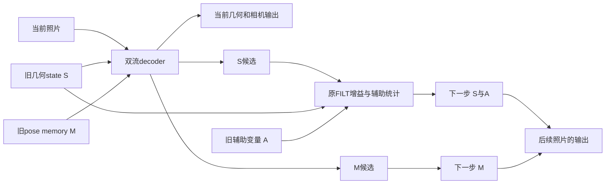

# S25设计草稿：哪条记忆写入影响后续几何

状态：**代码准备与假设澄清，未冻结实验、未运行S25模型、未选事件。** S24三个完整基线仍在运行。本文不是新方法、论文结果或生成视频证据。实际时间与版本见work/S25_state_intervention_preparation及追加主账。

## 问题与源代码事实

FILT3R lighter循环有两类跨帧内容：全局几何state S和LocalMemory中的pose memory M，还有协方差、EMA、上一候选等辅助变量A。当前照片先与旧S/M一起产生decoder输出；当前几何头已经输出后，才提交新的S/M供下一帧使用。

源代码里的ret_state虽然返回一个state列表，但lighter路径没有往列表里填内容；它不能直接充当完整实验检查点。Kalman统计字典还会原位更新，保存旧引用不等于保存旧状态。直接切片续跑、重新从i=0枚举也会触发第一帧初始化，改变问题。这三项是代码观察，并非自然失败机制的证明。

下面是依赖关系示意；箭头不表示本项目已测得错误传播。

## 为什么仅看gate大小不足以判断遗忘

对于更新 S' = S + β⊙(F(S,M,X)−S)，即使暂把β视为常量，状态导数仍包含候选F对S的依赖；M还有另一条进入后续计算的路径。如果β也依赖状态，还要加入其导数。因而某条显式保留项的衰减不等于完整网络对历史的函数依赖，更不等于历史几何是否仍能被读出。这是链式法则与模型结构的推论，**不是本项目的新理论**。

AFG原文用门控解释记忆跨度并提出帧级调节；HorizonStream在其明示的线性状态更新条件下推导通道保留。不能把这些特定更新的公式直接当作本项目非线性S/M系统的完整可恢复性结论，也不能因此否定论文的实测效果。根任务本轮核了这两篇相关方法/理论段落：[AFG §3.3–4.2](https://arxiv.org/html/2605.16981v1#S3.SS3)、[HorizonStream Appendix B](https://arxiv.org/html/2605.23889v1#A2)。普通门控和记忆跨度分析已有先例，不能换名当创新。

## 四种写入的最小干预

先对同一真实前缀和同一事件照片计算一次正常候选与当前输出。捕捉提交前、提交后的完整状态，再构造四个相互独立的分支，继续输入完全相同的后续照片：

| 分支 | 几何S与其辅助变量A | pose memory M | 能回答的问题 |
|---|---|---|---|
| 正常 | 原正常提交 | 原正常提交 | 原基线 |
| 暂停S/A写入 | 保留事件前值 | 正常提交 | 暂停这一组写入有什么后果 |
| 暂停M写入 | 正常提交 | 保留事件前值 | 暂停另一组写入有什么后果 |
| 都暂停 | 保留事件前值 | 保留事件前值 | 普通跳过写入能否解释全部收益 |

S/A是一组联合干预，不能叫“只改一个S张量”。事件照片已经被消费、当前输出已经发出；分支保持真实绝对帧号。所有分支的事件当前输出必须相同，差别最早应从后续帧出现。若事件当前输出不同，先查实现，不报告算法收益。

这是指定事件的因果诊断，不是部署策略。即使暂停M有效，也没有证明系统能在无GT时判断何时暂停，更没有排除所有普通选择/门控对照。误差中的交互差也可能来自非线性损失，不能单凭四臂数值就宣称发现新的信息交互规律。

## 执行前必须解决的技术边界

adapter保留原FILT函数的计算语句，在新目录增加捕捉与恢复，不修改S24冻结源码。删除观察代码后的AST相同仅证明结构对应；真实数值兼容仍待后续短前缀验证。必须先验证正常分支、分段续跑和原连续函数在所有六头及完整状态上相容，再运行四臂。

检查点包括11个跨帧局部变量、绝对帧号、输入身份及有关运行时状态；字典/tensor必须深拷贝。位置/RoPE缓存、module buffer、随机状态及调用方输入变换另列边界，不把循环局部状态冒称完整生成器状态。模式必须保持原基线每个module的training flag；曾出现强制eval的未运行草稿已由前审指出并修正，不能悄悄改推理模式。

本轮只做源码和必要的小容器核查，不与S24并发加载大模型。后续输入、前缀、事件、后缀、精度、匹配容差和资源限制须正式冻结。若测试本身不通过，保留原错误并修检查点；不能因此断言科学假设失败。

## 科学判别与停止条件

先看S24全部方法封存后的自然曲线，保留全轨迹Sim(3)主表。局部运动误差与持续区间可另行预定为描述性分析，但不能让每个窗口/分支重新拟合GT尺度来掩盖差别。最高单帧只用于明确标注的事后插图。若根据已见S24答案选择事件，整个干预是探索，必须另做确认。

同一后缀完整纳入，固定共同的评价坐标/尺度；报告所有四臂、退化、无变化和缺失。基线若没有清晰自然失败，就停止用该片段验证这一机制；人工破坏可作为单独压力测试，但不能填补自然失败证据。若普通全部跳过或同步门控能解释收益，不包装为新机制。

只有在自然错误、具体写入路径和可部署检测/修正之间建立证据，且排清近邻后，才设计方法。最后仍需接回原proposal的实际生成消费者：几何或相机改善不自动证明回访视频更稳定。此处尚没有这些证据。
