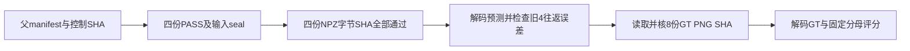

# S26B continuation：原评分规则不变

本文件继承下文S26固定数学、GT身份、顺序与容差，仅producer/output路径改为S26B。
`common_old` 的新receipt `status:PASS`严格表示 `validation_status:IMPORT_VALIDATED`：
导入S26既有原400步输出，经独立保存后恢复核查；不是新GA、不是原S26整门PASS。
原FAILED及未记录的历史PnP/loaded modules/postfinal标量保持原状。其余三个8图producer
仍须前瞻性完整PASS。执行程序为 `scripts/score_s26b_consumer.py score`；不调用prepare-inputs。
新manifest的scoring对象从旧冻结scoring逐项继承，仅更新producer/output及新scorer/本协议身份。

# S26 原消费者深度评分协议

状态：执行前代码与人工边界准备。此文档和评分器 SHA 由父任务并入正式 manifest 后才生效；本准备阶段没有读取真实预测数组、传感器 PNG 字节或执行 GA。评分器作者与 GA adapter / runner 作者不同；人工检查是评分器作者自检，不是另一个作者的真实实验复算。

问题是：同一组真实已存网络预测进入原 VMem 的 400 步 GA 后，在共同给定相机、共同旧深度下，三种基线的新深度与传感器参考相差多少？本轮是原几何消费者组件 pilot。共同相机是显式 GT camera control；不是盲测相机估计。首 8 帧跨约 0.235880 秒，4 个新帧不足以判断长期记忆、机制因果或方法优劣。

## 固定对象与接口

根目录为 `/Users/rocket/Desktop/HKUST IT/ip-/geometry-world-modeling`。输入四个目录为 `results/S26B_consumer_baseline/{common_old,cut3r,ttt3r,filt3r}`。每目录的 `output.npz` 只含六个 FP32 字段：depth `[N,384,512]`、point_cloud `[N,384,512,3]`、conf `[N,384,512]`、focal `[N,1]`、pp `[N,2]`、c2w `[N,4,4]`。common_old 的 N=4，另外三项 N=8；前缀索引 0–3、新帧 4–7 全部保留。

`work/S26_scoring_preparation/candidate_scoring_inputs.json` 整个对象放入最终父 manifest 的 `scoring` 键。其内容包括固定目录、索引、形状、规则、8 个 depth 路径及 SHA、评分器/本协议 SHA、两份来源 JSON SHA。GT SHA 从此前实际读取的 `results/S23_geometry_diagnostic/gt_receipt.json` 按 index+path 继承，不在准备时打开 PNG。该事实不恢复研究者对这 8 张 GT 的未知状态。

每个 producer 的 `receipt.json` 必须包含：

```json
{
  "status": "PASS",
  "manifest_sha256": "父冻结manifest的64位SHA",
  "mode": "common_old或cut3r或ttt3r或filt3r",
  "frame_count": 4,
  "inputs_seal_sha256": "本目录inputs_seal.json的64位SHA",
  "outputs": {"output.npz": "本目录output.npz的64位SHA"}
}
```

三种 8 帧模式的 frame_count 为 8。`inputs_seal.json` 至少含相同的 manifest_sha256 / mode / frame_count，以及布尔 `sensor_depth_used:false`。原 GA 参数冻结、400 step、实际来源和共同条件由 producer / observer 核验并封存；评分器核 receipt 和 seal 的身份，不能只凭一个 false 字段证明整个进程从未访问 GT。

冻结后调用：

```sh
.venv-cut3r/bin/python scripts/score_s26b_consumer.py score --manifest 父正式manifest路径 --manifest-sha256 父正式manifestSHA
```

评分输出固定 `results/S26B_consumer_baseline/scoring`，现存目录一律拒绝，不覆盖失败或旧结果。metadata candidate 的 `prepare-inputs` 是单独的 JSON/源码读取入口，不会启动 score。

## 打开答案之前的门



在读取任何 GT PNG 字节前，必须完成父 manifest 调用者 SHA、评分器/协议/metadata SHA、全部四份 PASS receipt 和父身份、全部四份 inputs_seal SHA 和未用传感器声明、全部四份 NPZ 字节 SHA。预测解码也在四份 NPZ SHA 都通过之后。保存 `pre_score_seal.json` 明确该截点尚未解码预测、尚未读 GT。之后验证六字段 schema 和共同旧深度；全部通过才记录 `sensor_gt_read_started_utc` 并打开 PNG。

三种模式旧 4 帧输出 depth 对 common_old 同帧 depth 的比较固定为 `abs(other-reference) <= 1e-6 + 1e-6*abs(reference)`，使用 float64 计算误差。参考和旧前缀必须有限且大于 0。这个容差由父任务在查看真实输出前确认，覆盖 plan 早期 1e-5 的建议，仅用于 FP32 `exp(log(depth))` 往返。另报告 bitwise equal、数值相等、差异元素数、最大/平均米制绝对差、超容差数。超容差停止在 GT 之前。输出容差不能取代 observer 对冻结内部 log-depth/pose 参数的 bitwise 检查，也不能声称全输出字节相同。

无效的新 depth 会保留并进入下面的计数，不能为了取得数值而删像素。其他 head 的非有限数和形状写 schema 诊断；它们不产生评分 mask，消费者正确性的检查由 producer 负责。评分结束重新核父 manifest、源码、协议、metadata、producer receipt/seal/NPZ、全部 GT 字节 SHA；变化则 FAIL，保留目录。

## 像素映射和数学定义

8 张传感器图像必须是 480×640 整数 PNG，数值在 0–65535。按既有 S23 的 nearest 规则映射到 384×512：对任意目标坐标 t，来源坐标是 `floor((2*t+1)*source_size/(2*target_size))`，在两个轴分别使用。这是完整画幅等比缩放，不新增裁切、插值、对齐或可见性估计。原始值除以 5000 转米；无逐帧/逐方法尺度拟合。源网格和目标网格的正值计数分别报告；主分母是**目标网格中所有有限且 >0 的 GT 像素**，不是原始 307200 像素数。

GT=0 或非有限不在分母；不删除远点，不使用 conf、clean、GT 深度范围或预测好坏筛选分母。预测非有限或 ≤0 记 invalid，同时报告全网格计数和 GT 有效域计数。

对一帧有效 GT 集合 V，N=|V|，预测 p、GT g：

- AbsRel = `sum(abs(p-g)/g)/N`；RMSE（米）= `sqrt(sum((p-g)^2)/N)`。
- δ1 = 在 V 中满足预测有效且 `max(p/g,g/p) < 1.25` 的像素数 / N，严格小于；无效预测算失败。
- 若 V 中有任何无效预测，整帧 AbsRel/RMSE 写 null，而不是只算剩余好像素。δ1 仍以完整 N 计算。
- N=0 时三项指标和 invalid fraction 都写 null，并标 `EMPTY_GT`。invalid 的原始计数始终保留。
- 数值计算先将保存的 FP32 预测转换成 float64；不对预测舍入、不加 epsilon。δ1 的边界针对保存值，例如 FP32 的 0.8 并不精确等于数学 0.8；人工检查要区别两者。

三种方法的共同逐帧分母仅由同一份 GT 决定。主表为新索引 4–7 的**等帧均值**，不将像素池化；平均 RMSE 是四帧 RMSE 的算术平均，不是合并所有像素后开根号。任一预定帧某指标 null，则该项主均值 null，保留 defined_frames；不得把“现有帧均值”冒充完整四帧。all8 和 old4 另外列为诊断；common_old 只作为共有约束的诊断，不当第四个竞争方法。

额外只描述每帧 post-clean conf 中有限且 >0 的全网格比例；它不影响评分分母、不等于真实可见性准确率、也不与其他阶段保留率混用。不进行 ATE、置信区间、显著性检验、GT scale、GT pose 重拟合或生成质量评分。

## 产物与解释门槛

`per_frame.csv` 含 4+8+8+8=28 行；`metrics.json` 同时保存逐帧完整行、primary_new4、diagnostic_all8、diagnostic_old4。`old_prefix_checks.json`、`output_schema.json`、`gt_receipt.json`、`pre_score_seal.json` 和最终 `receipt.json` 记录状态、真实时点、来源与前后 SHA。PASS 仅表示评分执行及封存检查完成；可能仍有 null 指标，须看 `primary_absrel_rmse_complete`，不能将 PASS 当方法赢了。

评分器作者的固定人工测试覆盖两种数学计算路径、nearest 索引、无效值、边界、固定均值、旧深度容差，以及四模式封存失败时不读 GT 的顺序。它们没有运行真实 producer、解码真实数组/GT 或证明模型/GA 正确。执行前仍需父任务静态审查和冻结，真实运行后仍需不同作者复算。

局部采用 `/Users/rocket/.claude/skills/sci-scientific-critical-thinking/SKILL.md` 的 methodology / validity / bias / statistical evaluation：共同相机和旧深度作为明确控制，新帧主指标与旧帧诊断分开，保留缺失和无效分母，不把像素当独立样本。流程图使用仓库原生 Mermaid，未调用图像模型。沿用 Supervisor 的先强基线、再归类真实失败路线；本小评分程序没有完整文献综述、创新评估或投稿审查的完成声明。

限制：8 张真实深度已在 S23 读过，本轮属于既有数据上的组件探索；近邻帧不是独立场景。原 proposal 所需 Surfel、检索、长期历史和真正生成闭环仍未在此完成。即使三基线数值有差，也不证明遗忘、因果机制、创新、可部署相机估计或生成提升。
