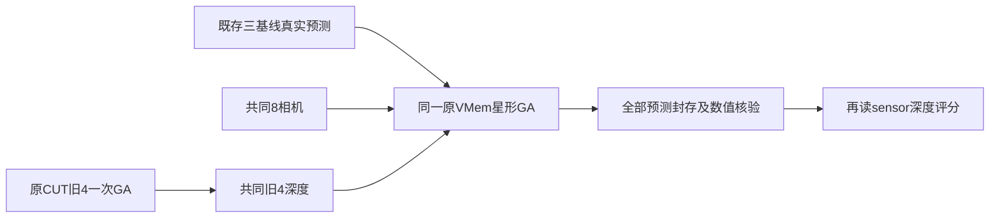

# S26 原几何消费者：固定执行协议

当前为执行前方案；只有 `work/S26_consumer_baseline_preparation/run_manifest.json` 生成、独立前审绑定以及真实运行回执才证明后续阶段发生。本协议将作者 plan 的建议落成明确运行合同，不覆盖以前任何冻结文件。选题依据为 Supervisor 第2章与本地 Claude scientific-critical-thinking 的构念效度、共同条件、证据与结论匹配原则。

问题：三种已跑完的几何基线，其已存预测进入 VMem 实际使用的几何优化后，新深度与真实传感器参考相差多少？使用 fr2_desk 首8帧，约0.236秒，旧4/新4。不把短片段比较解释成长期失败、机制因果、新算法或视频改进。本次不做同8帧ATE、不宣称300帧轨迹排名在此传递或反转。

## 共同输入与源码

候选元数据、原源码与依赖沿用 adapter 的 `candidate_inputs.json`、`source_binding.json`。来源199份嵌入源码由S17C已固定版本继承；原prepare_output、PIL预处理和star拼装由AST提取，不改变数学。三种网络预测源分别为S21 CUT/TTT与S22 shared-precision FILT，另S21 original4用于共同旧深度。28个已存NPZ在实际加载时逐个验其旧seal SHA，读取六个原FP32头，不重新运行模型或读取权重。CPU共享RoPE精度的历史边界仍适用，不新宣称原完整pipeline或全部网络实现等价。

相机来自同一S21固定GT时间配对，是所有作业共同的显式oracle camera input。控制worker记录解析时刻，按TUM光学c2w直接传原GA，不额外翻Y/Z、不进行尺度或首帧归一化。不能标成盲测/可部署相机估计。sensor depth仅评分器读取；8个PNG SHA继承此前S23的真实字节记录，不能称未见数据。

共同旧depth只由原CUT original4已存头进行一次给定前4相机、depths=None、400步原GA得到。全部三方法用该输出的同一4帧depth与相机prefix，验证文件与tensor身份。不能用GTdepth或方法各自重建的旧图。

## 依次执行的作业

执行入口 `scripts/s26_consumer_baseline.py dispatch --manifest-sha256 SHA`。先要求现有S24 dispatcher完整PASS，避免大CPU作业并发。每阶段新进程；worker源命名空间彼此隔离。失败保留目录，无自动缩图、减迭代、换帧或重跑。未启动作业不记作失败实验。

| 阶段 | 内容 | 时间/RSS上限 |
|---|---|---|
| control | 固定8个GT相机作为共同条件，封存FP32文件 | 180秒/2GiB |
| views_original / views_ttt / views_filt | 各源原baseline预处理，不加载网络；同8张实拍 | 各180秒/2GiB |
| compat | 原VMem PIL预处理与三份baseline tensor/shape精确比较；28份真实六头+原star/独立拼装核验 | 240秒/4GiB |
| common_old | 原4头+共同前4pose，无depth先验，原400步GA | 600秒/16GiB |
| cut3r / ttt3r / filt3r | 各8头+共同8pose+共同旧4depth，原400步GA | 各1200秒/16GiB |
| scoring | 四份完整producer封存后才运行独立作者评分器 | 180秒/2GiB |

总计最多4次真实GA、1600次实际Adam.step，0次新网络前向。每GA新增一次只读更新后目标求值，故正常目标求值1604次，不能混淆原最后返回的更新前loss。所有几何模块及observer安装后重置Python/NumPy/Torch/OpenCV seed=0；CPU8、原FP32运算、无外层autocast，原函数内部enable_grad。最低空盘10GiB，外控0.5秒采样进程树RSS；超限terminate并10秒后kill。记录的耗时含GA观察/核验/归档，不是纯推理速度基准。

## 原优化与观察，不改变原返回

固定star (0,j)，4图3边、8图7边；真正目标为anchor self/conf_self和其余other/conf，不给raw camera_pose另加用途。所有pose固定，旧4depth固定、新4depth可优化，focal保持原可优化，pp保持原固定，pairwise尺度不normalize。原MST/PnP初始化、L1名称下的欧氏范数log-conf目标、Adam、linear400步/.01及原clean均不改。

只委托observer记录原实际输入点/权重/edge IDs、preset参数值与requires_grad、MST/PnP调用、每步标量、实际Adam.step、最终pairwise poses/adaptors、clean前后conf和最终几何；不替换预测/优化器、不强制PnP成功。原PnP未返回解时如原流程能处理，就保留其fallback事实；异常或不完整作业停止。四作业预期400实际step、1次MST、1次clean。

约束参数在preset后快照，MST后、GA后、clean后逐值完全不变。原im_conf虽不参与梯度，却允许原clean修改，明确不列入“不变约束参数”；其更新由独立clean公式核验。输入pose与返回pose允许原FP32编码往返 `atol=1e-5, rtol=1e-6`，旧depth exp(log(d))往返 `atol=rtol=1e-6`。后者覆盖作者plan早期1e-5建议，且在看本轮输出前确定；内部参数快照仍要求精确不变。

原完整返回保存为output.npz，六字段按评分协议；原返回colors另与实际view重建色彩核对。非有限、depth/focal非正、conf负值停止producer，不能输入有效子集继续报成功。clean只改conf，其他几何字段精确保持。用原S17C不同作者编写的NumPy/SciPy reference，对4/8场景全部clean像素精确核验，保留不一致诊断，无难例豁免；按star全部边平均原pair_objective，核后更新目标 `atol=1e-5,rtol=1e-4`。原reference之前2图通过不代表本次4/8必过；这里将新增实测核验。另用NumPy行向量重建全部世界点，`atol=rtol=1e-5`。

源码文件与数值依赖身份继承父manifest；实际导入的几何模块必须来自绑定embedded tree且SHA相同，实际使用的overlay模块须匹配已有依赖SHA。核心NumPy1.26.4/Torch2.7.0/SciPy1.16.2版本保留，overlay不能替换它们。不是重新验证磁盘上每个无关依赖文件。

## 深度评分与报告

完整规则见 `docs/S26_CONSUMER_SCORING_PROTOCOL.md`：新4主表、旧4约束诊断、all8附表；sensor/5000及原nearest映射，全部有效GT像素作分母，不裁远点、不按conf删像素、不拟合GT尺度。无效预测/空GT导致的null如实保留。评分前四个producer PASS及output/seal SHA全部通过，随后预测旧depth约束通过，最后才读GT PNG。

前审中的人工数组、spy和静态AST检查都是程序检查。真实数组重放/GA/传感器评分分别有真实运行记录；即使评分PASS也不代表方法优胜。不同作者负责adapter、runner、scorer/静态审及既有独立参考公式；仍是同一团队内复核，未做外部团队复现。

正式执行前若发现脚本错误，改正并重新绑定后冻结；冻结之后任何变更必须另写版本和失败事实，不能静默放宽。全S24已有结果与其冻结流程不受此稿影响。S26结束后继续以实际自然失败决定更长历史、Surfel/选图和完整生成的下一项实验。
