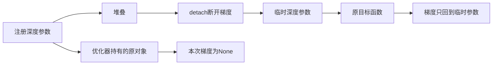

# S27：从坏地图定位到深度梯度断链

实际结果日期：北京时间2026-09-07。报告编写依据已完成的执行回执；最近更新时刻见主账和快照manifest。

本轮的实质进展是：**在真实预测档案驱动的原几何优化代码中，确认了注册深度参数收不到梯度；重新初始化的深度与旧400步终点完全相同。** 这为共同旧地图的误差提供了具体的实现层解释：后续优化没有更新深度。不过，初始化为什么得到过小尺度、修复梯度能否恢复正确几何，仍需分别检验。此处没有新方法增益或生成视频结果。

## 这次实际做了什么

| 工作 | 实际UTC时间（北京时间加8小时） | 新计算与证据范围 |
|---|---|---|
| S27保存量诊断 | 2026-09-06 16:37:34.549560–16:37:38.250474 | 读取28份已有网络预测、4份已有GA输出及已见的8帧传感器深度；重新计算描述量，无新网络、GA或初始化 |
| S27M真实初始化和梯度诊断 | 2026-09-06 16:51:19.465645–16:51:24.729366 | 原common4输入，一次原MST初始化、3次PnP、一次原目标前向和反传；0 Adam步、0网络推理、0传感器深度读取 |
| S27M外部资源监督 | 16:51:19.418633–16:51:25.592129 | 进程exit0，6.173291秒，观测峰值RSS 860,291,072字节；不是优化速度benchmark |

输入是TUM `fr2_desk` 已见片段首8帧，其中共同旧图用首4帧。保存的相机位姿来自真值，作为所有相关方法共享的显式输入；这不是只用RGB的部署条件。深度真值只用于S27评分，未作为初始化或优化深度输入。片段已被观察过，本轮是事后诊断，不是盲测。

## 1. 网络输出和地图输出的误差差异

AbsRel是绝对相对深度误差，越低越好；这里先算每帧，再对组内4帧等权平均。RMSE同样是逐帧RMSE的平均，单位米，不是把全部像素混在一起后的RMSE。

| 固定帧组 | 原网络self深度 AbsRel | GA地图深度 AbsRel | 原self RMSE / GA RMSE（米） |
|---|---:|---:|---:|
| 共同旧4帧 | 4.485928% | 83.338228% | 0.268911 / 1.725768 |
| CUT3R新4帧 | 4.325450% | 67.825891% | 0.233891 / 1.400540 |
| TTT3R新4帧 | 4.568730% | 93.543104% | 0.232496 / 1.902778 |
| FILT3R新4帧 | 4.411814% | 67.573024% | 0.234856 / 1.394245 |

**不能把两列直接称为“同一深度优化前后”。** 原消费者实际组合的是首帧self点图和后续帧other点图；other在参考帧坐标中，多数帧的self深度没有直接进入这条GA输入路径。该比较说明存在值得定位的接口差异，单凭它不能证明GA把每一帧self深度改坏了。所有other只作坐标域分布描述，没有错误地直接拿其z分量与当前帧传感器深度评分。

共同旧4中，每帧GA深度与self深度之比的中位数约0.169–0.173。GA对应的GT/pred中位比约5.84–5.94；这个比例只描述尺度差，**没有作为修正系数应用**，没有GT拟合后的“改进分数”。全8帧最大相机位移约2.543厘米，共同旧4约1.037厘米。短位移可能使尺度约束较弱，但不能仅据此认定尺度塌缩发生。

完整诊断保留132条分布、56条逐帧误差、20个组均值和1600条已有优化loss记录，见[保存量结果](../results/S27_saved_scale_diagnostic/summary.json)、[全部逐帧表](../results/S27_saved_scale_diagnostic/per_frame.csv)。没有挑帧、置信度过滤、远距离裁切或更换评分分母。

图保留各组全部4帧点，统一纵轴从0开始。作者与根任务均实际查看PNG，文字与数据无裁切；PDF/SVG同时提供，尚未做最终论文版面的嵌入检查。

## 2. 真实反传显示：梯度去了临时副本

原函数每次取深度时，先堆叠注册参数，再断开计算图并创建临时参数。于是，原优化器持有的深度参数和目标函数使用的临时对象不同。源码位置见[固定版本的上游实现](https://github.com/runjiali-rl/vmem/blob/39291e4f272f6b4f270691d930926ab5930f942e/extern/CUT3R/cloud_opt/dust3r_opt/optimizer.py)；本地运行身份与分析见[源码审计](../work/S27_scale_diagnosis_source/audit.md)。

S27M保持该原实现不变，在原初始化结束后执行一次原目标的反向传播，实际得到：

| 对象 | 声明可训练 | 原优化器候选中 | 实际梯度 |
|---|---|---|---|
| 注册深度0、1、2、3 | 均是 | 均是 | 全部None，即没有收到梯度 |
| 临时深度堆叠对象 | 是 | 否 | 有限且非零，L2范数0.000967566 |
| 注册焦距 | 是 | 是 | 有限且非零，L2范数0.000660437 |
| 注册pairwise位姿/尺度 | 是 | 是 | 有限且非零，L2范数1.326953292 |

这区分了“整个反传没有工作”和“只有注册深度失去连接”：其他可训练对象确实收到了梯度。已验证反传前后所有注册参数的名称、对象身份和数值均未改变；本轮没有执行优化器更新。详细记录见[gradient_report.json](../results/S27M_mst_gradient_diagnostic/gradient_report.json)。

## 3. 初始化深度与旧400步终点完全相同

本轮重放原初始化后保存4×384×512=786,432个深度元素，再读取旧终点进行比较：全部完全相同，每帧最大绝对差均为0，张量SHA一致：

`a68a166a3007a083b656794f5d8a3ab3f62840ebf33f4ac0faddab27bc3203b4`

第一次目标值为1.2425107955932617，与旧trace第一项相同。旧trace在400步中降到约0.015938，但不能把loss下降说成深度改善。结合源码和实际梯度，可以支持：**在这条兼容重放路径中，深度由初始化确定，原目标没有向注册深度提供更新梯度。** 其他参数可变化，所以loss仍可能下降。

新保存的[MST状态](../results/S27M_mst_gradient_diagnostic/mst_state.npz)是本轮的新计算，绝不是过去漏存的历史初态。它与旧终点相同不补回旧实验的逐步深度记录，也不把一次反传观察扩大成对所有场景、所有设备和所有版本的测量。见[完整比较](../results/S27M_mst_gradient_diagnostic/old_final_comparison.json)。

不同作者于16:54:54.388212–16:54:55.148021UTC实际对全部深度元素做位级比较并检查保存log-depth的指数恢复，结果通过。25个注册对象与1个临时对象的梯度记录经源绑定与逻辑核验；没有再次反传，因此没有把梯度范数称为独立重算。见[独立结果核验](../work/S27M_independent_result_review/receipt.json)。

本次保存的初始化Sim3尺度为0.173179984。直接应用已存变换后，相机中心残差RMSE约2.128毫米，但4帧相机方向与给定方向约差129.747–130.687°；场景实际固定相机矩阵则与给定值完全一致。因此不能把中心接近说成整体相机对齐良好。该方向差和尺度是新的描述线索，没有重拟合，也不单独证明深度失准的原因；尤其需要检查初始化深度的变换中哪些旋转会相消。完整4帧和6个相机对见[alignment_description.json](../work/S27M_independent_result_review/alignment_description.json)。

## 4. 已排除的过强解释

- 400个Adam步骤真实执行过，但不等于每个声明可训练的参数都有梯度；S26B报告已作明确澄清，原失败和结果不覆盖。
- 固定相机位姿不等于固定所有尺度。关闭pairwise尺度归一化，也不等于尺度固定为1。
- 源码中名为`l1_dist`的函数实际计算加权逐点三维欧氏距离，不是逐坐标绝对差之和。推导按实际公式进行。
- 同相机中心、所有深度可自由改变时，有共同收缩的理论路径；不同中心和固定旧深度会改变这个结论。原detach还阻断了经梯度改变深度的路径，所以不能拿这个理论直接解释旧实验发生了优化塌缩。
- 普通梯度修复、焦距冻结、地图重建与缓存同步都先列为工程对照，不是本项目的新算法贡献。

理论与人工小例独立放在[目标分析](../work/S27_scale_objective_review/review.md)。它们不计入真实照片实验。

## 5. 检索与技能怎样改变了决策

按Supervisor手册2.2“强基线→错误分类→根因→针对模块”的顺序，本轮暂缓记忆门控和复杂新组件，先定位共同旧图的失败。`idea-evaluator`用于排除“修一个实现问题就宣称创新”；本地Claude科学批判skill用于区分相关差异、实际计算图证据和因果干预。多agent分别承担源码追踪、独立审查、数值与图表；不把团队内复核称外部复现。手册版本与五维问题清单见[当前选题记录](IDEA_GENERATION_FOCUS_CURRENT.md)。

另检索了上游公开讨论：[Issue 8](https://github.com/runjiali-rl/vmem/issues/8)有人报告相机控制下预测偏离；[Issue 6](https://github.com/runjiali-rl/vmem/issues/6)询问坐标和采样间隔；[Issue 9](https://github.com/runjiali-rl/vmem/issues/9)已提出为何不直接利用在线状态。这些是原始使用反馈，不证明与本次故障同源，也不能支持“从未有人发现”的新颖性断言。网页提取没有核清全部历史评论或关闭PR，详[检索范围](../work/S27_upstream_context/retrieval_receipt.json)。

## 6. 下一项判别实验

S28先做最小工程对照：只让深度读取保留原注册参数的梯度，其余输入、原初始化、目标、400步预算和评分规则保持不变。拟做新的A/B各400步，并核初始化后全部原始参数及buffer一致；新增原路径A有明确的匹配起点用途，不重新标注或覆盖旧400步结果。修复应针对深度读取，不能全局替换构造参数的逻辑；仅删掉detach也不够，因为后续新建Parameter仍可能断链。未来旧4冻结、新4可训练时，逐参数冻结必须仍然有效。

先验证梯度确实到达注册深度、初始数值与原路径相同，再执行一次新的对照优化。参数封存后才能读取评分答案。结果无论好坏都保留：若普通修复足以解决问题，就先建立修复后的强基线；若仍尺度失准，再单独检验初始化和尺度约束，不能同时加多个模块后猜谁起作用。候选准备见`work/S28_gradient_scale_control/`；本报告不将其写成已完成实验。

## 复现与接手入口

S27M冻结合同[contract.json](../work/S27M_preparation/contract.json) SHA：`6afaa53445b618840991de4f5c49c61013628b5a571d79c078d247a07ac0ee56`；脚本SHA：`583083e7db3bc6649f056b68fd53d1c9bd773bcc313fc708de6bab6e15b9df70`；独立执行前审[review_v2.json](../work/S27M_independent_review/review_v2.json)。原输入、611份父源/控制身份、实际加载的几何和overlay模块身份均留在[执行回执](../results/S27M_mst_gradient_diagnostic/receipt.json)。

实际命令和资源回执见[caller.json](../work/S27M_execution/caller.json)与[外部监督](../work/S27M_execution/diagnostic/receipt.json)。这是记录已完成运行的入口，不能直接再执行覆盖目录。下一位AI应先读主记忆和最新追加主账，确认S28是否已有更新。

当前仍未达到最终PhD深度/CCF A投稿质量：缺独立新机制、公平跨场景确认、完整生成闭环与论文交付。S27提供了可复查的失败机制证据，推进了基线诊断这一环。
