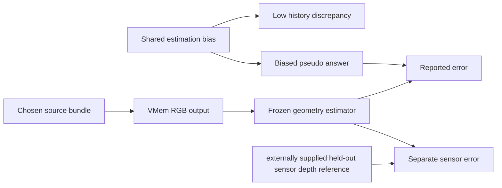

# Round 8 — A Minimal Source-Replacement Experiment and Its Counterexamples

Date: 2026-09-16, Asia/Shanghai. Evidence class: primary-source reading, local source inspection, and synthetic numerical diagnostics. No project dataset/model/future-GT access took place in this rotation. Status: **DEVELOPMENT PROTOCOL, NOT EXECUTED ON VMEM**. `new_method_validated=false`; `novelty_authorization=NONE`.

## Decision and applied research guidance

Use **equal-budget matched source replacement**, rather than deletion, for the first VMem memory diagnostic. It can measure a finite, conditional difference between two source bundles. It cannot identify an absolute value of a memory item, prove that conflict causes error, or establish cross-scene benefit.

Applied `/Users/rocket/.codex/skills/idea-evaluator/SKILL.md` and its `references/fatal-flaws.md`: identify the closest mechanism and the unverifiable-claim failure before proposing an experiment. Applied `/Users/rocket/.claude/skills/sci-scientific-critical-thinking/SKILL.md`: separate internal validity, measurement bias, selection bias, and scope of inference. This is a targeted application; no invented novelty scores, lifecycle estimates, human attestation or full survey was added. A compact causal schematic below serves the diagram need without extra image generation.

The two major concerns are (1) a removal contrast changes the number of active conditions and thus cannot isolate source identity; (2) a risk score and an evaluator can share a systematic geometry error. Both have explicit counterexamples below. The experimental question is therefore deliberately smaller than the original GRC claim:

> On one qualified development episode, does replacing one selected source with a geometrically matched source having lower historical discrepancy reduce the four-query geometry-readout loss under the unchanged VMem consumer, by more than observed replay variation?

This is a falsifiable development question, not an efficacy or novelty claim.

## Closest current primary sources, checked this rotation

| Primary work and inspected part | Verified overlap | Exact remaining distinction, if demonstrated |
|---|---|---|
| [World in World, 10 Sep 2026, §§3.1–3.5 and 4.1](https://arxiv.org/html/2609.11548v1) | Camera/time/support-tagged evidence; coverage/direction retrieval; correspondence routing and evidence-wise attention guidance on a frozen backbone. Camera evaluation uses two estimated trajectories. | Here the experimental unit is one of four already selected VMem source bundles, with a sensor-depth outcome after output sealing. Per-evidence weighting, routing and reliability language are not our novelty. |
| [WorldTrace, 7 Aug 2026, §4.4](https://arxiv.org/html/2608.07408v1) | The paper separates position assignment from content compression and tests these axes under a fixed cache budget. | Our contrast changes a historical source bundle while preserving active context count; it does not claim a new addressability or cache-compression mechanism. The paper's content-versus-position separation is directly useful for our controls. |
| [What-If World, 26 May 2026, §§3.2–3.3](https://arxiv.org/html/2605.27589v1) | A shared initial state plus paired prompt-level physical interventions; paired evaluation distinguishes adherence, physical plausibility, environment and outcome. | Our intervention is computational memory evidence, not a physical-world intervention or a prompt edit. Even a clean model-source effect must not be described as identifying a real-world causal law. |

These full-text sections support the distinctions above. They do not prove that no other work implements the proposed joint protocol. The earlier Round7 broad ranking is replaced here by this evidence-based, non-numeric decision.

## What the local VMem code actually does

Inspected source: `vendor/vmem_snapshot/modeling/pipeline.py` and `configs/inference/inference.yaml` (no weights were loaded).

- `prepare_context_data`, lines 517–523, retrieves **pose, latent, CLIP embedding, K, source index** as a bundle.
- `get_cond`, line 1124, averages all selected CLIP embeddings. Deleting a source changes both membership and the averaging denominator.
- Lines 1251–1282 concatenate context and query cameras, build the context mask and run with hard-coded `F=8`, `T=8`, `H=W=576`. The native target setting is **4 context + 4 query**, **50 steps**, **seed 42**. A 3-context run is not the same fixed-contract experiment and could also require shape/interface changes.
- `get_translation_scaling_factor`, lines 1094–1120, centers camera positions and derives scale from the combined cameras. The source pose is therefore an ancestor of multiple camera conditions. `get_cond` also modifies camera tensors in-place. Each arm must start from a fresh copy of the same unmodified input/state; reusing a mutated object is not replay.
- VMem's immediate generated output is RGB/latent content. A depth score from a frozen estimator applied to generated RGB is a score of the **estimator ∘ VMem pipeline**, not direct access to VMem's true 3D state.

The actual executed code/config/weight hashes must be bound by the parent pre-run manifest; these source observations do not certify the current remote adapter.

## Why removal, zero-fill and duplication answer different questions

| Operation | Budget consequence | Valid interpretation |
|---|---|---|
| Delete source and use three contexts | Active frame count, masks, semantic mean denominator and possibly tensor shape change | Joint source-removal and context-count effect; not equal-budget source responsibility |
| Keep slot but zero latent/embedding | Tensor size stays constant, but input is an artificial out-of-distribution null observation; effective information changes | Null-slot corruption diagnostic, not genuine source absence |
| Duplicate another source into the slot | Four active slots remain, but diversity and relative semantic weights change | Redundancy/reweighting diagnostic |
| Replace with a matched natural historical source | Four active slots and output count remain; source pose, K and appearance move together | Conditional source-bundle replacement effect; preferred main contrast |

Matching does not make two observations identical apart from discrepancy. Residual illumination, motion, occlusion, pose and support differences remain possible explanations. Thus “lower discrepancy predicts this replacement's outcome” is supportable; “discrepancy itself caused the outcome” is not.

## Minimal protocol: Development Source Replacement (SIFG-DEV-01)

### Execution contract

One **qualified DEVELOPMENT episode**, one four-query block, one selected four-source context, one main matched replacement, and one risk-neutral replacement control. This is not a held-out confirmation. Temporarily hiding development targets at runtime does not undo prior exposure. Do not consume a newly reserved held-out scene for this development test.

Fixed configuration: 576×576 network input, 4 active context frames, 4 query frames, seed42, 50 denoising steps, the signed baseline configuration for all other fields, the same model/weights, hardware, precision and kernels. Preserve the declared substitute-VAE limitation. No training or new gate is added. All long runs use the remote tmux/screen + Slurm contract.

### Allowed inputs before prediction

1. The episode's authorized historical RGB frames and their source IDs; historical depth, K and poses for **score/matching only**, unless the baseline itself is explicitly contracted to receive them.
2. The requested four target cameras/K as exogenous controls. If these are derived from dataset poses, disclose that they are supplied inputs. They cannot then be scored as if the model predicted those same poses.
3. The fixed development candidate pool, temporal cutoff, 4 selected context IDs/order, code/weight/config hashes, risk/matching rules and saved initial sampler noise/RNG states.

Forbidden before output sealing: target RGB/depth pixel values, residuals or scores; using future geometry to choose a pair, threshold, mask, scale alignment, or rendering convention. Static/dynamic labels must come from the pre-existing episode contract; do not infer convenient eligibility from future answers.

### History-only discrepancy and matching

Let the fixed background be three context sources `C`, the selected source be `i`, and an unselected candidate be `j`. Compute each candidate's discrepancy using the **same three background sources**, excluding both `i` and `j` from its reference construction. This avoids rewarding self-agreement.

For each background source, project the candidate's historical sensor depth with the frozen camera/depth adapter. On valid in-bounds projected pixels with valid reference depth, retain the signed normalized difference `(z_projected-z_reference)/z_reference`, its absolute median, projection coverage and invalid counts. Do not discard a pixel simply because its residual is large. Occlusion and reconstruction error can both create disagreement, so the scalar is called **historical discrepancy**, not a calibrated risk upper bound. No conformal guarantee is asserted.

The three reference sources can share bias; their agreement is not independent truth. The synthetic example below is a mandatory warning about this construction, not a validation of it.

For a concrete first development revision, proposed admission bounds are: identical processed K/resolution and scene identity; source-pose distance ≤0.02 m and rotation ≤2°; source-support IoU ≥0.90 and valid-depth fraction difference ≤0.02, measured from history under the common requested cameras. Require `r(j)<r(i)`. Pick the **first eligible (i,j) in frozen source-ID order**, not the largest predicted gain. These are design constants, not experimentally justified noise thresholds. Bind them before runs; if no pair qualifies, record `NO_MATCHED_PAIR` and stop this contrast without silently relaxing them.

Pick the neutral control `j0` from the same admission set by smallest `|r(j0)-r(i)|`, ties by source ID, excluding `j`. If unavailable, record that control as unavailable and limit interpretation. An alternate revision may replace these proposed bounds with already frozen development tolerances before any outcome read; that revision must have its own hash.

### Arms and replay

- `A`: `[C, i]`, native source tuple, same slot order.
- `B`: `[C, j]`, replace the complete tuple: RGB-derived latent, semantic embedding, K, pose and source index. Cache/retrieval state preceding selected-context construction remains fixed. Downstream semantic mean, camera normalization, rays, attention, denoising and decoding are recomputed.
- `P`: `[C, j0]`, the same matching/compute replacement procedure without deliberately selecting lower discrepancy.

Run each available arm **three times** from clean cloned pre-intervention state, injecting the identical saved initial noise tensor and restoring recorded RNG states. Nine forwards at most, four predicted query frames each. This is 36 frame outputs, not 36 independent examples. It is 450 configured denoising iterations at most; measure actual network function evaluations and CFG branch cost rather than equating iterations with NFE. Replay repetitions measure implementation variability, not independent seed robustness.

Record shape, active-mask count, source IDs, candidate pool hash, all input tensors/hashes, actual noise hash, pre-intervention state hash, semantic-mean delta, camera-normalization/scale delta, unchanged-background conditioning deltas, wall time, peak VRAM, NFE and output hashes. Identical tensor budget is the controlled dimension; do not claim identical runtime/VRAM merely from `k=4`.

Changing a source pose can alter native normalization for all cameras. Recompute it naturally and report this pathway as part of the source-bundle effect. This first protocol does not freeze a mediator or claim an appearance-only causal effect. A later common-gauge conditioning variant would be a different consumer experiment.

### Exact estimand and outcome

Let `Gθ(C,s,Q,u42)` denote the fixed VMem block, `Eφ` a pre-frozen geometric evaluator using only the generated RGB and permitted historical anchoring, and `Dq` the target sensor depth. The finite effect of replacement is:

`Δq(i→j | C,Q,u42) = Lq(Eφ(Gθ(C,j,Q,u42)), Dq) − Lq(Eφ(Gθ(C,i,Q,u42)), Dq)`.

Negative `Δq` means the replacement reduces that pipeline loss. Report all four `Δq` and their unweighted mean. This is conditional on a selected context, one block, one seed and a natural source replacement. It is not a population expectation, the total Store→Select→Generate effect, a source Shapley value, or an effect of intervening on the real world.

Primary loss is sensor-depth AbsRel on a target-valid mask fixed independently of model success. Bind metric range and failure handling in the parent data contract. A frame with missing/non-finite evaluator output is an explicit failed endpoint, not dropped pixels silently reducing loss. Report target coverage/invalid counts. A partial valid-only score is secondary and must display its denominator.

**Evaluator prerequisite:** before this protocol can report geometry, freeze the exact `Eφ`, checkpoint, depth semantics and history-only scale/gauge procedure. No target-depth scale alignment is allowed. If Eφ returns scale-ambiguous geometry with no valid historical metric anchor, or only input camera poses are available, depth/pose efficacy is `NOT_IDENTIFIABLE`; retain RGB influence diagnostics only. A second independent frozen evaluator is useful triangulation, but agreement between estimators does not replace a sensor-depth comparison. Pose reconstruction, if used, must estimate poses from generated images and disclose the supplied target path; it is secondary.

Save and seal every available A/B/P output before target RGB/depth is opened. Keep the `Eφ` reconstruction artifacts separate from generator artifacts. RGB/edge/ghosting changes are secondary and cannot reverse a failed geometry conclusion.

### Decision and invalidation

First compare per-arm replay loss spread with the A–B and A–P contrasts; show numerical values, not a p-value. The development prediction “lower discrepancy helps” is contradicted for this block if the mean B−A loss is positive beyond the observed replay range. If near replay range, the result is inconclusive. A negative contrast larger than replay variability is only a reason to design a fresh cross-scene test, not scientific success. With four dependent queries, do not estimate a meaningful tail CVaR, confidence interval, or statistical significance.

Invalidate the intended interpretation if active context/query count changes; different noise is used; stale or mutated consumer state leaks across arms; incomplete source tuples mix RGB/latent/CLIP/pose identities; future answers enter pair selection or scale fitting; calibration/drift makes sensor alignment unavailable; outcomes are censored by evaluator success; the claimed advantage is equally produced by P; or a global camera/decoder change is misreported as a localized source effect. Preserve the outputs and state which weaker diagnostic remains interpretable.

## Executed synthetic counterexamples

Actual script: `work/agents/innovation_round8_source_intervention_diagnostic_20260916/run_diagnostic.py`. Result/receipt files are adjacent. Four deterministic assertions passed; **zero VMem calls, zero dataset files, zero future-GT files**.

| Counterexample | Actual numerical result | What it disproves |
|---|---|---|
| Attention-like average of anchor 0 and four identical memory values 1, target 0.5 | Removing any source changes output 0.80→0.75 and improves squared error by 0.0275; equal-budget identical replacement changes nothing | Removal benefit need not identify a uniquely harmful source |
| Three biased references=12 m, true synthetic depth=10 m; candidate i=12 m, j=10 m | Discrepancy ranks i above j (0 vs 2). Four-source mean predicts 12 vs 11.5. True AbsRel improves 0.20→0.15, while the shared 12 m pseudo-reference says replacement worsens by 0.0416667 | Low disagreement and a shared estimator can reward a common error; sign can reverse under independent truth |
| Two RNG streams both seed42 but one consumes an extra draw | Noise values 0.6394268 vs 0.0250108; explicit saved-noise replay delta=0 | Same seed is weaker than exact noise replay |
| `mediator=source; output=2*mediator`, source1→2 | Recomputed total downstream effect=2; frozen-mediator effect=0 | Freezing descendants changes the estimand and can erase source influence |

The examples establish logical counterexamples, not the size or presence of these effects in VMem. No toy improvement is counted as a research result about the real project. The bounded next action is to finish the baseline adapter/isolation and execute this development protocol only when its allowed inputs and geometric evaluator are actually bound. No GRC training is authorized by this report.
