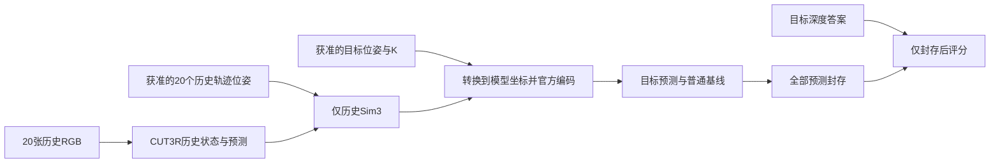

# S14E：相机标定与坐标独立审计

审计者：s14e_camera_calibration_audit，独立于后续实验设计和生产实现。读取范围为既有文稿、源码、官方说明与人工数学例；没有解码真实RGB、深度、轨迹或NPZ，没有运行模型，也没有修改成功的S14D。

**结论：可进行“已知相机条件、官方编码、仅历史对齐的探索性深度评价”，但不能称为未知位姿预测、官方基准复现或新方法结果。** 目标相机位姿作为所有方法共同获准的输入，与目标RGB/深度作为评分答案，必须在协议和实际读取过程中明确分开。S14D的人工目标只证明接口可用，不能直接补上真实质量分数。

## 1. 官方数据合同

TUM官方说明支持640×480、PNG深度/5000为米制光轴Z，零值无效；已配准深度与彩色图像像素对应。fr2彩色标定值是fx520.9、fy521.0、cx325.1、cy249.7，畸变[0.2312,−0.7849,−0.0033,−0.0001,0.9172]。但同页明确建议对于预配准深度采用ROS默认值[525,525,319.5,239.5]而不再去畸变。fr2的1.031深度修正已应用，不应再次相乘。轨迹是彩色相机光心的c2w，四元数文件顺序xyzw。[TUM原始格式说明](https://cvg.cit.tum.de/data/datasets/rgbd-dataset/file_formats)

因此最小方案沿用已有S8的ROS默认K与无新增去畸变，称为官方建议的近似相机模型；不要把fr2标定K、零畸变和原深度直接拼接后称精确标定。保持旧结果不变。如要改用完整畸变模型，另立重采样和注册验证合同。

**空间配准不代表时间同步。** 现有S8准备代码以时间戳配对RGB/depth，阈值20ms，另检查GT括号间隔不超过0.1s。旧实现以RGB时间插值GT位姿，深度来自相近但不同时间；后续新实验不能省略这项误差来源。上述数值是本项目既定合同，不是宣称TUM规定的唯一评价标准。此次未读取现有真实时间或位姿，不能报告实际偏移或拟合误差。

## 2. 224输入像素坐标

固定上游 `src/dust3r/utils/image.py::load_images` 对640×480输入先计算长边299，再实际缩为299×224，裁剪盒[37,0,261,224]，得到224×224。Pillow采用角点坐标，而相机公式以整数为像素中心；需保持半像素项。[Pillow坐标说明](https://pillow.readthedocs.io/en/stable/handbook/concepts.html#coordinate-system)

设sx=299/640、sy=224/480，则

```text
u224 = sx*(u640+0.5)-0.5-37
v224 = sy*(v480+0.5)-0.5
fx224 = 525*sx = 245.2734375
fy224 = 525*sy = 245
cx224 = 112
cy224 = 111.5
```

这与现有 `src/s6_memory_bridge.py::crop_intrinsics` 一致，可以复用；本轮没有发现这里需要修复。不能用两个方向共同的224/480比例，也不能把pseudo K的f=sqrt(224²+224²)、pp112误认为该真实K。GT深度应按同一resize/crop网格用最近邻采样；不能对无效零和前景/背景边缘做RGB式Lanczos混合。若延续已有 `learned_pair_metrics.measured_target` 的5×5邻域/50mm平滑区域掩码，必须显式声明它只评价平滑有效区域，并同时保存全部有效深度与掩码覆盖；这不是新定义的全图准确率。

上游训练裁剪工具另有 `opencv_to_colmap_intrinsics` 的+0.5与逆操作−0.5佐证中心约定；但其缩放取整流程不完全等于demo的 `load_images`，不可直接混用两条流程。此次人工调用AST抽取的实际load_images确认输出形状，另用独立逆映射恒等式核对4个人工像素，没有读取真实图。

## 3. 官方“ray”究竟是什么

viewer与训练 `BaseMultiViewDataset.get_ray_map` 都执行如下编码（后者先求第一相机到当前相机的相对c2w）：

```text
origin = t
direction_channel = normalize(R @ inv(K) @ [u,v,1] + t)
```

标准同K、同R、同t的pinhole方向则是 `normalize(R @ inv(K) @ [u,v,1])`。除t=0或特殊退化像素等情况，两者并不相等。人工平移t=[0.4,0,0]的224²网格已构造数值反例，详见receipt；它不是在真实场景上测出的质量差。虽然这一方向场可在某些条件下用另一组有效投影参数解释，但那不再是给定的真实相机K/R，不能靠改名称消除差异。

**这不是仅存在于viewer的偏差。** 训练代码同样编码含平移项，所以按官方编码查询是有源码依据的模型使用方式；不能仅凭物理射线解释不成立就宣布神经模型输出无效。也不能静默删掉平移、改变训练输入分布后仍称原版结果。如果未来比较纯方向编码，必须预先命名为“改变输入编码的诊断对照”，完整保留官方编码结果，不能挑较好版本报告。

当前direct `inference_step`读取ray_map用于ray encoder；填写 `camera_pose` 字段本身不会强制模型使用该外参。条件内容必须进入实际ray数组；保留array/hash和encoder调用计数，验证target RGB encoder为零。S14D的已有证据不自动覆盖新K、新坐标或真实相机条件。

## 4. 合法的仅历史Sim3

如果采用相机中心对齐，应在看目标深度之前固定一个策略。对20个历史预测c2w中心p_i和共同获准的米制历史轨迹中心C_i，拟合一次

```text
C_i ≈ s * A @ p_i + b       s > 0, A.T @ A = I, det(A) = +1
```

这是尺度、旋转、平移的相似变换；history GT位姿是此实验的额外监督条件，不可说GT完全未使用。拟合数据只来自20个历史时间，不得包含目标深度、目标RGB、目标模型输出误差，或用目标位姿来改善拟合。目标位姿可以在拟合完成后作为给定查询位置使用。

固定Umeyama等中心拟合方案时，事前规定数值秩/基线门、输出全部奇异值、s、旋转正交误差、20个中心残差及历史方向误差。非共线（秩至少2）的匹配中心可识别proper rotation；平面轨迹不应因第三奇异值接近零而自动当作无解。近共线、小平移或预测漂移会让尺度/旋转估计不稳，应保存失败，不在看目标结果后换拟合点、选择另一尺度、增设旋转权重或改成首帧深度校准。

给定米制目标 `R_GT, t_GT`，应转换到模型坐标：

```text
R_model = A.T @ R_GT
t_model = A.T @ (t_GT - b) / s
```

4×4 c2w的旋转部分必须仍是单位尺度的正交矩阵；不可把完整带s的齐次逆变换直接当作刚体相机传进ray函数。上面的变换使用历史拟合坐标系，不应再额外相对首帧二次归一化，除非整套模型历史输出及latent也按同一合同处理；latent不能任意空间旋转后假定不变。

人工相似变换检验已检查目标位姿往返、旋转行列式以及query self点的米制坐标转换。真实数据是否退化和拟合是否可靠，此次没有读取、也没有判断。

## 5. 输出坐标及评分量

固定上游loss的训练语义是：`pts3d_in_self_view` 对应当前相机坐标；`pts3d_in_other_view` 对应首个输入相机的参考坐标。`camera_pose` 是c2w，内部四元数wxyz，与TUM文件xyzw顺序不同。选用的linear带pose头对self和cross分别输出三维点，cross不是代码中强制由self乘预测pose得到的。

因此新诊断最小主预测为 `z_metric = s * pts3d_in_self_view[...,2]`，与该给定目标的实测光轴Z比较。不要使用欧氏长度norm代替Z；不要把cross的第三维直接称目标深度；不要把预测query位姿用于偷偷重新对齐分数。self/cross一致性和条件位姿/预测位姿差可另作已规定诊断，但不得替换主输出。

如果要评价cross点，必须先用历史固定Sim3转到GT世界，再用获准的目标GT c2w逆变换到目标相机；这是一项不同输出头的次评价，仍不代表其像素射线被强制约束正确。

## 6. 时间选择与公平普通基线

本审计建议最小新合同选择**已固定4个目标条目的depth时间戳**作为查询相机条件，历史20张仍在其RGB时间戳拟合pose。既然目标本来不使用RGB，直接预测实际深度采集时刻可避免把RGB时刻相机与另一个时刻的答案混用。协议应在解码真实轨迹/深度之前锁定该选择，记录RGB与depth两个时间，仅history RGB用于模型。GT插值采用平移线性插值、规范化四元数最短弧SLERP、禁止外推、括号间隔≤0.1s；这是可解释的插值假设，不能声称精确还原连续真实运动。深度预注册自身仍有设备几何/时延近似。

如果根采用与旧S8一致的RGB时刻，也可进行有界的“异步配对深度诊断”，但必须保留时间差并说明没有运动补偿，不改称同时刻精确评价。两条路线不能看目标分数后再决定采用哪条。

至少给两个不依赖目标答案的普通基线，提前固定细节：

- 最后历史帧的预测self Z经同s缩放，原像素位置直接持久化；它是刻意简单的零运动基线，不假装几何正确。
- 将同20个历史预测点经已固定pose/Sim3变换，向目标相机普通投影并z-buffer；固定最近像素/填洞/置信度筛选规则与计算预算。若用提供的历史GT外参改善warp，这些外参也必须在所有方法输入合同中公开可用，且不得与仅预测pose版本混称。

所有方法同目标K、同时间、同history与同历史尺度；target深度只在全部模型及基线预测封存后读取。至少保存逐目标绝对误差与预测覆盖；稀疏warp不能只算自身有值部分而隐去大量空洞。另报告共同有效像素上的比较和以全部GT有效像素为分母的固定阈值成功率，未预测像素作为失败。阈值、裁边、深度范围与平滑掩码须事前冻结，不用分数调它们。4相关帧仍只是一个已用场景的探索诊断，不能当4个独立场景做显著性结论。

## 7. 技能落地、审计范围及下一步

Supervisor `idea-evaluator` 仅应用“先审致命混淆/可验证性”的部分：不给普通相机对齐、编码接入或基线新颖性评分；当前待验证的是测量能力，不是提出新方法。Claude本地 `scientific-critical-thinking` 应用于构念效度（Z/距离/cross坐标）、共同输入条件、测量偏差、选择偏差和结论边界；没有调用Claude模型/CLI。没有新增无必要AI示意图，以上公式和下面的输入边界足以支持审读。



最小执行建议：固定一个block的20history+4target及时间定义；冻结K/中心变换/尺度策略/普通基线/评分掩码；不同作者预运行审读；先人工检验再执行真实模型；封存全部预测后读取目标深度；独立复算相机、缩放、像素对应、分母与误差。不重跑S14D人工接口，不回改旧S8结果，不把本审计的4组人工检查写成真实数据实验。

证据和实际时间见 `work/S14E_calibration_audit/receipt.json`；可重查工具为同目录 `collect_and_check.py`。系统git不能识别worktreeconfig的只读失败与TUM工具页超时已记录，未修改Git配置，改用限定HEAD/ref元数据和已有源码SHA识别。官方原文HTML归档在同目录，引用事实以本地读到的源码与本轮官方页面为依据。
