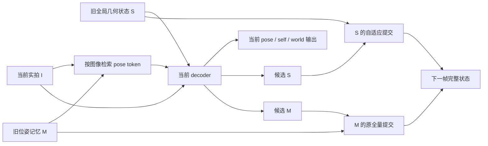

# S23 创新路线1：门控强度与真实几何记忆，是否被混为一谈？

作者：innovation_geometry_state agent。范围：源码核验、原文检索、数学边界与实验设计；**本轮未启动模型、未读取新的深度答案、未产生新算法效果结果**。准确写入时间及文件身份见同目录 `sources.json`。本文件不改主账，供root合并。

**判断：保留一个有条件的机制问题，尚不批准新方法立项。** 最值得验证的不是再找一个更复杂的门控，而是：现有门控压小了状态的直接写入，但是否仍有几何错误沿候选状态的递归路径或独立位姿记忆传播？如果有，能否只约束真正破坏已观测几何的更新方向，保留合理的新视角适应？“同时给两套记忆加gate”本身只是简单对照，不作为贡献。

## 1. 按 handbook 2.3 生成问题，再用 idea-evaluator 审查

实际阅读本地 Supervisor `handbook/02_Idea_Generation/2.3_进阶_如何做颠覆式创新.md` 全文。应用的是第一性原理和回到任务目的：记忆的目的在于以后还能正确回答几何问题，不能只凭内部token变化较小或门控较小判断保留得更好。随后应用 idea-evaluator 的早期致命缺陷、近邻检索、五维与能力匹配；没有把 evaluator 当作想法生成器。

原proposal明确研究**生成世界模型的长期几何一致性**，尤其相机/物体运动、稀疏观察、遮挡与重见。当前CUT3R/TTT3R/FILT3R只是可控的几何组件入口；这个问题若只改善实拍轨迹，不能替代proposal中的生成原型与视频质量评估。

| handbook 2.3 路径 | 本轮实际产物 | 尚不能声称的内容 |
|---|---|---|
| 第一性原理 | 区分直接保留系数与完整递归系统的几何读出影响 | 不能声称已推翻TTT3R/FILT3R性能 |
| 关注极端失败 | 设计一次不良观测后，干净观察能否恢复的干预 | 当前没有自然坏帧统计或恢复曲线 |
| 技术周期 | 冻结可运行的几何模型允许保存状态并分支干预 | 不代表无额外推理成本，也不代表首次 |
| 重要问题清单 | 既要保留真实约束，又要允许新场景信息进入 | 其重要性还需跨场景失败与生成损失支持 |

## 2. 已有实证与真实源码证据

S21/S22已经在同一段已见TUM fr2_desk的300张实拍、约10.44秒上运行三个已有方法。全序列Sim(3)对齐位置RMSE依次为8.253931/2.847830/1.858154厘米。FILT是当前该段最强的已跑对照；结果不是新方法，也不足以证明长期失败、自然污染或新问题成立。主报告 `docs/S21_RESULTS.md`、`docs/S22_RESULTS.md`；本文件没有重新评分。

实际检查S22公开FILT源码的 **`forward_recurrent_lighter`**，即本机runner确实调用的路径，而不是仅阅读未执行的训练分支。源码commit `6cf6d28b6ec7fbcc985187a0f099ccbc90224392`，S22共同精度只改CroCo的RoPE dtype一行；本文涉及的dust3r代码未改。

| 实际位置（相对于FILT源码根） | 源码事实 | 推论的限制 |
|---|---|---|
| `src/dust3r/model.py:1623` | 初始化全局state S与位姿memory M | 两套buffer不等于两种可独立解释的物理变量 |
| `model.py:1632` | 当前全局图像feature查询M，产生pose token，再送入decoder | M影响后续decoder；不能仅凭名称认定只影响pose |
| `model.py:1639` | 候选state和decoder输出同时依赖S、图像和pose token | 候选state不是独立于旧state的外来测量 |
| `model.py:1655` | 以旧M、图像feature与decoder的pose token计算候选M | M更新也包含旧S经decoder传来的路径 |
| `model.py:1666` | 当前输出在新S/M提交之前计算并归档 | 本帧提交gain影响下一状态，不能反过来解释本帧已输出误差 |
| `model.py:1692`、`:1726` | FILT对S用Kalman gain；M仍用原始update_mask全写。TTT同样在S用自适应gain而M全写 | 原设计的明确选择，**不是已证明的bug**；快速pose adaptation可能正需要它 |
| `model.py:901` | FILT方差递归依赖候选state跨帧差，固定measurement noise；还有previous candidate/EMA等buffer | 复制S/M但漏掉这些buffer，不是等价的分支续跑 |
| `src/dust3r/heads/dpt_head.py:256`、`:264` | DPT pose、self点和world点是不同读出；world点受pose modulation | 同帧闭合差可诊断内部不一致，不能充当跨帧一致性或外部真值 |

完整状态应写成 `z=(S,M,P,previous_candidate,EMA,previous_feature,reset_state,...)`，实际需要的字段由执行代码确定。纯S/M替换产生的混合状态也可能离开正常轨迹，不能把其效果直接等同于自然故障的因果贡献。诊断优先在相同前缀上控制**写入动作**，避免任意跨轨迹混搭。

图为源码结构示意，不是实验结果。按Claude科学批判技能考虑了示意图；使用可审查的Mermaid表达实际路由，无需生成照片或额外绘图模型。

## 3. 最接近工作与排除边界

所有机制说明来自所列作者原文/官方代码的具体部分，未把搜索摘要当方法证据。本文是定向近邻审查，不是全领域穷尽综述。

| 工作 | 已核机制 | 相对本候选的对象/机制差别，以及必须承认的重叠 |
|---|---|---|
| Xingyu Chen等，TTT3R，2025/2026 [§3.3及附录](https://arxiv.org/html/2509.26645v4) | 注意力对齐导出逐token状态更新率 | 比较的是更新系数；本问题考察完整状态对未来几何读出的影响。冻结backbone和自适应更新本身已有 |
| Seonghyun Jin、Jong Chul Ye，FILT3R，2026 [§3、§4.8](https://arxiv.org/html/2603.18493v1) | 候选漂移驱动process noise，方差传播决定gain；固定R | “动态R替换固定R”已有attention版本负例；不能重复其已做的global/local trade-off分析。本文不据该负例否定所有可观测measurement模型 |
| Feiran Wang等，RayMap3R，2026 [§3.2–3.5](https://arxiv.org/html/2603.20588v1) | 同一冻结状态的图像/射线两路差异识别动态，调节更新；另有重置对齐与平滑 | 两路深度差gate已经直接占位。候选若退化成相同信号换权重，立即否决 |
| Lanbo Xu等，PAS3R，2026 [§3.1–3.3](https://arxiv.org/html/2603.21436v1) | 用pose变化及图像结构调更新，并训练轨迹一致性、做在线稳定化 | 相机运动+图像质量gate也不是空白；本文需考察作用方向/实际传播，而不是增加这两种输入 |
| Kejun Ren等，AFG，2026 [§3、§4、附录A1](https://arxiv.org/html/2605.16981v1) | 图像/pose feature帧间变化控制frame gate；已有重复帧注入诊断 | 重复帧造成漂移及frame gate不是新发现。本文仅检查其gate-horizon解释能否推广为完整几何记忆，不能否认其报告的经验改善 |
| Chong Cheng等，HorizonStream，2026 [§3、附录B](https://arxiv.org/html/2605.23889v1) | 时空影响分解、多时间尺度记忆与尺度/pose读出 | 已明确研究geometric evidence influence；不能声称首次研究证据传播。其线性attention展开与CUT3R非线性双记忆系统需区分 |
| Chin-Yang Lin等，Scal3R，2026-09-03 [§3及附录D](https://arxiv.org/html/2609.04201v1) | 冻结backbone上的相对pose prompt、多参考与PGO；研究局部depth与global pose失效分离 | “局部depth还好而global pose坏”已被提出；本文只有证明不同的双记忆写入故障才可能有差异。不能仅把global pose改relative当新方法 |
| Mehrdad Farajtabar等，OGD，AISTATS 2020 [作者论文页](https://proceedings.mlr.press/v108/farajtabar20a.html) | 投影更新方向以保护旧任务输出 | 下文的读出约束投影有明确老方法重叠；作用于fast state不自动等于创新 |
| Yuheng Yuan等，Test3R，2025 [方法](https://arxiv.org/html/2506.13750v1) | 测试时以共享参考图的跨配对几何一致性适配prompt | “用几何一致性修正模型”本身已有；须区分固定权重下完整递归写入约束的新增能力 |

同名提醒：上表Lin等Scal3R是 `2609.04201`；Xie等的 **Scal3R: Scalable Test-Time Training for Large-Scale 3D Reconstruction** 是 `2604.08542`，基于VGGT全局上下文，不能把两者作者、方法、代码或成绩混合。

既有否决记录也仍有效：S19否决ray-depth discrepancy gate；S15B/S16已否决把普通cost选择、来源routing和z-buffer交互包装为新机制。本候选不重新启用这些名字。

## 4. 核心可证伪问题及一个数学边界

把S更新暂写成

`S_t = S_(t-1) + D(beta_t) [F(S_(t-1), M_(t-1), I_t) - S_(t-1)]`。

即使固定I与M，在可微区域也有

`dS_t/dS_(t-1) = I-D(beta_t) + D(beta_t) dF/dS + D(F-S) d(beta_t)/dS`。

完整z的Jacobian还包含S与M互相影响、方差和历史候选等通道。因而 `Π(1-beta)` 只描述固定候选/固定gain时的直接保留项，**不能一般地识别旧观测对未来几何输出的总影响**。一个标量反例就能看清：在同一个beta下，F(S)=0的灵敏度为1-beta，F(S)=S为1，F(S)=2S为1+beta。此为普通递归链式法则反例，不是新理论贡献或模型实验。

这不表示AFG/FILT效果无效，也不否定HorizonStream在线性模型假设下的展开。后续有实际干预数据后才能说简化解释在本模型上是否失准。

**H1，未证实：**在部分不良观测后，即使S的更新已经很保守，M路径或候选状态的递归反馈仍足以使后续干净帧的几何读出持续偏移。

**H2，未证实：**存在同预算的写入方向/状态通道干预，能降低这种持久几何污染，同时不损害真实视角变化后的适应；此收益不能被skip、同步gate、单纯重置或已有RayMap/PAS/AFG信号解释。

最强反例是：S/M速率不同恰好服务不同时间尺度，M全量更新帮助pose快速响应；统一gate反而损害跟踪。或主要问题完全是首帧坐标系外推，Scal3R式relative-pose即可解释；或错误来自图像/point head，改变记忆提交只能降低表面抖动而不提升GT几何。以上任一都可能出现，当前数据没有排除。

## 5. 最小本机判别实验：先定位路径，不先调新方法

**建议冻结后再执行，目前0次运行。** 先等root的S23旧输出depth评分；同帧pose/self/world闭合差只作为选题线索。不从最高GT误差处挑首轮干预点。

一个有界入口使用同一已见fr2_desk清晰前缀60帧、预先固定第60帧、随后16张原始实拍。这是探索性组件压力实验，不是未见测试；原模型/权重/512/CPU/精度和公开超参数与S22一致。

1. 保存第59帧后的完整可继续状态包。S21/S22未保存足够中间状态，因此这次前缀计算若必要，理由是取得新的干预对象；不能称作无理由重跑旧分数。先验证无干预续跑逐头与连续执行兼容，失败就停。
2. 固定两种第60帧输入：原图，以及对同一原图作一个事先指定的确定性质量扰动。具体算子/强度由root写入正式协议；不能按GT挑强度。几何和GT相同但像素被人工改变，明确标“真实照片上的人工压力条件”；不声称自然模糊频率或真实动态物体已覆盖。
3. 两输入各运行四种**仅该次提交**动作：A原S+原M；B保持旧S和它的FILT辅助包、正常M；C正常S包、保持旧M；D两包都保持旧值。其后16帧使用完全相同的原更新。所有分支均先产生该帧输出，再做提交；主分析从第61帧开始。D为整帧skip强控制，B/C为机制消融，均不是部署方法。
4. 主指标：第61–76帧相对clean同动作臂的**外部GT几何误差增量及其积分**；必须分开pose、self depth、world几何。scale/pose alignment固定于共同干净前缀或沿root已冻结metric尺度，不对每个分支/后段重新拟合以吸走污染。主深度共同有效域及全域覆盖都报；按帧汇总，不把像素当独立实验。
5. 次指标：初始扰动与16步后读出差、S/M相对变化、FILT gain及方差、同帧内部闭合差。GT只在所有预测封存后评分。保存所有8臂，包括变差和缺测。没有足够有效深度支持时主结论为未能判别。
6. 下一阶段只有H1出现才比较TTT/CUT与AFG/RayMap等对照，增加自然质量变化、真实运动/遮挡条件和至少一个未用场景。当前一个事件/一个人工扰动不会被当独立泛化证据。

**可执行否决条件：**

- 无干预续跑不兼容，或完整state packet漏字段：否决实现，不能评价假说。
- 人工条件只伤害当前帧，后续干净帧无超过预先数值容差的持久损失：不支持H1，停止这一失效故事；不要增加强度直到“成功”。
- C与A无可分辨差异，B或D已解释变化：不支持“M旁路是关键”的版本，保留完整负结果。
- 抑制M只降低内部闭合差而GT变差：否决把该代理当改进依据。
- 固定skip、统一gate或公开强基线已在同允许信息/计算条件下不劣：否决基于该事件提出复杂新机制。
- 仅人工扰动有信号，自然事件或跨场景不能复现：限定压力测试发现，不能升格为重要自然失败。

相同完整状态下两臂不是两个独立场景。四臂差异可用于因果定位一次提交的作用，但S/M依赖交互意味着不能把总体误差简单相加分摊。

## 6. 只有诊断支持后才展开的方法方向

候选研究方向是**按可观测几何读出约束完整状态提交**：保持冻结backbone，以少量过去实拍的静态几何约束构造局部读出敏感方向；从原候选更新中保留不会破坏可信约束的分量，并同步处理S/M的影响。抽象地，可以寻找离原更新最近、同时满足有限几何误差预算的联合增量。这改变作用方向/通道，而不只是把所有token乘更小的数。

它目前只是条件化方法轮廓，**不是已定义算法**：可信anchor如何在线得到、哪些区域真静态、允许误差预算、有限差分/低秩读出的成本、FILT辅助状态如何兼容，都尚未解决。当前不能写“首次”“优于”或新缩写。

最强老方法对照必须包括：简单同步S/M gate、整帧skip、普通几何一致性loss、OGD式输出保持投影、RayMap式双路差异、relative-pose/PGO路线。若最后只等于OGD作用在fast state上，或只把现有RayMap信号接到两个buffer，就没有足够新颖性，应拒绝这一方法版本。

生成主线的必要连接是：几何状态给生成器提供参考时，一次坏观测或坏生成是否破坏已实拍区域的回访约束；联合提交能否保留这些约束，又允许未见区域合理展开。必须实际运行生成闭环，比较同预算视频质量、几何一致性、覆盖与计算成本。当前VMem主资源缺项仍在，不能把本组件试验说成已解决生成一致性。

## 7. Supervisor 评审式判断

**Paper定位：待验证的机制问题，潜在Novel Method前置；当前不是一篇已成立的论文。**

致命缺陷早期门：**F1 / MAJOR，新增机制尚不足**。检测规则是“相对单个最接近工作能否明确新增能力”。本轮找到了作用对象的可能差别，但OGD/Test3R/HorizonStream与更新gate家族已覆盖大量构件。防御动作是上述路径定位和同预算强对照；并非通过换名即可修复。现有数据未直接测试本候选，故不把“未测试”误报为“已被数据推翻”。

| 五维，从5起评 | 暂定分 | 依据 |
|---|---:|---|
| Higher | 5 | 无新方法或GT提升，无理由加分 |
| Faster | 4 | 分支/读出探测增加计算；不能称零开销 |
| Stronger | 6，机制推断待验证 | 完整递归路由存在，H1可用有界干预检验；真实失败尚未出现 |
| Cheaper | 5 | 可复用现有权重不等于比现有训练免费基线更便宜 |
| Broader | 5 | 尚未到生成闭环或另一backbone |

能力匹配：用户MSc准备申请PhD、自述新手、本机M3 Max 64GiB、暂无远程GPU。每周有效投入与数学熟悉度未知，不编评级。机制诊断可在本机做；跨场景、几何方向求解及完整生成评估风险较高。研究类别暂属frontier exploration，不能用技能的生命周期范围当本项目保证工期。

计算估计仅用于规划：S22已测453秒/300帧、峰RSS约9.7GiB。上述单模型60帧前缀加8×17分支约196帧次，线性外推约5分钟纯同类归档前向，另加启动、保存和验证；建议20分钟/24GiB进程上限，超限停止并保存。**这不是已测新实验耗时**。完整Jacobian不应在本机物化；低秩有限差分会增加推理，资源需单独测量。大模型训练和生成资源尚未由本轮解决。

范式检查：第一性假设值得测；不存在“全领域都回避”的证据；冻结模型插桩提供方便但不是独有代际突破；对生成应用的重要性尚待实际失败证明。因此不宣称颠覆性。

**Verdict：Accept with Revisions，仅接受先做有界机制诊断；0个新方法验收通过。** 第一优先拿root S23几何评分确定重要性；第二冻结完整状态干预；第三仅在证据支持且强对照不能解释时正式定义方法。保留用户“先强基线，再从未解决问题提炼创新”的主线。

本轮同时落实本地Claude scientific-critical-thinking的因果时序、混杂、代理指标、负结果和泛化边界。没有调用Claude模型/CLI，也未声称用户已完成阅读或学术责任确认。
