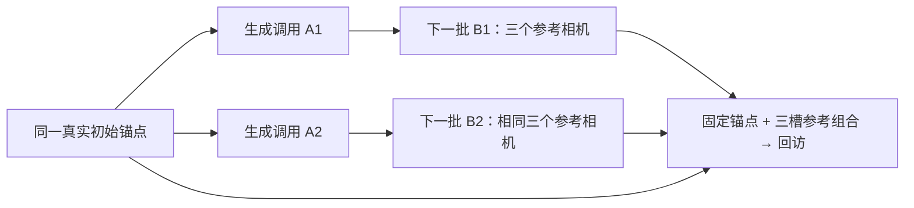

# S23 方向 3：生成记忆的共同来源是否带来额外错误？

记录：2026-09-06，UTC 14:06（北京时间 22:06）；准确文件封存时点见 sources.json。作者：独立子代理 research_novelty_routes。范围：文献与既有源码/报告的只读分析；没有运行生成器、下载 GB 权重、重算 S21/S22，未修改主记忆或主日志。

**裁决：Accept with Revisions，仅保留一个有条件的问题调查，不批准直接写成新方法。当前资源不足以执行真实生成判别实验。** 它比“给生成帧加置信度”“按相似度去重”更具体，但尚没有数据证明这个问题存在，更没有证明解决它能提高视频质量。

**一句假设：固定同一个真实初始锚点、三个参考相机和四个条件槽时，来自同一非根生成分支的参考组合，比互补混合两个分支的组合更容易带偏回访画面；若普通图像相似度或质量选择已能解释全部差异，就否决其独立创新价值。**

论文定位暂为 **New Setting／可证伪的失效诊断**。即使发现效应，也要先解释机制，再考虑最小检索修改。它不是“新算法已有效”，也不证明 CCF A 级贡献或能保证导师的反应。

## 1. 致命缺陷先行

本次候选只有一个需要先解决的 MAJOR 问题，尚无证据认定它在整个研究周期内不可修复，故未触发 CRITICAL 短路。原先已被反证的“生成后代覆写既有 surfel 坐标”是另一版本，维持 Reject and Pivot，不在这里辩护或重启。

| 问题 | 检测依据与当前状态 | 必要修正 |
|---|---|---|
| F6：日志可验证依赖，却不能验证“共同祖先导致错误” | idea-evaluator 的 F6 要求能说出什么实验结果支持或推翻主张。目前没有真实生成谱系或反事实输出；仅给 source ID 加标签，无法从日志识别质量因果。 | 缩小为下述真实参考组合干预；冻结数量、相机、锚点、采样预算及单张参考的边际分布。结果只解释这个组合策略的总效应，继续排除普通相似度和质量因素。没有真实生成输出则停止效果叙事。 |

F1 的真实检索没有证明重复，也没有证明新颖：五个最邻近工作已覆盖几何记忆检索、图像相似度过滤、原图锚点、自生成历史抗漂移、长视频缓存与训练反馈。本候选仅在“非根分支的互补组合干预”上暂有区别。按下述关键词未检索到直接重合工作，**不等于不存在**。F5/F7 的本机资源缺口列在第 6 节；目前不能把修复成本承诺为可控。

## 2. 从原 proposal 与真实记录得到的边界

原 proposal 要先复现开源基线、分析相机运动/重访/长时段的失效，再做针对性的几何机制；不是先取一个漂亮方法名。以下证据不得互相替代：

- S19 固定源码的成功 merge 只向既有 surfel 的来源集合追加 frame ID，不修改它的旧坐标、法线、半径或颜色。新点的加入可以改变渲染胜出点，来源关联也可能改变投票和实际条件图，但这都不是旧坐标被生成后代覆写。
- 原 VMem 确实把真实采样输出的 latent 缓存为后续条件，并从实际生成 RGB 编码图像 embedding；这建立反馈的代码路径，没有建立“有害反馈”的实证。get_cond 的 embedding 均值与实际 latent 替换，才是需要记录的生成器输入。
- 一次 do_sample 的多个目标联合生成。它们是同批兄弟，不是按保存顺序形成的父子链。若只记录 frame ID 或保存时间，会构造错误谱系。
- S20 的观察器通过了人工接口检查，尚无实际生成闭环日志。色块视频、接口测试和可视化都不能填补它。
- S21/S22 是同一段 300 张旧场景真实照片的 CUT3R、TTT3R、FILT3R 推理。它们支持已有方法的几何比较，既没有生成节点，也不能把其轨迹误差解释为共同祖先反馈。这里未读取评分数组或独立重算；这两份报告的独立作者审查当时尚未完成。

依据：ROOT/docs/S19_FEEDBACK_PATH_AUDIT.md、S20_PROGRESS.md、S21_RESULTS.md、S22_RESULTS.md，以及固定 VMem pipeline.py 的 merge、源投票、get_cond 和采样存储代码段。精确文件身份和阅读范围见 sources.json。研究整体仍未完成。

## 3. handbook 2.3 的四种生成思路，实际产生了什么？

| 手册入口 | 对本问题的应用 | 不允许推出的结论 |
|---|---|---|
| 第一性原理 | 三张生成图未必代表三个独立物理观测；相同参考数量不等于相同新增信息。进一步问组合中的共同误差是否具有可测影响。 | 不声称 VMem/WorldMem 明确假定统计独立；它们的检索启发式不是独立样本的概率证明。 |
| 房间里的大象 | 把“写入许多历史图”与“新增可靠证据”分开，追踪错误是否在回访中再利用。 | 误差累积不是无人研究的问题，Lyra 2.0 已直接研究漂移。 |
| 技术周期 | 可记录真实缓存身份的生成接口，使过去难追踪的条件依赖变得可检查；2026 年方法提供更强反例与比较对象。 | 接口已能记录，不代表原模型权重可用或本机已能生成。 |
| Hamming 的问题选择 | 若重访持续采纳共同错误，可能影响可探索场景的长期稳定性；只保留可改变这种行为的假设。 | 受益大小尚未测量，不能称颠覆性突破。 |

handbook 2.2 的“先复现→找真实失败→改机制”仍是执行顺序。这里是候选产生与筛选，不能越过完整生成基线。

### 要记录的结构与不能混淆的概念

单张初始照片是所有生成帧共同的根。若“祖先重合度”只比较最初根节点，所有帧都重合，特征退化为常数。应分别记录：真实初始根、非根生成调用、调用所用的有序真实 context cache 身份、同批联合输出、后续调用的直接输入关系。

这个例子只是待执行实验的结构，**不是已经观察到的真实轨迹**：

B1/B2 内是联合生成的兄弟帧；图中省略的实际条件边必须由真实调用日志补全，不能假定每次仅依赖一个父调用。两分支都依赖同一个真实根，它们也不是独立的现实证据。

来源日志只回答“什么实际输入被使用”；相关性回答“哪些组合常伴随误差”；因果实验回答“主动改变明确的输入组合后，输出如何变化”。保持像素、latent、embedding、相机和 RNG 完全相同，只改祖先标签，按原生成器就不应改变画面；这个元数据安慰剂最多是软件检查。

更强的相反解释是：单图生成存在多种合法场景补全，两个随机分支可能各自一致，却描述了不同世界。混合分支可能造成相互矛盾，而共享来源反而有助保持同一个世界。这里特意把主要终点限制为返回共同真实锚点、核已观测内容；即使混合更好，也不外推到未观测区域。不能先把“来源越多样越可靠”当方法原则，也不能将合法的多模态补全差异直接称为错误。

## 4. 五篇最邻近原文：四轴差别

检索覆盖 2025 文献和 2026 年 4、7、8 月原文，最后一项日期不代表此领域的完整最新排名。正文方法细节来自固定版本的原文，不来自搜索摘要；未做完整系统综述或穷尽前后向引用。

| 原文（作者、年份/所读版本） | 作用对象：原文 → 本候选 | 机制：原文 → 本候选 | 输入粒度：原文 → 本候选 | 问题设置：原文 → 本候选 |
|---|---|---|---|---|
| [VMem](https://arxiv.org/html/2506.18903v3)，Runjia Li、Philip Torr、Andrea Vedaldi、Tomas Jakab，2025，v3 2025-08-14 | surfel 索引的历史视图 → 实际生成条件的参考组合；不改旧坐标 | 几何投票和 NMS 取参考 → 固定条件预算的分支组合干预 | surfel/source frame → 生成调用及其有序 latent/embedding/相机输入 | 持续交互生成 → 返回已观测锚点，诊断共同来源的组合效应 |
| [WorldMem](https://arxiv.org/html/2504.12369v3)，Zeqi Xiao、Yushi Lan、Yifan Zhou、Wenqi Ouyang、Shuai Yang、Yanhong Zeng、Xingang Pan，2025，v3 2026-01-01 | 帧及状态的记忆库 → 相同数量与相机下的参考组 | FOV/时间置信排序、相似度过滤、状态感知条件 → 检验分支信息是否超出这些普通因素；不把另加一个去重项称新颖 | 帧/姿态/时间 → 非根调用关系及实际条件组合 | 长期世界一致性 → 配对的同分支/互补混合回访 |
| [Lyra 2.0](https://arxiv.org/html/2604.13036v1)，Tianchang Shen、Sherwin Bahmani 等，2026，v1 2026-04-14 | 独立每帧几何用于路由、生成历史 → 固定权重时的共同来源组合 | 几何覆盖检索、初始图锚点、自增强历史抗漂移 → 所有实验臂均保留同一锚点，单独检验组合效应 | 时空记忆槽/带噪后去噪的历史 → 真正逐批生成得到的非根分支 | 大范围持久场景及生成后重建 → 先对小规模回访作机制判别；不是重复抗漂移训练 |
| [Addressable Memory for Video World Models（WorldTrace）](https://arxiv.org/html/2608.07408v1)，Xindi Wu、Sven Elflein 等，2026，v1 2026-08-07 | Transformer KV 的位置与内容 → 输入图像/latent 的真实生成关系 | 虚拟位置、canonical key 压缩/冻结 landmark keys → 控制位置和缓存布局后，检验生成内容组合 | token/KV 与历史帧摘要 → 生成调用与参考相机槽 | 固定缓存预算的连贯/召回 → 固定生成条件预算的图像回访；不将所有漂移归给来源 |
| [Self Gradient Forcing](https://arxiv.org/html/2607.20368v2)，Junhao Zhuang、Shiyi Zhang 等，2026，v2 2026-07-24 | 训练时历史 KV 缺失的梯度监督 → 推理时固定模型的条件组 | 两遍流程重算上下文 KV，未来损失监督写入 → 不训练模型，只改变预先生成的参考组合 | 自生成 latent、KV、训练梯度路径 → 生成调用、同批兄弟及实际缓存身份 | 长视频训练/推理差距 → 是否存在普通去重未解释的参考共同错误 |

必须处理的最近反例：WorldMem 已做相似度过滤；Lyra 已同时保留初始锚点并处理抗遗忘/抗漂移，其 self-augmentation 用噪声化历史再去噪，不等于已经执行完整祖先对照。WorldTrace 提醒，缓存位置/数值本身可造成记忆失效；SGF 提醒，自生成历史反馈已有成熟训练研究。本候选的固定权重推理问题不能被包装成参数递归训练的“模型崩塌”。

关键词分三组，共 9 次查询：①世界模型/生成历史/漂移，②持久场景/相关参考/长期记忆，③来源/祖先/自生成反馈；精确查询和返回原文保存在 sources.json、web_receipts.json。

## 5. 最便宜但仍真实的判别实验

**这是资源到位后的计划草图，不是冻结协议，也不是本轮已运行实验。当前 VMem 的主权重与原 VAE 条件下，没有可立即执行的真实版本。**

### 先过一个基线门槛

按 S19/S20 校正的原导航语义，至少完成真实两批生成，核真实 RGB、生产者 latent、embedding、被选相机以及生成调用的对应关系。四个请求目标首轮会有内部 padding；只留真正保留的帧，历史 1→5→9。这只确认原闭环能够工作，不作为共同祖先问题的支持证据。若原默认检索没有实际使用有关生成参考，先报告“未观察到该暴露”，不能通过伪造 source ID 制造成功案例。

### 一个最小配对单元：最多 9 次真实采样调用

1. 从相同真实初始照片和相机状态复制两条分支，预先固定不同分支 RNG。每条先作一批真实生成，再继续生成包含同样三个参考相机的下一批，合计 **4 次历史采样**。不能把另一模型、真实照片、渲染图或色块当成这些输出。保留全部实际输出及失败，不按好坏挑分支。
2. 两条后续批次在三个相机槽的参考分别记作 A1/A2/A3 与 B1/B2/B3。每个回访都使用同一个真实初始锚点 + 三个参考槽；相机顺序固定。对照组为 AAA、BBB，互补混合组为 ABA、BAB。两臂合计时，每张实际参考各用一次，因而单张照片质量、每个相机的来源边际完全相同。
3. 做 **4 次真实回访采样**，固定同一最终噪声、采样步数、CFG、权重、分辨率与目标相机。比较返回初始已观测视角的误差。定义 E 越小越好，则差值为 Δ = [E(AAA)+E(BBB)]/2 − [E(ABA)+E(BAB)]/2。正值只表示这套互补组合优于该同分支组合；不是对抽象“祖先”标签的纯因果效应。
4. 普通图像相似度/质量策略也必须在同一个六参考池中选一张每相机的参考，保持锚点和槽数。其规则在看回访结果前固定；若选择不在上述四组里，至多新增 **1 次回访采样**。记录其是否已经实现同样收益，不能把它故意削弱。它不使用回访误差来选图。与原默认检索的部署比较要在后续另设实验，不能把本次强制条件组合的结果当原管线方法提升。

实施时必须先核跨分支的坐标规范、相机尺度和缓存输入兼容性。若它们不一致，不能直接拼接不同分支的 latent。将回访的几何/相机输入固定，并记录干预绕过了哪段默认检索；否则图像条件差异与地图变化混在一起。B 分支的符号不是“独立观测”认证。

最低成本的主指标可用相同裁剪/分辨率的初始视角 RGB 重建误差与 PSNR；它们不需新评分网络，但不代表感知质量和整个未观测世界的真实性。冻结身份的 LPIPS 和几何指标可作另报验证，不能看完结果后换主指标或只选好看的区域。每个生成调用的多个输出也不是独立样本；这个单元是接口与方向性判别，不能靠多算几帧制造统计显著。

小试至少需要两个新物理起点与预先固定的多个种子，具体样本数/等价区间/停止预算必须在任何新输出被看见前写入协议。已有 TUM desk 的结果是已见数据，不能作最终盲测；小试数据也不能再作最终独立确认集。最廉价的新数据是合法公开且此前未看的场景起点及对应原图身份，但必须先确认视角/图像条件适配；没有既定的新增数据清单，不承诺它已就绪。

### 提前写下失败与停止条件

- 权重、VAE、缓存拼接语义或资源门槛未通过：**无法检验**，不是假设被证明或反证。
- 全部帧只有共同初始根、没有可区分的非根分支，或条件中没有实际用到生成后代：当前轨迹不具备判别条件。
- 同分支不差于混合分支，或方向跨场景/种子不稳定：拒绝稳定收益主张；按冻结的不确定性/等价标准判断反证或不确定，不删负例。
- 普通相似度/质量控制即可解释全部收益，或必须多给一组条件槽/采样预算才能获益：放弃“来源关系带来独立贡献”的版本。
- 混合分支因不兼容的场景补全而更差：这是“多样性未必有益”的重要反例，必须保留；不得事后反向宣传为另一种已证实的来源一致性算法。
- 只在移除真实锚点、挑选已知坏图、事后修改参考规则时出现：不能作为目标设定中的创新证据。
- 即使通过配对单元，仍不能宣称独立新方法；须回到默认检索和新场景，在相同预算下检验一个最小、可部署的修改。

## 6. 能力、五维评价与真实资源

生命周期按 **Frontier Exploration** 看待。用户是研究新手、MSc 希望读 PhD；每周有效研究时数未知，proposal 的每周 12 小时是课程要求，不是已投入工时。本机是 M3 Max 64GB、暂无远程 GPU。手册中的生命周期类别不能转换成当前可承诺的毕业/投稿日期。

| 维度 | 机制层面的预估，非实验得分 | 依据与提高门槛 |
|---|---:|---|
| Higher | 5/10 | 尚无质量收益，且相似度/参考质量仍可能解释结果；先作配对真实回访。 |
| Faster | 4/10 | 分支构造与来源跟踪增加准备计算，未提出加速机制。 |
| Stronger | 7/10 | 若共同错误有组合效应，限制其重复进入条件具有明确鲁棒性动机；需真实回访和普通控制支持，当前未证实。 |
| Cheaper | 4/10 | 诊断至少需要多批真实生成；没有降低总体研究成本的证据。 |
| Broader | 5/10 | 调用来源可用于别的模型，但尚未有跨模型方法或实证。 |

从 5 分起评；加分只来自已说明的条件性机制。当前优先谈 Stronger，Higher 只能是后续目标，不把五维都写成优点。

范式探针：第一性原理 **Partial**（区分参考数量与新增信息，但不是证明前人假定独立）；大象问题 **No**（已有多项直接研究）；技术周期 **Partial**（可观察性与公开模型进展，但本机访问未解决）；Hamming **No，未证实**（潜在用途合理，影响大小未知）。**没有依据称颠覆性创新。**

| 风险 | 当前可核事实 | 处理方式 |
|---|---|---|
| 原完整 VMem：高 | 主权重 401/访问条件沿用既有 S17/S20 记录，本轮未重新申请；原 VAE 的确切身份/可用文件未齐；公开原 CLIP safe 约 3.94GB 尚未下载。 | 合法取得原资源、核身份，先测一个原生成批次的时延与峰内存，再决定分支预算。不能用替代 VAE 或小模型假称原基线。 |
| 本机计算：高 | 导入程序及几何组件已能工作，不等于完整扩散生成可运行。S20 的 CPU fp32、T=8、576²、50 步是草案；本轮无真实时间或内存测量。 | 不预测分钟数，不下载 GB 来碰碰运气；先完成精确资源门槛。 |
| 数据：中 | 旧 TUM desk 已看，不能用于最终独立确认；新起点清单尚未冻结。 | 先确定授权公开数据与独立物理场景划分，保留全体失败。 |
| 工程与周期：高 | 共同来源的记录、实际 latent/embedding 身份及跨分支坐标都需要验证；新手有效工时未知。 | 一次先验单元验证接口，之后才扩样；不承诺完成完整论文的期限。 |

### 一个明确身份的未来替代：Lyra 2.0，不能静默换模型

[官方模型库](https://huggingface.co/nvidia/Lyra-2.0) 的本次匿名元数据请求实际返回 200，private=false、gated=false，revision 为 c178c3fcf12b63cf98f6749999e6ecb63901669f。这里只验证了元数据访问，**没有下载或验证全部权重**。模型卡给出的基础模型为 Wan 14B；许可证为 NVIDIA Internal Scientific Research and Development License，应按原许可使用，不称为无条件开放/可任意再分发。

[官方安装说明](https://raw.githubusercontent.com/nv-tlabs/lyra/main/Lyra-2/INSTALL.md) 写明测试环境为 Ubuntu 22.04、CUDA 12.8、NVIDIA H100，并依赖 Flash Attention、Transformer Engine 和 CUDA 扩展。因此它是可公开定位、未来可评估的另一个生成基线，**不是本机 M3 的已验证便宜替代**。本次官方代码 main commit API 因 SSL 错误未取得；安装文档内容已归档并核哈希，不能声称代码 revision 已完整锁定。若以后改用 Lyra，必须新建协议、明确方法身份和硬件，不能把其结果写成原 VMem 复现。模型卡/安装条件不等于已经跑通。

## 7. 最终去留与已应用的技能

**有条件保留问题，暂不进入方法实现。** 优先级低于把原生成基线合法、真实地跑通。当前最值得提交给主线的是“互补参考组合能否暴露普通去重未解释的共同错误”这一判别标准，而不是一个来源惩罚公式。

最先做的三件事：

1. 原模型/VAE/条件编码资源与真实两批生成就绪，或明确另选公开模型并重新设定基线；本报告不代替这个决策。
2. 冻结上述真实组合干预、相似度/质量对照、独立数据和预算；先证明可执行，再采样。
3. 无额外效应就否决此路；有可靠效应才回到默认检索，提出且检验最小修改。

实际使用：已读固定 Supervisor-Skills handbook 2.3 与 2.2，并分别用四种问题生成方式、基线先行约束；已读 idea-evaluator 的主技能、fatal-flaws、lifecycle-capability-matching、five-dimensions、paradigm-shift-probe 并执行前置缺陷检查、三组检索、五近邻四轴比较及有条件裁决；已读本地 Claude sci-scientific-critical-thinking，应用构念区分、混杂因素、反事实、失败条件与证据边界。示意使用明确标注的 Mermaid，未生成研究图片；没有调用 Claude 模型或 CLI。主账由根代理统一维护，本报告与回执只记录这一路实际完成的工作。
