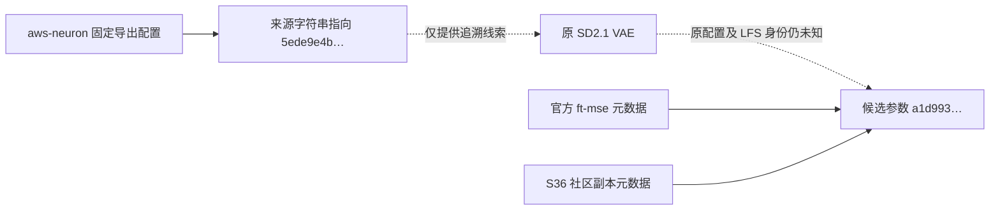

# S38：原 SD2.1 VAE 的历史来源追溯

记录 UTC：2026-09-07T03:14:09.231360+00:00；北京时间：2026-09-07T11:14:09.231360+08:00。作者 `/root/s14_feature_extractor`。这是一次有边界的资源来源审阅，没有模型下载、模型执行或科学评分；原 VMem 权重获取由根任务单独处理。

**结论：新增了原仓库的历史 revision 候选，仍未取得原 VAE 的配置和权重指纹，原件身份关系保持 `UNKNOWN`。可以透明地另设“VMem + 官方 ft-mse VAE”组件复现版本，但它不能冒称原 VMem exact baseline，也不能替代 S35 原件门。**

## 新线索与它的证明范围

[aws-neuron 发布的固定 VAE 导出配置](https://huggingface.co/aws-neuron/stable-diffusion-2-1-base-512x512/raw/153465cce59a65bec6a0cdaacc362702a2b92a91/vae_encoder/config.json)实际取得 HTTP 200，1,782 B。配置的 `_name_or_path` 指向原 `stabilityai/stable-diffusion-2-1-base` 缓存中 `5ede9e4bf3e3fd1cb0ef2f7a3fff13ee514fdf06/vae`；`sample_size=768`，`scaling_factor=0.18215`。这是固定下游产物中直接保存的来源字符串，比只看到模型名称更具体。

它仍是下游导出记录，不是 Stability 原仓库对该 revision 的认证清单。该配置含 Neuron 编译项、`_diffusers_version=0.30.3` 与额外默认字段；不能把它当作原 `vae/config.json` 的字节副本，更不能把编译模型当作原 safetensors 参数对象。名称空间本身也不承担权重身份验证。此处只保留历史版本线索，不把“有人记录用过它”跳成“原件已经证实”。

针对这一新精确 revision，原仓库的 [config raw](https://huggingface.co/stabilityai/stable-diffusion-2-1-base/raw/5ede9e4bf3e3fd1cb0ef2f7a3fff13ee514fdf06/vae/config.json) 与 [权重 LFS raw 指针](https://huggingface.co/stabilityai/stable-diffusion-2-1-base/raw/5ede9e4bf3e3fd1cb0ef2f7a3fff13ee514fdf06/vae/diffusion_pytorch_model.safetensors)均返回 HTTP 401，只收到各 29 B 的错误正文。没有取得原 config、LFS SHA 或权重。这不说明该候选 revision 无效，也不说明原权重必然不同。

原 [HF commit 历史入口](https://huggingface.co/api/models/stabilityai/stable-diffusion-2-1-base/commits/main)发生 TLS 连接失败，未收到 HTTP 状态；不能把它写成 401。原 [Stability GitHub README API](https://api.github.com/repos/Stability-AI/stablediffusion/readme?ref=main)返回 HTTP 404；这是该入口本次响应，不是永久移除证明。没有反复重试。

## 原件身份与独立组件版本的判断

S36 已保存并独立审阅的结论仍有效：社区候选和官方 `stabilityai/sd-vae-ft-mse` 的发布元数据声明同一对象，大小 334,643,276 B，LFS SHA256 为 `a1d993488569e928462932c8c38a0760b874d166399b14414135bd9c42df5815`。这不是本轮下载后哈希，也没有接通“原 SD2.1 VAE → 该对象”的关系。两份配置并不字节相同；详情见 [S36 来源审阅](../../S36_resource_recovery/vae_relation_review.md)。

本轮取得的 [官方 ft-mse 固定 README](https://huggingface.co/stabilityai/sd-vae-ft-mse/raw/31f26fdeee1355a5c34592e401dd41e45d25a493/README.md)明确描述另行发布的解码器微调产品，并说明兼容已有模型的用途。它支持该组件有明确的独立产品身份；它没有声明自己就是 SD2.1-base 的原 VAE。本文不据此推断替代后数值不变或视频质量更好。

**判断：可以科学透明地建立独立公开组件复现版本。** 建议使用同一个官方 ft-mse 固定 revision 的权重与它自己的配置，避免额外混入社区配置；版本名明确写 `VMem + stabilityai/sd-vae-ft-mse (declared VAE component variant)`。这是可研究的原 VMem 流程组件变体，当前尚未执行，不是新方法，也不是论文原版数字的严格重现。

若根任务选择推进该版本，应另立协议并固定以下内容：

- 组件仓库 `stabilityai/sd-vae-ft-mse`，revision `31f26fdeee1355a5c34592e401dd41e45d25a493`；权重服务端预期身份如上，实际下载后必须重新校验完整文件 SHA/字节数。配置用同 revision 的原文件，SHA256 `92d3dfb746fca211a2c9e019e285f8597412211728dce3c5bcf4eda0f2d62e7e`。
- 保留原 VMem wrapper 的后验均值、0.18215 缩放和 encode/decode 方式。按 S36 已审源码的条件保持 `use_tiling=false`，记录真实库版本、精度和设备；`sample_size=256` 不得被悄悄改回 768 后还说是同一官方配置。未来若改 tiling 或其他计算路径，需作为另一个明确配置差别记录。
- 先验收真实严格加载及原流程的实际集成，再判断本机能否完成完整生成。来源相容推断不是加载测试或运行性能证据。后续算法对照都使用该同一具名组件版本；替代导致的质量差异不能被计成算法收益。

若目标仍限定 exact-original，唯一尚缺的来源证明是原出版者的可信历史 config 与参数身份，或原出版者明确的迁移/等价记录；即便某版本将来数值相似，也不能反证历史来源相同。本轮未创建替代实验，未设置 `VERIFIED_ORIGINAL_VAE_IDENTITY`，未修改 S35 gate/manifest 或科学环境。

## 实际请求、停止点与留痕

4 个不同检索查询已用完，均限定 `huggingface.co` / `github.com`；6 个有区别的小 HTTP 请求已用完。请求 UTC 为 2026-09-07T03:10:00.501288+00:00 至 2026-09-07T03:10:02.043293+00:00，北京时间 11:10:00–11:10:02。检索请求的精确开始/结束时点未单独仪表记录，保留检索正文及其本地保存时间，不补造请求时间。

| 请求 | HTTP/传输 | 实收正文 B | 实际用途 |
|---|---:|---:|---|
| aws-neuron 固定导出 config | 200 | 1782 | 新历史 revision 线索 |
| 原 SD2.1 固定 revision config | 401 | 29 | 未取得原配置 |
| 原 SD2.1 固定 revision LFS raw | 401 | 29 | 未取得原权重指纹 |
| 原 SD2.1 commits API | TLS 失败，无 HTTP | 0 | 未取得原历史列表 |
| 官方 ft-mse 固定 README | 200 | 6844 | 独立产品身份与用途 |
| Stability GitHub README API | 404 | 128 | 本次无可读正文 |

HTTP 实收总计 **8,812 B**。每请求一次、至多 20 秒、至多 256 KiB，未跟随重定向，无认证；未读取浏览器账号、token 或凭据。LFS 请求使用小文本 raw 入口，不是 resolve 权重下载。检索服务返回的文本另存，服务内部抓取字节不可量测，不与上述 HTTP 字节混算。搜索遇到的其他社区副本没有进一步打开，也未作为原件等价证据；S36 的四个已知 metadata/config URL 没有重新请求。

应用的本地技能是 [scientific-critical-thinking](/Users/rocket/.claude/skills/sci-scientific-critical-thinking/SKILL.md) 的主张与证据分级、来源跳跃检查和条件性判断；未套用不适用的临床统计框架。沿用项目 Supervisor 研究原则，保持来源、源码推断、真实执行三类证据分开。本轮新增模型/数据实验、权重读取、软件安装、Claude 模型调用均为 0。读集、各来源 SHA、失败原文和逐项请求时间见 [receipt.json](receipt.json) 与 [http_receipts.json](http_receipts.json)。检索额度耗尽后停止，原件关系保留 `UNKNOWN`，没有以继续重复请求代替研究进展。
