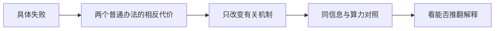

# 从四篇顶会论文学习：怎样把“记不住”变成可检验的问题

**最值得学的是：指出旧办法在哪个具体条件下失效，改动对应机制，再用能推翻自己的对照验证。** 本次选取正式发表的 StreamingT2V（CVPR 2025）、VMem（ICCV 2025）、WorldMem（NeurIPS 2025）和 LongLive（ICLR 2026）。会议官网、正式原文、访问时刻及阅读范围均绑定在 [sources.json](sources.json)。这不是综述或四篇独立复现；VMem、WorldMem 补读正式版消融，不重复 S23 的五篇近邻清单。

## 1. StreamingT2V：把两种“记忆”拆开

只接上一段视频，可能逐渐换脸；死守第一帧，又可能让画面不动。它让最近八帧通过注意力承担接续，让首段锚点的 CLIP 特征承担外观保持；后者按 `SiLU(α)×混合特征+文本特征` 注入，另外处理增强阶段的接缝。[正式论文 §4–5](https://openaccess.thecvf.com/content/CVPR2025/papers/Henschel_StreamingT2V_Consistent_Dynamic_and_Extendable_Long_Video_Generation_from_Text_CVPR_2025_paper.pdf)

最有用的是拆模块对照：补充材料 A.3 在同训练数据上比较注意力、相加和拼接；再去掉外观模块，身份分数从94.95降到93.42，LPIPS从0.151变为0.192。跨模型比较统一了初始段，但不是等参数、等训练、等算力证明。身份指标还只是相邻可检出人脸的代理，不能代替三维回访。[原补充材料 A.3–A.4](https://openaccess.thecvf.com/content/CVPR2025/supplemental/Henschel_StreamingT2V_Consistent_Dynamic_CVPR_2025_supplemental.pdf)

**可学套路：按职责拆解失败，指标同时防止“冻住画面就一致”的投机。** 迁移会失败于：初图没有当前物体、真实世界发生变化，或没有训练就硬接新注意力模块。首段锚点也不自动等于实拍真值。

## 2. VMem：几何的职责是选对图

最近帧、最近相机可能都看不见目标表面；直接把估计几何渲染成最终图，又容易把几何错带进画面。VMem用粗表面元保存“谁看过这里”，按目标可见表面投票，再让生成器消费历史图。它没有要求几何模型本身成为最终世界。[正式论文 §3](https://openaccess.thecvf.com/content/ICCV2025/papers/Li_VMem_Consistent_Interactive_Video_Scene_Generation_with_Surfel-Indexed_View_Memory_ICCV_2025_paper.pdf)

决定性对照是表4同一K内换检索规则：K=4时，相机距离与VMem的PSNR为13.27和14.82。K=4与17之间还改变了微调和总帧数，因此12倍速度不能全归给索引。普通前进轨迹很少重访，作者另用返回轨迹检验记忆；两种任务不能混为一个成绩。[§4.1–4.4、表1/4](https://openaccess.thecvf.com/content/ICCV2025/papers/Li_VMem_Consistent_Interactive_Video_Scene_Generation_with_Surfel-Indexed_View_Memory_ICCV_2025_paper.pdf)

**可学套路：把中间表示服务的决策说清，再让基准暴露它的用途。** 若不同地图仍选出同样条件，或选对图后生成器仍忽略细节，继续降低深度误差可能无益；这是本项目必须核的链条。

## 3. WorldMem：找到图，还要知道它属于哪个状态

有限窗口会忘掉走过的地方；只有图像特征又难区分相似外观、不同位置或不同时间。其记忆保存帧、姿态和时间，以视野重叠及时间差筛选，再用相对状态增强查询和键，值仍来自视觉特征。[正式论文 §3](https://proceedings.neurips.cc/paper_files/paper/2025/file/470629a47e2d65ce0606c40055df5d26-Paper-Conference.pdf)

表2逐步比较稀疏/稠密、绝对/相对姿态；表3先置信筛选再加相似过滤，PSNR由23.12到23.98；表6用放置事件验证时间条件。需注意：无记忆对照没有同样的额外历史，Minecraft还给定真实姿态；不能概括成“同信息预算全面胜出”。[§4、表2/3/6](https://proceedings.neurips.cc/paper_files/paper/2025/file/470629a47e2d65ce0606c40055df5d26-Paper-Conference.pdf)

**可学套路：把任务歧义转成显式状态，并单独检验状态表示和检索。** 迁移风险是姿态不准、遮挡令视野重叠失真；静态TUM短窗也检验不了物体状态随时间改变。加入时间或去重本身已经是普通基线。

## 4. LongLive：保留缓存与服从新条件之间存在冲突

切换提示时，清空KV缓存会突变，保留则可能拖着旧语义走。它用已有视频和新提示重算缓存，并在训练中接续自己的历史；短窗口再配首段记忆，控制开销。[正式论文 §3](https://proceedings.iclr.cc/paper_files/paper/2026/file/91a1610c6ed9e02d33f826b46f472b92-Paper-Conference.pdf)

最决定性的表4固定10秒、5秒时切换，比较清空、保留、重算。**表题说重算的CLIP最好，但实际清空为28.95，重算27.87。** 重算是在连贯性与语义之间改善折衷，不能说每项都赢。图7还比较相同有效窗口的9局部+3锚点与12局部；重算、长训练都有成本，不能把结果写成免费缓存技巧。[§4.4–4.5、表4/图7](https://proceedings.iclr.cc/paper_files/paper/2026/file/91a1610c6ed9e02d33f826b46f472b92-Paper-Conference.pdf)

**可学套路：先比较两个相反的普通办法，找到各自失败，再设计中间机制。** 本项目没有同样的跨批DiT KV路径，不能照搬“重算缓存”；其多GPU训练也不是本机已具备能力。

## 回到项目：只保留一个待证问题

Supervisor 2.2要求先见真实失败；2.3提示回到“怎样让生成器用对证据”。S34已说明地图和票权变了，最终候选仍可能不变；原自由优化已有效，额外尺度只小幅增益。S35只是两步、4×4人工接线。S38原VMem权限已获准，获取和验收由root推进，**尚无本轮真实生成结论**。

候选问题：**几何选中的多视角图，在统一语义平均后，是否反而削弱回访已观察内容的保持？** 原 `get_cond` 把所选CLIP向量取均值，而原生产latent、相机另走条件通道（源码1124–1194行）。这是可查的结构，不是已经发现有害效果；也不同于S23跨生成分支混合。

最便宜的判别须等真实基线通过：冻结一个自然生成历史和回访请求，保留原选图、顺序、真实latent、相机、焦距、噪声及采样配置；只比较语义均值、同一已观察锚点向量、所选最近相机向量三种普通规则。替代向量匹配原均值范数，排除单纯幅值变化。不更换地图，不拼假latent；若原合法条件未含锚点，记不适用并保留分母，不偷偷增加信息。至少两个预选新场景、配对种子，全部结果保留；先定同视角重建与视角服从的联合判据，不能靠复制初图取胜。

idea-evaluator裁决：**Accept with Revisions，仅作失效诊断。** F6主要缺口是真实消费者证据；F1明确否决“固定锚点/加权平均就是新方法”。若普通单向量已解决，就停在强基线；若差异不稳定、只靠错误相机或增加条件量才出现，否决该版本。预算由真实首轮耗时决定，不用论文H100速度承诺本机。即使诊断成立，仍需新增机制、同预算强基线和独立场景，不能直接宣称PhD或CCF A水平。

这里只应用Claude科学批判的混杂、构念和证据分层；未调用Claude模型，未训练或运行科学实验。未声称穷尽最新工作；资料中的图片是论文图，不是本项目实拍或新生成结果。
