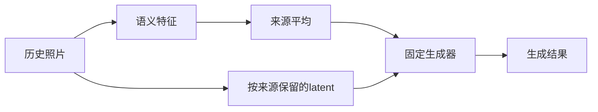

# 下一项判别：来源平均后的信息能否被正确解释

本文件记录2026-09-08继续研究时的有限分析，不是生成实验、完整确认协议或新方法。

## 数学预测与模型预测分开

设不同来源的语义特征为e_i，c=(Σe_i)/K；固定噪声、相机及另一条latent路径L，输出写成Y=F(c,L,q,ε)。S51已用精确计算验证平均映射的零空间。

在F对c可微的位置，链式法则还给出：

```text
∂Y/∂e_i = (1/K) ∂F/∂c， 对每个i相同。
```

这只是对独立特征坐标的偏导。若真实图像I_i同时决定e_i=E(I_i)与latent路径，∂Y/∂I_i还包含不同的编码器Jacobian和latent贡献，不能从上式推出每张照片同等重要。该推导是标准微积分，不宣称新定理。

| 待检验命题 | 当前证据 | 必须怎样区分 |
|---|---|---|
| 仅改变语义来源分解且总和不变时，该均值路径不变 | 数学上成立，机器归约存在舍入边界 | 作为未来hook实现的零效应检查；不是收益实验 |
| 单靠这条均值路径的特征梯度能区分来源重要性 | 上述条件下无法由相同偏导区分 | 不能把相同梯度误读为真实照片同等影响；image/latent梯度另算 |
| 这条平均机制实际损害重访细节 | 未验证 | 需要真实基线错误、固定外生条件的语义路径干预、其他路径对照和合法实拍误差 |
| 保留更多来源信息能改善结果 | 未验证，且普通per-source token已有近邻 | 与同容量、同输入、同算力的已有方法比较；没有收益时否决方法候选 |

因此，当前最值得问的是“我们是否测对了某条来源的影响”，而非预先认定应该增加某个模块。对称特征扰动只是实现诊断，可能不在自然图像编码分布内；未来自然来源替换的主实验必须重算它影响的全部后代，不能称受限路径检查为全流程总效应。



## 原论文带来的约束与启发

1. **LongDiff，Zhuoling Li等，CVPR 2025。** 官方CVF年份为2025；旧原则v2.0把它放在“正式CVPR 2026材料”的组句中不准确，应以本次订正为准。原文从有界attention logits推导随N变化的熵下界，并用邻近帧与关键帧选择处理长视频信息交换。它给我们的启发是先明确数学假设、再让方法改变对应映射；其时间attention问题与VMem来源平均不是同一个对象，二者也不能只用“信息稀释”一词宣称新颖。[正式发表页](https://openaccess.thecvf.com/content/CVPR2025/html/Li_LongDiff_Training-Free_Long_Video_Generation_in_One_Go_CVPR_2025_paper.html)，[原文§4.2及附录E](https://arxiv.org/html/2503.18150v1)。CVF PDF本轮返回403，因此正文采用公开arXiv原稿。
2. **ARC-JSD，Ruizhe Li等，ICLR 2026。** 本轮从官方会议论文集再次核实发表状态和摘要：它在RAG中用分布差异识别上下文贡献。生成受到某段条件影响已经有强近邻；迁移到几何视频必须给出对象、测量和验证上的实质差别。[官方论文集](https://proceedings.iclr.cc/paper_files/paper/2026/hash/ed67dff7cb96e7e86c4d91c0d5db49bb-Abstract-Conference.html)。OpenReview PDF本轮遇验证页，未将它记为已阅读全文。
3. **Outputs of generative diffusion models are often unattributable，Zheng Dai与David K. Gifford，Nature Communications，2026-08-18。** 原文研究训练数据单元的leave-one-out归因，并通过专门构造的ensemble消除某训练单元影响。这提醒我们：删掉一个单元没有明显变化，也不能自动推断所有信息未被使用。但其训练数据归因结果不能直接推广为VMem推理时历史记忆不可归因。[原文Results与Discussion](https://www.nature.com/articles/s41467-026-75667-5)。

本节只是有限近邻更新，未报告完整综述或首创证明。Nature工作是期刊论文；ARC-JSD与LongDiff的正式会议信息均来自主办方/出版方原始页面。

## 当前决策及实际下一步

依据Supervisor handbook 2.2/2.3、idea-evaluator近邻筛查和本地Claude scientific-critical-thinking中的混杂/构念效度检查：上述数学性质保留为诊断工具。单独以“平均丢失来源”或“测来源影响”投稿的贡献不足；尚未选择新方法。不会为扩大叙事而训练普通门控。

先让C1/C2基线成为可评分的实际样本。本轮C2真实启动在模型加载前因授权凭证读写格式不一致退出；C1 V9仅修两处真实旧报告结构。它们是执行适配问题，不是生成质量差或假说被否决。修复需用实际文本生产链做集成核验，保留原失败，避免只在手造schema上验证。

当且仅当基线门、数据身份和预算满足时，将以上预测填入最小干预实验；不从S48/RAIMA V4偷换阈值，不把target历史暴露或单参考偏差隐藏。`new_method_validated=false`，`novelty_authorization=NONE`。
